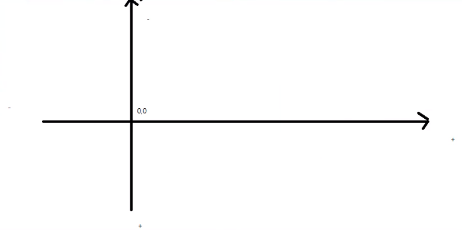
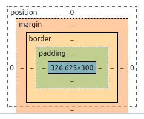
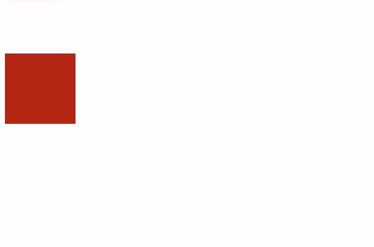

# 1、什么是CSS

如何学习？

1. CSS是什么
2. CSS怎么用（快速入门）
3. CSS选择器（重点+难点）
4. 美化网页（文字、阴影、超链接、列表、渐变…）
5. 盒子模型
6. 浮动
7. 定位
8. 网页动画（特效效果）

## 1.1、什么是CSS

Cascading Style Sheet 层叠级联样式表

CSS表现：美化网页

字体、颜色、边距、高度、宽度、背景图片、网页定位、网页浮动…

## 1.2、发展史

CSS1.0 

CSS2.0  DIV（块） + CSS，HTML与CSS结构分离的思想，网页变得简单，利于SSo

CSS2.1 浮动、定位

CSS3.0 圆角、阴影、动画… 浏览器兼容性~

## 1.3、快速入门

**基本入门**

```html
<!DOCTYPE html>
<html lang="en">
<head>
  <meta charset="UTF-8">
  <title>Title</title>

  <!-- 规范，<style>中可以编写css代码
  语法：
    选择期 {
      声明1;
      声明2;
      声明3;
    }
  -->
  <style>
    h1 {
      color: red;
    }
  </style>
</head>
<body>
  <h1>标题</h1>
</body>
</html>
```

**分离模式（建议）**

```html
<!DOCTYPE html>
<html lang="en">
<head>
  <meta charset="UTF-8">
  <title>Title</title>

  <!-- 规范，<style>中可以编写css代码
  语法：
    选择期 {
      声明1;
      声明2;
      声明3;
    }
  -->
  <link rel="stylesheet" href="./css/style.css">
</head>
<body>
  <h1>标题</h1>
</body>
</html>
```

```css
h1 {
    color: red;
}
```

**css优势**

1. 内容和表现分离
2. 网页结构表现统一，可以实现复用
3. 样式十分的丰富
4. 建议使用独立于html的css文件
5. 利于SEO，容易被搜索引擎记录

## 1.4、CSS的3种导入方式

> 优先级：就近原则

```html
<!DOCTYPE html>
<html lang="en">
<head>
    <meta charset="UTF-8">
    <title>Title</title>
    <!--内部样式-->
    <style>
        h1 {
            color: green;
        }
    </style>

    <!--导入式-->
    <style>
        @import url("./css/style.css");
    </style>

    <!--外部样式-->
    <link rel="stylesheet" href="./css/style.css">

</head>
<body>
<!--优先级： 就近原则-->

<!--行内样式-->
<h1 style="color: red;">标题</h1>
</body>
</html>
```

```css
h1 {
    color: blue;
}
```

拓展：外部样式有两种写法

* 链接式

  ```html
  <link rel="stylesheet" href="./css/style.css">
  ```

* 导入式

  > @import 语法是从css 2.1 开始引入的

  ```html
  <style>
      @import url("./css/style.css");
  </style>
  ```

# 2、选择器

> 作用：选择页面上 的某一个或者某一些元素

## 2.1、基本选择期

> 优先级：id选择器 > 类选择器 > 标签选择器

1. 标签选择期：选择一类标签

   ```html
   <!DOCTYPE html>
   <html lang="en">
   <head>
       <meta charset="UTF-8">
       <title>Title</title>
   
       <style>
           /*标签选择器*/
           h1 {
               color: red;
               background-color: aqua;
               border-radius: 15px;
           }
   
           p {
               font-size: 50px;
           }
       </style>
   </head>
   <body>
   <h1>学习HTML</h1>
   <h1>学习CSS3</h1>
   <p>上bilibili</p>
   </body>
   </html>
   ```

2. 类选择器（class）：选择所有class属性一致的标签，跨标签

   ```html
   <!DOCTYPE html>
   <html lang="en">
   <head>
       <meta charset="UTF-8">
       <title>Title</title>
   
       <style>
           /*
             类选择器
             可以多个标签归类，同一个class可以复用
           */
           .cl-h1-1 {
               color: aqua;
           }
   
           .cl-h1-2 {
               color: bisque;
           }
       </style>
   </head>
   <body>
   <h1 class="cl-h1-1">标题1</h1>
   <h1 class="cl-h1-2">标题2</h1>
   <h1 class="cl-h1-1">标题3</h1>
   
   <p class="cl-h1-1">p标签</p>
   </body>
   </html>
   ```

3. id选择期：全局唯一

   ```html
   <!DOCTYPE html>
   <html lang="en">
   <head>
       <meta charset="UTF-8">
       <title>Title</title>
   
       <style>
           /*
             id选择器
             优先级：id选择器 > class选择器 > 标签选择器
           */
           #id_h1_1 {
               color: blue;
           }
   
           .cl-h1-1 {
               color: brown;
           }
   
           h1 {
               color: chocolate;
           }
       </style>
   </head>
   <body>
   <h1 id="id_h1_1">标题1</h1>
   <h1 class="cl-h1-1">标题2</h1>
   <h1 class="cl-h1-1">标题3</h1>
   </body>
   </html>
   ```

## 2.2、层次选择器

1. 后代选择器：在某个元素的后面

   ```css
   <!DOCTYPE html>
   <html lang="en">
   <head>
       <meta charset="UTF-8">
       <title>Title</title>
       <style>
           /*后代选择器*/
           body p {
               background-color: green;
           }
       </style>
   </head>
   <body>
   <p>p1</p>
   <p>p2</p>
   <p>p3</p>
   <ul>
       <li>
           <p>p4</p>
       </li>
       <li>
           <p>p5</p>
       </li>
       <li>
           <p>p6</p>
       </li>
   </ul>
   </body>
   </html>
   ```

2. 子选择器

   ```css
   <!DOCTYPE html>
   <html lang="en">
   <head>
       <meta charset="UTF-8">
       <title>Title</title>
       <style>
           /*子选择器*/
           body > p {
               background-color: brown;
           }
       </style>
   </head>
   <body>
   <p>p1</p>
   <p>p2</p>
   <p>p3</p>
   <ul>
       <li>
           <p>p4</p>
       </li>
       <li>
           <p>p5</p>
       </li>
       <li>
           <p>p6</p>
       </li>
   </ul>
   </body>
   </html>
   ```

3. 相邻兄弟选择器

   ```html
   <!DOCTYPE html>
   <html lang="en">
   <head>
       <meta charset="UTF-8">
       <title>Title</title>
       <style>
           /*相邻兄弟选择器，紧挨的一个，相邻（向下）*/
           .active + p {
               background-color: blue;
           }
       </style>
   </head>
   <body>
   <p>p1</p>
   <p class="active">p2</p>
   <p>p3</p>
   <ul>
       <li>
           <p>p4</p>
       </li>
       <li>
           <p>p5</p>
       </li>
       <li>
           <p>p6</p>
       </li>
   </ul>
   <p class="active">p7</p>
   <p>p8</p>
   <p>p9</p>
   </body>
   </html>
   ```

4. 通用选择器

   ```html
   <!DOCTYPE html>
   <html lang="en">
   <head>
       <meta charset="UTF-8">
       <title>Title</title>
       <style>
           /*通用选择器，向下所有兄弟元素（向下）*/
           .active ~ p {
               background-color: aqua;
           }
       </style>
   </head>
   <body>
   <p>p1</p>
   <p class="active">p2</p>
   <p>p3</p>
   <ul>
       <li>
           <p>p4</p>
       </li>
       <li>
           <p>p5</p>
       </li>
       <li>
           <p>p6</p>
       </li>
   </ul>
   <p class="active">p7</p>
   <p>p8</p>
   <p>p9</p>
   </body>
   </html>
   ```

## 2.3、结构伪类选择器

```html
<!DOCTYPE html>
<html lang="en">
<head>
    <meta charset="UTF-8">
    <title>Title</title>
    <style>
        /* ul的第一个子元素 */
        ul > li:first-child {
            background-color: aqua;
        }
        /* ul的最后一个子元素 */
        ul > li:last-child {
            background-color: blue;
        }

        /* 选择当前p元素的父级元素，选中父级元素的第一个，并且是当前元素才生效，按顺序 */
        p:nth-child(1) {
            background-color: brown;
        }
        /* 选中父元素下的p元素的第二个，按类型 */
        p:nth-of-type(1) {
            background-color: green;
        }
    </style>
</head>
<body>
<h1>h1</h1>
<p>p1</p>
<p>p2</p>
<p>p3</p>
<ul>
    <li>li1</li>
    <li>li2</li>
    <li>li3</li>
</ul>
</body>
</html>
```

## 2.4、属性选择器

> =   绝对等于
> ~= 含有（以空格隔开的）
> *=  匹配（匹配到字符即可）
> ^= 以开头
> $= 以结尾

```html
<!DOCTYPE html>
<html lang="en">
<head>
    <meta charset="UTF-8">
    <title>Title</title>
    <style>
        .demo > a {
            display: inline-block;
            width: 50px;
            height: 50px;
            /*line-height: 50px;*/
            font: bold 20px/50px Arial;
            text-align: center;
            text-decoration: none;
            margin-right: 5px;
            border-radius: 25px;
            background-color: chocolate;
            color: aqua;
        }

        /*存在id属性的元素a*/
        a[id] {
            background-color: green;
        }
        /*id等于first的元素a*/
        a[id="first"] {
            background-color: brown;
        }

        /*
        class含有links的元素
        = 绝对等于
        ~= 含有（以空格隔开的）
        *= 匹配（匹配到字符即可）
        ^= 以开头
        $= 以结尾
        */
        a[class="links item first"] {
            background-color: blueviolet;
        }
        a[class~="links"] {
            background-color: blue;
        }
        a[class*="la"] {
            background-color: chartreuse;
        }
        a[class^="link"] {
            background-color: cadetblue;
        }
        a[class$="st"] {
            background-color: darkkhaki;
        }
    </style>
</head>
<body>
  <p class="demo">
    <a href="https://www.baidu.com" class="links item first" id="first">1</a>
    <a href="" class="links item">2</a>
    <a href="page/1.html" class="links item">3</a>
    <a href="page/2.html" class="links item">4</a>
    <a href="a.pdf" class="links item">5</a>
    <a href="bd.pdf" class="links item">6</a>
    <a href="c.png" class="links item">7</a>
    <a href="d.png" class="links item">8</a>
    <a href="" class="links item">9</a>
    <a href="https://www.taobao.com" class="links item last" id="last">10</a>
  </p>
</body>
</html>
```

# 3、美化网页元素

## 3.1、为什么美化网页

1. 有效传递页面信息
2. 美化网页，页面足够漂亮才能吸引用户
3. 凸显页面的主题
4. 提高用户体验性

  span标签：重点要突出的字，使用span嵌套起来

```html
<!DOCTYPE html>
<html lang="en">
<head>
    <meta charset="UTF-8">
    <title>Title</title>
    <style>
        .title {
            font-size: 50px;
        }
    </style>
</head>
<body>
学习<span class="title">Java</span>
</body>
</html>
```

## 3.2、字体样式

> font-family：字体
> font-size：字体大小
> font-weight：字体粗细
> color：字体颜色

```html
<!DOCTYPE html>
<html lang="en">
<head>
    <meta charset="UTF-8">
    <title>Title</title>
    <style>
        /*
        font-family：字体
        font-size：字体大小
        font-weight：字体粗细
        color：字体颜色
        */
        body {
            color: darkkhaki;
            font-family: "微软雅黑", "Courier New", serif;
        }
        h1 {
            font-size: 50px;
        }
        p {
            font-weight: bold;
        }

        .en-poetry {
            /*字体风格，oblique：斜体*/
            font: oblique bold 20px "微软雅黑";
        }
    </style>
</head>
<body>
<h1>魁拔 （2011年王川导演大陆TV动画）</h1>
<p>
    《魁拔》 [1]  是2008年北京青青树动漫科技有限公司以系列动画电影的第一部《魁拔之十万火急》为基础，重新剪辑而成的TV动画。由王川执导，田博、马华等编剧，刘婧荦，竹内顺子等配音。
</p>
<p>
    TV版完整保留了电影的世界观、人物设定、故事内容和情节主线，但重制了片头曲。《魁拔妖侠传》是魁拔系列电影的前传，主要讲述的是有关卡拉肖克潘家族的故事，与电影关系并不大。目前大家所说的魁拔通常指魁拔系列动画电影。
</p>

<p class="en-poetry">
    Love　　by Roy CroftI love you,Not for what you are,But for what I amWhen I am with you.I love you,Not only for whatYou have made of yourself,But for whatYou are making of me.
</p>
</body>
</html>
```

## 3.3、文本样式

> 1. color：颜色
>            a) 颜色单词
>            b) rgb 0~F
>            c) rgb()
>            d) rgba()，透明度0~1
> 2. text-align：文本对齐方式
>            left
>            center
>            right
> 3. text-indent：首行缩进，em代表一个字符位置
> 4.  line-height：行高，如果和块的高度一致，就可以垂直剧中
> 5. text-decoration：
>            overline：上划线
>            line-through：中横线（删除线）
>            underline：下划线
> 6. vertical-align：垂直对齐，参照物 A, B
>            img, span {
>                vertical-align: middle;
>            }

```html
<!DOCTYPE html>
<html lang="en">
<head>
    <meta charset="UTF-8">
    <title>Title</title>
    <!--
    color：颜色
        a) 颜色单词
        b) rgb 0~F
        c) rgb()
        d) rgba()，透明度0~1
    text-align：文本对齐方式
        left
        center
        right
    text-indent：首行缩进，em代表一个字符位置
    line-height：行高，如果和块的高度一致，就可以垂直剧中
    text-decoration：装饰
        overline：上划线
        line-through：中横线（删除线）
        underline：下划线
    vertical-align：垂直对齐，参照物 A, B
        img, span {
            vertical-align: middle;
        }
    -->
    <style>
        h1 {
            color: red;
            color: #cb0d0d;
            color: rgb(0, 255, 255);
            color: rgba(0, 255, 255, .3);
            text-align: center;
        }
        .en-poetry {
            text-indent: 2em;
            height: 100px;
            line-height: 100px;
        }

        /* text-decoration */
        .a1 {
            text-decoration: overline;
        }
        .a2 {
            text-decoration: line-through;
        }
        .a3 {
            text-decoration: underline;
        }

        /* 垂直对齐，参照物 A, B */
        img, span {
            vertical-align: middle;
        }
    </style>
</head>
<body>
<p class="demo">
    
    <span>asdufowhejfosiadlfkjsdlfjlsdj</span>
</p>

<a class="a1">123123123</a>
<a class="a2">123123123</a>
<a class="a3">123123123</a>

<h1>魁拔 （2011年王川导演大陆TV动画）</h1>
<p>
《魁拔》 [1]  是2008年北京青青树动漫科技有限公司以系列动画电影的第一部《魁拔之十万火急》为基础，重新剪辑而成的TV动画。由王川执导，田博、马华等编剧，刘婧荦，竹内顺子等配音。
</p>
<p>
TV版完整保留了电影的世界观、人物设定、故事内容和情节主线，但重制了片头曲。《魁拔妖侠传》是魁拔系列电影的前传，主要讲述的是有关卡拉肖克潘家族的故事，与电影关系并不大。目前大家所说的魁拔通常指魁拔系列动画电影。
</p>

<p class="en-poetry">
Love　　by Roy CroftI love you,Not for what you are,But for what I amWhen I am with you.I love you,Not only for whatYou have made of yourself,But for whatYou are making of me.
</p>
</body>
</html>
```

## 3.4、文字阴影



```css
.price {
    /*文字阴影*/
    text-shadow: 10px 10px 2px darkgray;
}
```

## 3.5、超链接伪类

> :link        未被访问的链接
>
> :visited   已访问页面的链接
>
> ==:hover== 鼠标悬浮状态
>
> :active    鼠标按住未释放状态

```html
<!DOCTYPE html>
<html lang="en">
<head>
    <meta charset="UTF-8">
    <title>Title</title>
    <style>
        a {
            text-decoration: none;
            color: #000;
        }

        /* 未被访问的链接 */
        a:link {
            color: blue;
        }

        /* 已访问页面的链接 */
        a:visited {
            color: blueviolet;
        }

        /* 鼠标悬浮状态 */
        a:hover {
            color: chocolate;
        }

        /* 鼠标按住未释放状态 */
        a:active {
            color: crimson;
        }

        .price {
            /*文字阴影*/
            text-shadow: 10px 10px 2px darkgray;
        }
    </style>
</head>
<body>
<a href="">
    
</a>
<p>
    <a href="#">码出高效：Java开发手册</a>
</p>
<p>
    <a href="#">作者：古今老师</a>
</p>
<p class="price">
    ￥99.00
</p>
</body>
</html>
```

## 3.6、列表样式

> list-style:
>     none    去掉原点
>     circle  空心园
>     decimal 数字
>     square  正方形

```css
/*
list-style:
    none    去掉原点
    circle  空心园
    decimal 数字
    square  正方形
*/
ul > li {
    height: 30px;
    list-style: none;
    text-indent: .5em;
}
```

## 3.7、背景图片

> 颜色 图片 图片位置 平铺方式
> background: #cb0d0d url("../images/icon_down.png") 270px 10px no-repeat;
>
> 拆开
>
> background-image: url("../images/icon_right.png");
> background-repeat: no-repeat;
> background-position: 230px 2px;

```css
div {
    width: 980px;
    height: 400px;
    border: 1px solid red;
    /* 默认全平铺 */
    background-image: url("./images/bg.png");
}
.dv1 {
    /* 水平平铺 */
    background-repeat: repeat-x;
}
.dv2 {
    /* 垂直平铺 */
    background-repeat: repeat-y;
}
.dv3 {
    /* 不平铺 */
    background-repeat: no-repeat;
}
```

```css
.title {
    /*background-color: #cb0d0d;*/
    /*颜色 图片 图片位置 平铺方式*/
    background: #cb0d0d url("../images/icon_down.png") 270px 10px no-repeat;
}

ul > li {
    background-image: url("../images/icon_right.png");
    background-repeat: no-repeat;
    background-position: 230px 2px;
}
```

## 3.8、渐变效果

> https://www.grabient.com
>
> 径向渐变
>
> 圆形渐变

```css
/*径向渐变；圆形渐变*/
body {
    background-color: #0093E9;
    background-image: linear-gradient(160deg, #0093E9 0%, #80D0C7 100%);
}
```

# 4、盒子模型

## 4.1、什么是盒子

> margin：外边距
>
> padding：那边据
>
> border：边框



## 4.2、边框样式

> border: 2px solid black;
>
> border-width：边框的粗细
>
> border-style：边框的样式
>
> border-color：边框的颜色

```css
/*div:nth-of-type(1) > input {
	border: 2px solid black;
}*/
div:nth-of-type(1) input {
    /*border: 2px solid black;*/
    border-style: solid;
    border-width: 2px;
    border-color: black;
}

div:nth-of-type(2) input {
    border: 3px dotted green;
}
```

## 4.3、内外边距

> ```
> /* 居中元素 */
> margin: 0 auto;
> ```
>
> ```
> /* 上下左右 */
> margin: 10px;
> /* 上下 左右 */
> margin: 10px 20px;
> /* 上 左右 下 */
> margin: 10px 20px 30px;
> /* 上 右 下 左 */
> margin: 10px 20px 30px 40px
> ```

```html
<!DOCTYPE html>
<html lang="en">
<head>
  <meta charset="UTF-8">
  <title>Title</title>
  <style>
    * {
      margin: 0;
      padding: 0;
    }

    #box {
      width: 300px;
      border: 1px solid red;
      /* 居中元素 */
      margin: 0 auto;
    }

    h2 {
      font-size: 16px;
      background-color: #0093E9;
      line-height: 30px;
      color: white;
      /* 上下左右 */
      margin: 10px;
      /* 上下 左右 */
      margin: 10px 20px;
      /* 上 左右 下 */
      margin: 10px 20px 30px;
      /* 上 右 下 左 */
      margin: 10px 20px 30px 40px
    }

    form {
      background-color: #0093E9;
    }

    input {
      border: 1px solid #cb0d0d;
      padding: 15px;
    }
  </style>
</head>
<body>
<div id="box">
  <h2>会员登录</h2>
  <form action="#">
    <div>
      <label>用户名：</label>
      <input type="text"/>
    </div>
    <div>
      <label>密码：</label>
      <input type="password"/>
    </div>
  </form>
</div>
</body>
</html>
```

盒子计算方式 = margin + border + padding + width


##　4.4、圆角边框

> ```
> /* 四角 */
> border-radius: 20px;
> /* 左上|右下 右上|左下 */
> border-radius: 10px 30px;
> /* 左上 右上|左下 右下 */
> border-radius: 10px 30px 50px;
> /*左上 右上 右下 坐下*/
> border-radius: 10px 30px 50px 70px;
> /* 圆圈 圆角 = 半径 */
> border-radius: 50px;
> ```

```html
<!DOCTYPE html>
<html lang="en">
<head>
    <meta charset="UTF-8">
    <title>Title</title>

    <style>
        div.radius {
            width: 100px;
            height: 100px;
            border: 10px solid red;
            /* 四角 */
            border-radius: 20px;
            /* 左上|右下 右上|左下 */
            border-radius: 10px 30px;
            /* 左上 右上|左下 右下 */
            border-radius: 10px 30px 50px;
            /*左上 右上 右下 坐下*/
            border-radius: 10px 30px 50px 70px;
            /* 圆圈 圆角 = 半径 */
            border-radius: 100px;
        }

        .circle {
            width: 50px;
            height: 100px;
            background-color: #cb0d0d;
            /* 半圆 */
            border-radius: 50px 0 0 50px;
        }

        img {
            width: 100px;
            height: 100px;
            border-radius: 50px;
        }
    </style>
</head>
<body>
<div class="radius"></div>

<div class="circle"></div>


</body>
</html>
```

## 4.5、盒子阴影

> box-shadow: 10px 10px 100px yellowgreen;

```html
<!DOCTYPE html>
<html lang="en">
<head>
    <meta charset="UTF-8">
    <title>Title</title>
    <style>
        img {
            width: 100px;
            height: 100px;
            border-radius: 50px;
            box-shadow: 10px 10px 100px yellowgreen;
        }
    </style>
</head>
<body>

</body>
</html>
```

# 5、浮动

## 5.1、标准文档流

* 块级元素

  ```html
  h1~h6
  p
  div
  ul
  ol
  ...
  ```

* 行内元素

  ```html
  span
  a
  img
  strong
  input
  ...
  ```

## 5.2、display

> block            块元素
> inline            行内元素
> inline-block 行内块元素
> none             隐藏

```html
<!DOCTYPE html>
<html lang="en">
<head>
    <meta charset="UTF-8">
    <title>Title</title>
    <!--
    block        块元素
    inline       行内元素
    inline-block 行内块元素
    none         隐藏
    -->
    <style>
        div {
            width: 100px;
            height: 100px;
            border: 1px solid red;
            display: inline-block;
        }

        span {
            width: 100px;
            height: 100px;
            border: 1px solid red;
            display: inline-block;
        }
    </style>
</head>
<body>
<div>DIV块元素</div>
<span>SPAN行内元素</span>
</body>
</html>
```

## 5.3、float

> float 左右浮动
>
> clear 清除浮动

```html
<!DOCTYPE html>
<html lang="en">
<head>
    <meta charset="UTF-8">
    <title>Title</title>
    <style>
        div {
            width: 100px;
            height: 100px;
            border: 1px solid red;
            float: left;
        }

        .dv4 {
            clear: both;
        }
    </style>
</head>
<body>
<div>div1</div>
<div>div2</div>
<div>div3</div>
<div class="dv4">div4</div>
</body>
</html>
```

## 5.4 父级边框塌陷

解决方案：

1. 增加父级元素的高度

   ```css
   #nav {
       /* 方案一：增加父级高度 */
       height: 300px;
       border: 1px solid green;
   }
   ```

2. 增加一个空的div标签，清除浮动

   ```html
   <style>
       .clear {
           /* 方案二：清除浮动 */
           clear: both;
       }
   </style>
   
   <div class="clear"></div>
   ```

3. 在父级元素中增加一个overflow: hidden;

   ```css
   #nav {
       /* 方案三：overflow: hidden; */
       overflow: hidden;
   }
   ```

4. 父级添加一个伪类 :after

   ```css
   /* 方案四：在父级添加伪类 */
   #nav:after {
       content: '';
       display: block;
       clear: both;
   }
   ```

**小结：**

1. 浮动元素后面加空div

   简单，但代码中尽量避免空div

2. 设置父元素高度

   简单，元素假设有了固定高度，就会被限制

3. overflow

   简单，下拉的一些场景避免使用

4. 父级添加一个伪类 :after（推荐）

   写法稍微复杂一些，但是没有副作用，推荐使用

## 5.5、对比

* display

  方向不可以控制

* float

  浮动会脱离标准文档流，所以要解决父级边框塌陷的问题

# 6、定位

## 6.1、相对定位

> posttion: relative;
>
> 相对于原来的位置，进行指定的偏移，仍然在标准文档流中，原位置会保留（占位）

```html
<!DOCTYPE html>
<html lang="en">
<head>
  <meta charset="UTF-8">
  <title>Title</title>
  <!--
  相对定位：相对于自己原来的位置定位
  -->
  <style>
    div {
      margin: 10px;
      padding: 5px;
      font-size: 14px;
      line-height: 25px;
    }

    .father {
      border: 1px solid #cb0d0d;
    }

    .first {
      border: 1px solid #0093E9;
      background-color: #009399;
      /*相对定位*/
      position: relative;
      top: -20px;
      left: 20px;
    }

    .second {
      border: 1px solid #80D0C7;
      background-color: #80D077;
    }

    .third {
      border: 1px solid #c5c5cb;
      background-color: #c5c5cc;
      position: relative;
      bottom: -20px;
      right: 20px;
    }
  </style>
</head>
<body>
<div class="father">
  <div class="first">第一个盒子</div>
  <div class="second">第二个盒子</div>
  <div class="third">第三个盒子</div>
</div>
</body>
</html>
```

小练习

```html
<!DOCTYPE html>
<html lang="en">
<head>
    <meta charset="UTF-8">
    <title>Title</title>
    <style>
        #box {
            width: 300px;
            height: 300px;
            padding: 10px;
            border: 2px solid red;
        }

        a {
            width: 100px;
            height: 100px;
            text-decoration: none;
            background-color: #80D0C7;
            line-height: 100px;
            display: block;
            text-align: center;
            border-radius: 3px;
        }

        a:hover {
            background-color: #8000CC;
        }

        .a2, .a4 {
            position: relative;
            left: 200px;
            top: -100px;
        }

        .a5 {
            position: relative;
            left: 100px;
            top: -300px;
        }
    </style>
</head>
<body>
<div id="box">
    <a href="#" class="a1">链接1</a>
    <a href="#" class="a2">链接2</a>
    <a href="#" class="a3">链接3</a>
    <a href="#" class="a4">链接4</a>
    <a href="#" class="a5">链接5</a>
</div>
</body>
</html>
```

## 6.2、绝对定位

> 1. 没有父级元素的情况下，相对于浏览器
> 2. 如果父级元素存在定位，是相对于父级元素进行偏移
> 3. 在父级元素范围内移动
>
> 相对于父级或浏览器位置，进行指定的偏移，脱离标准文档流，原位置不会被保留

```html
<!DOCTYPE html>
<html lang="en">
<head>
  <meta charset="UTF-8">
  <title>Title</title>
  <style>
    div {
      margin: 10px;
      padding: 5px;
      font-size: 14px;
      line-height: 25px;
    }

    .father {
      border: 1px solid #cb0d0d;
      /* 父级定位 */
      position: relative;
    }

    .first {
      border: 1px solid #0093E9;
      background-color: #009399;
    }

    .second {
      border: 1px solid #80D0C7;
      background-color: #80D077;
      /* 绝对定位 */
      position: absolute;
      right: 20px;
      top: -20px;
    }

    .third {
      border: 1px solid #c5c5cb;
      background-color: #c5c5cc;
    }
  </style>
</head>
<body>
<div class="father">
  <div class="first">第一个盒子</div>
  <div class="second">第二个盒子</div>
  <div class="third">第三个盒子</div>
</div>
</body>
</html>
```

## 6.3、固定定位

> 脱离文档流

```html
<!DOCTYPE html>
<html lang="en">
<head>
    <meta charset="UTF-8">
    <title>Title</title>
    <style>
        body {
            height: 1000px;
        }

        .dv1 {
            width: 100px;
            height: 100px;
            background-color: red;
            position: absolute;
            right: 0;
            bottom: 0;
        }

        .dv2 {
            width: 50px;
            height: 50px;
            background-color: yellow;
            /* 固定定位 */
            position: fixed;
            right: 0;
            bottom: 0;
        }
    </style>
</head>
<body>
<div class="dv1">div1</div>
<div class="dv2">div2</div>
</body>
</html>
```

## 6.4、z-index

> z-index：默认是0

```html
<!DOCTYPE html>
<html lang="en">
<head>
    <meta charset="UTF-8">
    <title>Title</title>
    <style>
        .content {
            width: 350px;
            padding: 0;
            margin: 0;
            font-size: 14px;
            line-height: 25px;
            border: 1px solid #000;
        }

        ul, li {
            padding: 0;
            margin: 0;
            list-style: none;
        }

        .content ul {
            position: relative;
        }

        .tip-text, .tip-bg {
            position: absolute;
            width: 350px;
            height: 25px;
            top: 254px;
        }

        .tip-text {
            color: #FFF;
            z-index: 1;
        }

        .tip-bg {
            opacity: .5;
            /* IE8及更早浏览器支持替代filter属性 */
            /*filter: alpha(opacity=50);*/
            background: #0093E9;
        }
    </style>
</head>
<body>
<div class="content">
    <ul>
        <li></li>
        <li class="tip-text">学习CSS3</li>
        <li class="tip-bg"></li>
        <li>时间：2099-01-01</li>
        <li>地点：月球一号基地</li>
    </ul>
</div>
</body>
</html>
```

# 7、flex弹性布局

> Flex 是 Flexible Box 的缩写，意为"弹性布局"，可以轻松的控制元素排列、对齐和顺序的控制。
>
> 现在的终端类型非常多，使用弹性盒模型可以让元素在不同尺寸终端控制尺寸。
>
> 父元素设为flex布局后，子元素的float、clear和vertical-align属性将失效。

## 7.1、与传统布局对比

* 传统布局
  * 兼容性好
  * 布局繁琐
  * 局限性，不能在移动端很好的布局
* flex弹性布局
  * 操作方便，布局极为简单，移动端应用广泛
  * PC端支持较差
  * IE11或更低版本，不支持或部分支持

## 7.2、flex实现

> ```css
> /* 弹性布局 */
> display: flex;
> /*
> 控制主轴（水平方向）对齐方式
> flex-start：靠左对齐
> center：居中对齐
> flex-end：靠右对齐
> space-between：两端对齐
> space-evenly：分散对齐
> space-around：跟space-evenly类似，但是左右两边的留白为平分空间的1/2.
> */
> justify-content: center;
> /*
> 控制交叉轴方向（即垂直方向）上的对齐方式
> stretch：自动把子元素拉伸成容器的高度
> flex-start：靠上对齐
> center：居中对齐
> flex-end：靠下对齐
> baseline：基线对齐（如果子元素文字尺寸和行高不同，则子元素会按照文字的基线进行对齐）
> */
> align-items: baseline;
> /*
> flex 支持按行排布，也支持按列排布。按列排布时，主轴和交叉轴换了方向
> row
> column
> row-reverse|column-reverse：反向按行和列布局
> */
> flex-direction: row;
> /*
> 子元素有固定宽度，并且超出了容器的宽度，还不允许收缩的话，那么可以使用flex-wrap属性来让元素进行折行排列
> */
> flex-wrap: wrap;
> /*
> 如果 flex 容器开启了折行，那么两行及以上的内容可以通过align-content属性来控制各行之间在交叉轴上的排列规则，它的取值和 justify-content基本相同
> */
> align-content: center;
> ```
>
> 子元素属性
>
> ```css
> /*
> 子元素可以通过设置 align-self 来控制自己在交叉轴上的对齐方式
> */
> align-self: flex-start;
> /*
> 空间占比
> 默认值是   0         1         auto
>     flex-grow、flex-shrink、lex-basis
> */
> flex: 3;
> /*
> 行模式下是子元素的高度，列模式下是宽度。
> */
> flex-basis: 100px;
> width: 200px;
> /*
> flex 容器在有剩余空间的时候，子元素占据剩余空间的占比
> */
> flex-grow: 1;
> /*
> 子元素的收缩：当它们的宽度超过 flex 容器之后，该如何进行收缩
> 数值越大，收缩程度也越大
> */
> flex-shrink: 1;
> ```

```html
<!DOCTYPE html>
<html lang="en">
<head>
    <meta charset="UTF-8">
    <title>Title</title>
    <style>
        .flex {
            width: 800px;
            height: 100px;
            /* 弹性布局 */
            display: flex;
            /*
            控制主轴（水平方向）对齐方式
            flex-start：靠左对齐
            center：居中对齐
            flex-end：靠右对齐
            space-between：两端对齐
            space-evenly：分散对齐
            space-around：跟space-evenly类似，但是左右两边的留白为平分空间的1/2.
            */
            justify-content: center;
            /*
            控制交叉轴方向（即垂直方向）上的对齐方式
            stretch：自动把子元素拉伸成容器的高度
            flex-start：靠上对齐
            center：居中对齐
            flex-end：靠下对齐
            baseline：基线对齐（如果子元素文字尺寸和行高不同，则子元素会按照文字的基线进行对齐）
            */
            align-items: baseline;
            /*
            flex 支持按行排布，也支持按列排布。按列排布时，主轴和交叉轴换了方向
            row
            column
            row-reverse|column-reverse：反向按行和列布局
            */
            flex-direction: row;
            /*
            子元素有固定宽度，并且超出了容器的宽度，还不允许收缩的话，那么可以使用flex-wrap属性来让元素进行折行排列
            */
            flex-wrap: wrap;
            /*
            如果 flex 容器开启了折行，那么两行及以上的内容可以通过align-content属性来控制各行之间在交叉轴上的排列规则，它的取值和 justify-content基本相同
            */
            align-content: center;;
        }

        .flex > * {
            width: 500px;
        }

        .flex1 {
            background-color: #0093E9;
            /*
            子元素可以通过设置 align-self 来控制自己在交叉轴上的对齐方式
            */
            align-self: flex-start;
            /*
            空间占比
            默认值是   0         1         auto
                flex-grow、flex-shrink、lex-basis
            */
            flex: 3;
        }

        .flex2 {
            font-size: 24px;
            background-color: #cb0d0d;
            /*
            行模式下是子元素的高度，列模式下是宽度。
            */
            flex-basis: 100px;
            width: 200px;
        }

        .flex3 {
            background-color: #8000CC;
            /*
            flex 容器在有剩余空间的时候，子元素占据剩余空间的占比
            */
            flex-grow: 1;
            /*
            子元素的收缩：当它们的宽度超过 flex 容器之后，该如何进行收缩
            数值越大，收缩程度也越大
            */
            flex-shrink: 1;
        }

        .flex4 {
            background-color: #009399;
        }

        .flex5 {
            background-color: #c5c5cc;
        }
    </style>
</head>
<body>
<div class="flex">
    <div class="flex1">Flex 1</div>
    <div class="flex2">Flex 2</div>
    <div class="flex3">Flex 3</div>
    <div class="flex4">Flex 4</div>
    <div class="flex5">Flex 5</div>
</div>
</body>
</html>
```


# 8、动画



```html
<!DOCTYPE html>
<html lang="en">
<head>
    <meta charset="UTF-8">
    <title>Title</title>
    <style>
        div {
            width: 100px;
            height: 100px;
            background-color: red;
            position: relative;
            /* 循环 */
            animation: infinite;
            /* 指向自定义frame */
            animation-name: move;
            /* 动画时间 */
            animation-duration: 4s;
        }

        @keyframes move {
            0% {
                background-color: red;
                left: 0;
                top: 0;
            }
            25% {
                background-color: yellow;
                left: 200px;
                top: 0;
            }
            50% {
                background-color: blue;
                left: 200px;
                top: 200px;
            }
            75% {
                background-color: green;
                left: 0;
                top: 200px;
            }
            100% {
                background-color: red;
                left: 0;
                top: 0;
            }
        }
    </style>
</head>
<body>
<div></div>
</body>
</html>
```


