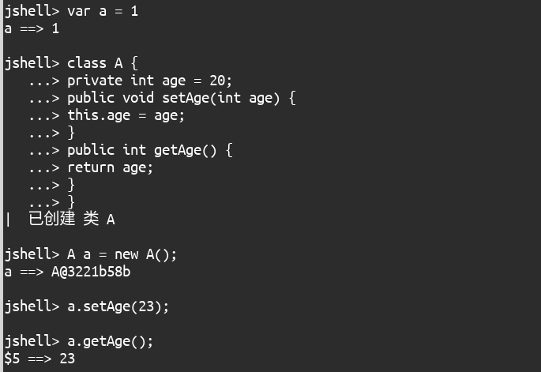

# jshell

```shell
jsell
# 直接输入Java代码

# 单行
var a = 1

# 多行
class A {
   ...> private int age = 20;
   ...> public void setAge(int age) {
   ...> this.age = age;
   ...> }
   ...> public int getAge() {
   ...> return age;
   ...> }
   ...> }

A a = new A();

a.setAge(23);

a.getAge();
```



# 类型推断（var）

```java
var a = "abc";
a = "bcd";

var b = new ArrayList<String>();
b.add(a);
//b.add(12); // error

Thread t = new Thread(() -> System.out.println(Thread.currentThread().getName()));
t.start();
//t.run();

Consumer<String> consumer1 = c -> System.out.println(c.toUpperCase());
Consumer<String> consumer2 = (var c) -> System.out.println(c.toUpperCase());
Consumer<String> consumer3 = (@Deprecated var c) -> System.out.println(c.toUpperCase()); // 添加注解
```

> var语法：局部变量的类型推断。
>
> PS：
>
> 1. var a; // 这样不可以，因为法务推断。
> 2. 类的属性的数据类型不可以使用var。

# 集合（Array/Set）

```java
public static void test1() {
    List<String> list1 = Arrays.asList("a", "b", "ab", "ac");
    // list1.add("yy"); // 无法添加
    System.out.println(list1);

    List<String> list2 = List.of("a", "b", "ab", "ac");
    //list2.add("yy"); // 无法添加 /
    System.out.println(list2);
}

public static void test2() {
    LocalDate localDate = LocalDate.of(2021, 8, 23);
    System.out.println(localDate);

    Set<String> set1 = Set.of("1", "32", "3");
    System.out.println(set1);

    // Set<String> set2 = Set.of("1", "32", "3", "1");  // 无法添加重复数据
    // System.out.println(set2);

    Stream<String> stream = Stream.of("1", "32", "3", "1");
    System.out.println(Arrays.toString(stream.toArray()));
}
```

# 流（Stream）

```java
public static void test1() {
    Stream<Integer> stream1 = Stream.of(1, 3, 4, 6);
    //stream1.forEach(t -> System.out.println(t));
    stream1.forEach(System.out::println);

    Stream<Integer> stream2 = Stream.of();
    stream2.forEach(System.out::println);

    // 不能设为null
    //Stream<Integer> stream3 = Stream.of(null);
    //stream3.forEach(System.out::println);

    Stream<Integer> stream4 = Stream.ofNullable(null);
    stream4.forEach(System.out::println);
}

public static void test2() {
    Stream<Integer> stream1 = Stream.of(1, 3, 4, 6);
    // 按顺序取符合条件的数据，遇到false即会终止
    Stream<Integer> takeWhile = stream1.takeWhile(t -> t % 2 != 0);
    takeWhile.forEach(System.out::println);
    System.out.println("----------------");

    Stream<Integer> stream2 = Stream.of(1, 3, 4, 6);
    // 删除所有符合条件的数据
    Stream<Integer> dropWhile = stream2.dropWhile(t -> t % 2 != 0);
    dropWhile.forEach(System.out::println);
}

public static void test3() {
    // 无限迭代
    Stream<Integer> stream1 = Stream.iterate(1, t -> (t * 2) + 1);
    stream1.limit(10).forEach(System.out::println);

    // 有限迭代
    Stream<Integer> stream2 = Stream.iterate(1, t -> t < 1000, t -> (t * 2) + 1);
    stream2.forEach(System.out::println);
}
```

# 字符串（String）

```java
public static void test1() {
    String str = "  \t  \r\n 　 ";
    // 是否都是空白字符
    System.out.println(str.isBlank());

    str = "  \t  \r\n abc \t　";
    // 去除首尾空白，含半角、全角空白
    String strip = str.strip();
    System.out.println(strip);
    System.out.println(strip.length());
    // 去除首尾空白，全角不行
    String trim = str.trim();
    System.out.println(trim);
    System.out.println(trim.length());

    // 去除首部的空白
    String stripLeading = str.stripLeading();
    System.out.println(stripLeading);
    System.out.println(stripLeading.length());
    // 去除尾部的空白
    String stripTrailing = str.stripTrailing();
    System.out.println(stripTrailing);
    System.out.println(stripTrailing.length());
}

public static void test2() {
    String str = "Java";
    // 复制5次
    String repeat = str.repeat(5);
    System.out.println(repeat);

    str = "A\nB\nC";
    // 行统计
    long count = str.lines().count();
    System.out.println(count);
}

public static void test3() throws IOException {
    FileInputStream fis = new FileInputStream("src/org/zhoupb/jdk11/string/StringDemo.java");
    byte[] buffer = new byte[fis.available()];
    fis.read(buffer);
    fis.close();
    String str = new String(buffer);
    // 分行输出
    str.lines().forEach(System.out::println);
}
```

# Optional

```java
public static void test1() {
    Optional<String> optional = Optional.ofNullable(null);
    // 如果内部引用为空返回参数引用，否则返回内部引用
    // 无论是否为空orElse都会执行
    String str = optional.orElse("a");
    System.out.println(str);

    // 只有当为null时，orElseGet才会执行
    str = optional.orElseGet(() -> "b");
    System.out.println(str);

    // 当为null时，抛出异常
    str = optional.orElseThrow();
    System.out.println(str);
}
```

# InputStream

```java
public void test1() {
    var classLoader = this.getClass().getClassLoader();
    try (
        var is = classLoader.getResourceAsStream("file1.txt");
        var os = new FileOutputStream("file2.txt");
    ) {
        is.transferTo(os);
    } catch (IOException e) {
        e.printStackTrace();
    }
}
```

# HttpClient

```java
public static void syncTest() throws IOException, InterruptedException {
    HttpClient httpClient = HttpClient.newHttpClient();
    HttpRequest httpRequest = HttpRequest
        .newBuilder(URI.create("https://www.baidu.com"))
        .build();
    HttpResponse.BodyHandler<String> responseBodyHandler = HttpResponse.BodyHandlers.ofString();
    HttpResponse<String> httpResponse = httpClient.send(httpRequest, responseBodyHandler);
    String body = httpResponse.body();
    System.out.println(body);
}

public static void asyncTest() throws ExecutionException, InterruptedException {
    HttpClient httpClient = HttpClient.newHttpClient();
    HttpRequest httpRequest = HttpRequest
        .newBuilder(URI.create("https://www.baidu.com"))
        .build();
    HttpResponse.BodyHandler<String> responseBodyHandler = HttpResponse.BodyHandlers.ofString();
    CompletableFuture<HttpResponse<String>> completableFuture = httpClient.sendAsync(httpRequest, responseBodyHandler);
    HttpResponse<String> httpResponse = completableFuture.get();
    String body = httpResponse.body();
    System.out.println(body);
}
```

# 编译运行（java）

> 1. 支持运行单个Java源文件
> 2. 执行源文件中的第一个类，第一个类中必须包含main方法
> 3. 可以引用别的源文件中的自定义类，本文件内德自定义类是可以的

# GC

> -XX:+UnlockExperimentalVMOptions -XX:+UseEpsilonGC
>
> -XX:+UnlockExperimentalVMOptions -XX:+UseZGC

# Java Flight Recorder

```shell
jcmd <pid> JFR.start
jcmd <pid> JFR.dump filename=recording.jfr name=1
jcmd <pid> JFR.stop [name=1]
```


