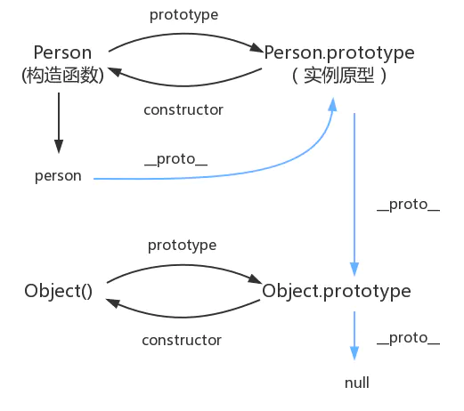

# 1、什么是JavaScript

## 1.1、概述

​		JavaScript是一门时界山最流行的脚本语言。

​		JavaScript（简称“JS”） 是一种具有函数优先的轻量级，解释型或即时编译型的编程语言。虽然它是作为开发Web页面的脚本语言而出名，但是它也被用到了很多非浏览器环境中，JavaScript 基于原型编程、多范式的动态脚本语言，并且支持面向对象、命令式、声明式、函数式编程范式。

## 1.2、历史

​		JavaScript在1995年由Netscape公司的Brendan Eich，在网景导航者浏览器上首次设计实现而成。因为Netscape与Sun合作，Netscape管理层希望它外观看起来像Java，因此取名为JavaScript。但实际上它的语法风格与Self及Scheme较为接近。 
​		JavaScript的标准是ECMAScript 。截至 2012 年，所有浏览器都完整的支持ECMAScript 5.1，旧版本的浏览器至少支持ECMAScript 3 标准。2015年6月17日，ECMA国际组织发布了ECMAScript的第六版，该版本正式名称为 ECMAScript 2015，但通常被称为ECMAScript 6 或者ES2015。

# 2、快速入门

## 2.1、引入JS方式

1. 内部标签

   ```html
   <script>
       alert('Hello World!')
   </script>
   ```

2. 外部引入

   ```html
   <script src="js/helloworld.js"></script>
   ```

## 2.2、基本语法入门

```html
<!DOCTYPE html>
<html lang="en">
<head>
    <meta charset="UTF-8">
    <title>Title</title>
</head>
<body>

<script>
    // 1. 定义常量
    var num = 1;

    // 2. 条件控制
    if (2 > 1) {
        if (2 > 1) {

        } else if (3 > 1) {

        } else {

        }
    }
</script>
</body>
</html>
```

## 2.3、数据类型

> 数值、文本、图形、音频、视频…

1. 数字（number）

   ```js
   123; // 整数
   123.1 // 浮点
   1.123e3; // 科学计数
   -99; // 负数
   NaN; // not a number
   Infinity; // 无限大
   ```

2. 字符串

   ```js
   ‘abc'
   "abc"
   ```

3. 布尔值

   ```js
   true
   false
   ```

4. 逻辑运算

   ```js
   && // 逻辑与
   || // 逻辑或
   !  // 非
   ```

5. 比较运算符

   ```js
   =   // 赋值
   ==  // 等于（值相同，但类型不一定相同）
   === // 绝对等于（类型、值均相同）
   
   // 尽量不适用==比较
   NaN === NaN // false
   isNaN(NaN) // true
   
   // 浮点数问题，存在精度问题
   (1 / 3) === (1 - 2 / 3) // false
   ```

6. null 和 undefined

   * null 空
   * undefined 未定义

7. 数组

   ```js
   var arr = [1, 3, 'hello', null, true];
   var arr = new Array(1, 3, 'hello', null, true);
   console.log(arr[100]); // undefined
   ```

8. 对象

   ```js
   var person = {
       name: 'js',
       age: 10,
       tags: ['js', 'javascript']
   }
   person.name
   person['age']
   ```

## 2.4、严格检查模式

```js
// 放到js第一行有效
'use strict';
i = 0; // error
```

# 3、数据类型

## 3-1、字符串

1. 单/双引号（优先单引号）

   ```js
   'use strict';
   // 单/双引号（优先单引号）
   console.log('a' + "b");
   ```

2. \转义字符

   ```js
   'use strict';
   // \u：unicode字符
   // \x：ascii字符
   console.log('a\nb\tc\u4e2d\x41');
   ```

3. 多行字符串

   ```js
   'use strict';
   let s = `
       hello
       js
   `;
   console.log(s);
   ```

4. 模板字符串

   ```js
   'use strict';
   let name = 'JavaScript';
   const msg = `Hello, ${name}`;
   console.log(msg);
   ```

5. 字符串长度

   ```js
   'use strict';
   console.log(name.length);
   ```

6. 字符串的可变性

   ```js
   //'use strict';
   name[0] = 1;
   console.log(name); // JavaScript --> 不可变
   ```

7. 大小写转换

   ```js
   'use strict';
   console.log(name.toUpperCase());
   console.log(name.toLowerCase());
   ```

8. 获取位置

   ```js
   'use strict';
   console.log(name.indexOf('S')); // 4
   ```

9. 截取字符串[m, n)

   ```js
   'use strict';
   // 从第一个开始最最后一个
   console.log(name.substring(1));
   // [m, n) 从第一个开始到第五个(不包含第五个字符)
   console.log(name.substring(1, 5));
   ```

## 3-2、数组

> Array可以包含任意的数据类型

1. 数组长度

   ```js
   let arr = [1, '2', true, null, '2'];
   // 数组长度
   console.log(arr.length); // 5
   
   // 如果给arr.length赋值，数组大小会发生变化
   arr.length = 10;
   console.log(arr.length); // 10
   ```

2. 获取下标

   ```js
   console.log(arr.indexOf(2)); // -1
   console.log(arr.indexOf('2')); // 1
   ```

3. 截取数组部分，返回一个新数组

   ```js
   console.log(arr.slice(1, 2)); // [1, 2)
   ```

4. 尾部添加（push）、尾部删除（pop）

   ```js
   // 尾部添加
   arr.push('c');
   console.log(arr);
   
   // 尾部删除
   arr.pop();
   console.log(arr);
   ```

5. 头部添加（unshift），头部删除（shift）

   ```js
   // 头部添加
   arr.unshift('a', 'b');
   console.log(arr);
   
   // 头部删除
   arr.shift();
   console.log(arr);
   ```

6. 排序（sort）

   ```js
   arr.sort();
   console.log(arr);
   ```

7. 元素反转（reverse）

   ```js
   arr.reverse();
   console.log(arr);
   ```

8. 数组拼接（concat）

   ```js
   // 返回新数组
   const arr1 = arr.concat(['1', '23']);
   console.log(arr1);
   ```

9. join连接符

   ```js
   console.log(arr.join('-'));
   ```

10. 多维数组

    ```js
    let a = [[1, 3], [3, 5], ['5', '6']];
    console.log(a[1][1]); // 5
    ```

11. map

    ```js
    let numbers = [1, 4, 9];
    const roots = numbers.map((value, index, array) => {
        return Math.sqrt(value)
    })
    console.log(roots);
    // roots的值为[1, 2, 3], numbers的值仍为[1, 4, 9]
    ```

12. find/findIndex

    ```js
    let items = [
        {name: 'apples', quantity: 2},
        {name: 'bananas', quantity: 0},
        {name: 'cherries', quantity: 5}
    ];
    const item = items.find((value, index, obj) => {
        return value.name === 'bananas';
    })
    console.log(item); // {name: "bananas", quantity: 0}
    const index = items.findIndex((value, index, obj) => {
        return value.name === 'bananas';
    })
    console.log(index); // 1
    ```

13. flat([depth])，depth默认1

    ```js
    let arr = [1, 2, [3, 4]];
    let newArr = arr11.flat();
    console.log(newArr); // [1, 2, 3, 4]
    ```

14. some 是否至少有1个元素符合，返回boolean

    ```js
    [2, 5, 8, 1, 4].some(x => x > 10);  // false
    [12, 5, 8, 1, 4].some(x => x > 10); // true
    ```

15. every 所有元素是否符合，返回boolean

    ```js
    [12, 5, 8, 130, 44].every(x => x >= 10); // false
    [12, 54, 18, 130, 44].every(x => x >= 10); // true
    ```

16. filter 过滤

    ```js
    let filtered = [12, 5, 8, 130, 44].filter(x => x >= 10);
    console.log(filtered);
    ```

17. reduce 结果汇总

    ```js
    let sum = [0, 1, 2, 3, 4].reduce((accumulator, currentValue, currentIndex, array) => {
        return accumulator + currentValue;
    }, -1);
    console.log(sum);
    ```

18. splice 删除/替换元素

    ```js
    let myFish = ['angel', 'clown', 'mandarin'];
    myFish.splice(1, 0, "drum"); // ["angel", "drum", "clown", "mandarin"]
    // myFish.splice(1, 1, "drum"); // ["angel", "drum", "mandarin"]
    myFish.splice(2, 1); // ["angel", "drum", "mandarin"]
    ```

19. includes(valueToFind[, fromIndex])

    ```js
    [1, 2, 3].includes(2);     // true
    [1, 2, 3].includes(4);     // false
    [1, 2, 3].includes(3, 3);  // false
    [1, 2, 3].includes(3, -1); // true
    [1, 2, NaN].includes(NaN); // true
    ```

## 3-3、对象

> 若干键值对

```js
let person = {
    name: 'js',
    age: 3,
    email: '999293@qq.com',
    score: 0
}
```

1. 对象赋值

   ```js
   person.name = 'JavaScript';
   console.log(person.name);
   ```

2. 获取不存在的属性值

   ```js
   person.haha; // undefined
   ```

3. 动态删减属性

   ```js
   delete person.name;
   console.log(person);
   ```

4. 动态添加

   ```js
   person.haha = 'haha';
   console.log(person);
   ```

5. 判断属性是否存在

   ```js
   console.log('age' in person); // true
   console.log('toString' in person); // true
   ```

6. 判断属性是否自身所拥有

   ```js
   console.log(person.hasOwnProperty('age')); // true
   console.log(person.hasOwnProperty('toString')); // false
   ```

## 3-4、流程控制

1. if判断

   ```js
   if () {
       
   } else if () {
              
   } else {
       
   }
   ```

2. while循环

   ```js
   while () {
          
   }
   
   do {
       
   } while()
   ```

3. for循环

   ```js
   for (let i = 0; i < 100; i++) {
           
   }
   ```

4. forEach循环

   ```js
   const arr = [11, 12, 15, 11 , 55, 55];
   arr.forEach((value, index, array) => {
       console.log(value, index, array)
   })
   ```

5. for…in循环

   ```js
   for (let key in arr) {
       if (arr.hasOwnProperty(key)) {
       	console.log(arr[key])
       }
   }
   ```

6. for…of循环

   ```js
   for (let data of arr) {
       console.log(data)
   }
   ```

## 3-5、Map和Set

* Map

  ```js
  let map = new Map([['tom', 73], ['jack', 88]]);
  // get
  const name = map.get('tom');
  // set
  map.set('admin', 89);
  ```

* Set：无序不重复

  ```js
  let set = new Set([1, 3, 4, 3, 1, 3]);
  console.log(set); // {1, 3, 4}
  // add
  set.add(8);
  // delete
  set.delete(1);
  // has
  set.has(3);
  ```

## 3-6、iterator

```js
// 遍历数组
const arr = [3, 4, 5];
for (let data of arr) {
    console.log(data);
}

// 遍历Map
const map = new Map([['tom', 77], ['Jack', 88]]);
for (const x of map) {
    console.log(x);
}

// 遍历Set
const set = new Set([4, 5, 6]);
for (const x of set) {
    console.log(x);
}
```

# 4、函数

## 4-1、函数定义

1. 定义方式

   ```js
   // 方式一
   function abs(x) {
       if (x >= 0) {
           return x;
       } else {
           return -x;
       }
   }
   
   // 方式二
   const abs = function (x) {
       
   }
   ```

2. 未传参数处理

   ```js
   const abs = function (x) {
       if (typeof x !== 'number') {
           throw 'x is not a number'
       }
   }
   ```

3. arguments

   ```js
   let abs = function (x) {
       for (let i = 0; i < arguments.length; i++) {
           console.log(arguments[i])
       }
   }
   abs('a', 'c', 'd');
   ```

4. rest

   > 获取除了已经定义的参数之外的参数

   ```js
   let sum = function (a, b, ...rest) {
       console.log(a, b);
       console.log(rest);
   }
   sum(1, 2, 3, 4, 5); // 1, 2 // [3, 4, 5]
   ```

## 4-2、变量的作用域

1. 函数内部变量不允许访问

   ```js
   function xx() {
       let x = 1;
       x = x + 1;
   }
   
   x = x + 2; // ReferenceError: x is not defined
   ```

2. 内部函数可以访问外部函数的成员

   ```js
   function xx() {
       let x = 1;
   
       // 内部函数可以访问外部函数的成员
       function yy() {
           let y = x + 2;
       }
   
       // 外部函数无法访问内部函数成员
       let z = y + 3;
   }
   
   xx(); // ReferenceError: y is not defined
   ```

3. 内外函数互不干扰（重名变量）

   ```js
   function mm() {
       let x = 1;
   
       (function nn() {
           let x = 'A';
           console.log('inner-x: ', x);
       })();
   
       console.log('outer-x: ', x)
   }
   mm();
   ```

4. 全局函数

   ```js
   let x = 1;
   function fn() {
       console.log(x)
   }
   fn();
   console.log(x);
   ```

   全局对象window

   ```js
   let x = 1;
   console.log(x) // 1
   console.log(window.x) // 1
   // 默认所有全局变量都会绑定到window对象上
   ```

5. 规范

   由于所有的全局变量都会绑定到window上，那么如果不同的js文件，使用了相同的变量名，就会发生冲突。

   ```js
   let App = {};
   App.name = 'JavaScript';
   App.sum = function(a, b) {
       return a + b;
   }
   ```

## 4-3、方法

1. 定义方法

   ```js
   let App = {
       name: 'JS',
       birth: 2000,
       age: function () {
           let year = new Date().getFullYear();
           return year - this.birth;
       }
   }
   console.log(App.age());
   ```

2. apply

   this默认指向调用它的对象，apply可以控制this指向

   ```js
   function getAge() {
       let year = new Date().getFullYear();
       return year - this.birth;
   }
   
   let App = {
       name: 'JS',
       birth: 2000,
       age: getAge
   }
   console.log(getAge());
   console.log(getAge.apply(App));
   ```

# 5、内部对象

> 标准对象

```js
typeof 123
"number"

typeof NaN
"number"

typeof '123'
"string"

typeof true
"boolean"

typeof []
"object"

typeof {}
"object"

typeof Math.abs
"function"

typeof undefined
"undefined"

typeof null
"object"
```

## 5.1、Date

1. 基本使用

   ```js
   let now = new Date(); // Sun Aug 22 2021 10:45:52 GMT+0800 (中国标准时间)
   console.log(now);
   now.getFullYear(); // 年
   now.getMonth(); // 月 0~11
   now.getDate(); // 日
   now.getDay(); // 星期
   now.getHours(); // 时
   now.getMinutes(); // 分
   now.getSeconds(); // 秒
   now.getMilliseconds(); // 毫秒
   now.getTime(); // 时间戳
   ```

2. 转换

   ```js
   let now = new Date(); 
   now.toLocaleString(); //"2021/8/22 上午11:00:31"
   now.toGMTString(); //"Sun, 22 Aug 2021 03:00:31 GMT"
   ```

## 5-2、JSON

> 什么是JSON

* JSON(JavaScript Object Notation, JS 对象简谱) 是一种轻量级的数据交换格式。
* 基于 ECMAScript (欧洲计算机协会制定的js规范)的一个子集，采用完全独立于编程语言的文本格式来存储和表示数据。
* 简洁和清晰的层次结构使得 JSON 成为理想的数据交换语言。 
* 易于人阅读和编写，同时也易于机器解析和生成，并有效地提升网络传输效率。

1. JSON字符串和JS对象转换

   ```js
   let user = {
       name: 'JS',
       age: 23,
       sex: '男'
   };
   
   // {"name":"JS","age":23,"sex":"男"}
   let jsonStr = JSON.stringify(user);
   
   // {name: "JS", age: 23, sex: "男"}
   let parseUser = JSON.parse(jsonStr);
   ```

## 5-3、Ajax

* 原生js写法，xhr异步请求

  ```js
  const xhr = new XMLHttpRequest();
  xhr.open('GET', `url`, true|false);
  //xhr.setRequestHeader('Authorization', `bearer xxx`)
  xhr.send(null)
  JSON.parse(xhr.responseText)
  ```

* jQuery框架封装的方法

* axios请求

# 6、面向对象编程

## 6-1、面向对象

* 类：模板
* 对象：具体的实例

1. 原型：

   ```js
   let Student = {
       name: 'js',
       age: 3,
       run: function () {
           console.log(this.name + ' run...')
       }
   }
   
   let Bird = {
       fly: function () {
           console.log(this.name + ' run...')
       }
   }
   
   let person = {
       name: '小明'
   }
   //person.__proto__ = Student;
   person.__proto__ = Bird;
   person.fly();
   ```

2. class定义

   ```js
   // ES6之前的方式
   function Student(name) {
       this.name = name;
   }
   Student.prototype.run = function () {
       console.log(this.name + ' run...')
   }
   new Student('A').run();
   
   // ES6后
   class Student {
       constructor(name) {
           this.name = name
       }
   
       run() {
           console.log(this.name + ' run...')
       }
   }
   new Student('A').run();
   ```

3. class继承

   ```js
   class Student {
       constructor(name) {
           this.name = name
       }
   
       run() {
           console.log(this.name + ' run...')
       }
   }
   
   class Person extends Student {
       constructor(name, age) {
           super(name);
           this.age = age
       }
   
       run() {
           console.log(`name: ${this.name}, age: ${this.age}`)
       }
   }
   
   new Person('A', 11).run();
   ```

4. 原型链

   `__proto__`




