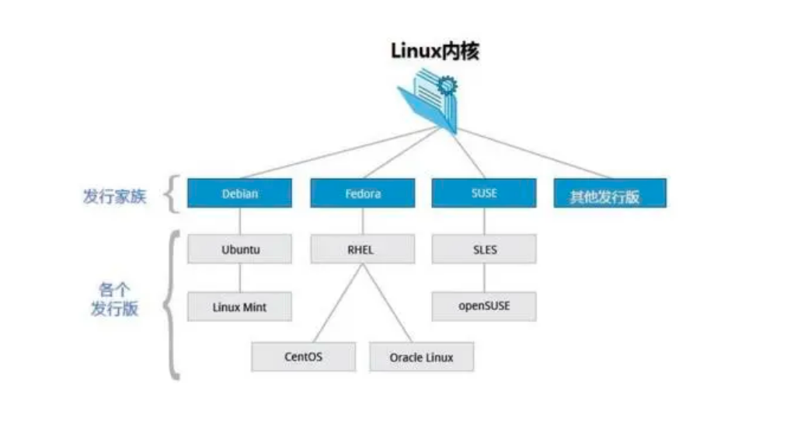
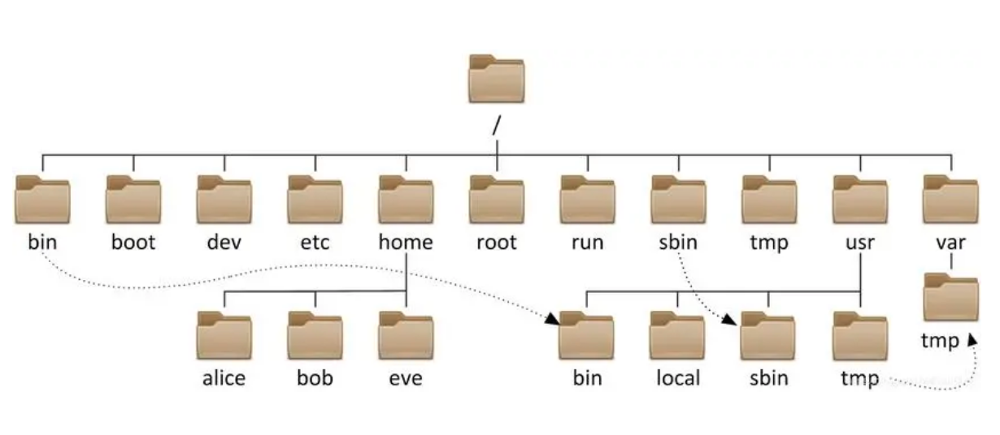
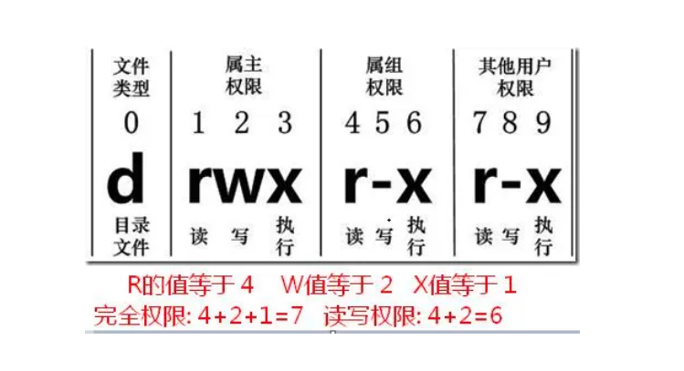
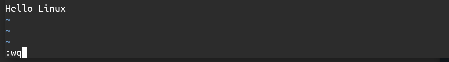
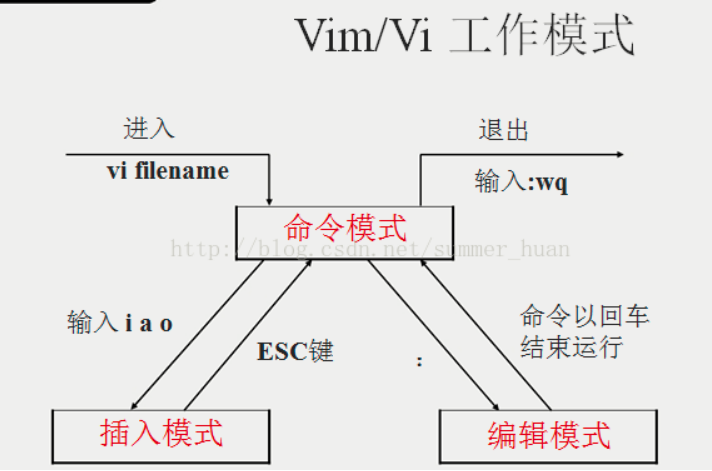

# Linux发行版



# 关机指令

```shell
# 数据由内存同步到硬盘
sync

# 关机指令
shutdown

# 10分钟后关机
shutdown -h 10

# 立刻关机
shutdown -h now

# 系统会在今天20:25关机
shutdown -h 20:25

# 十分钟后关机
shutdown -h +10

# 系统立马重启
shutdown -r now

# 系统十分钟后重启
shutdown -r +10

# 重启，等同于shutdown -r now
reboot

# 关闭系统，等同于shutdown -h now 和 poweroff
halt
```

> 不管重启系统还是关闭系统，记得首先运行`sync`命令，把内存中的数据写入磁盘中。

# 系统目录结构

1. 一切皆文件

2. 根目录/，所有文件都挂载在这个节点下

   ```shell
   ╭─    ~/workspace/Linux ·························· ✔  at 21:52:54  ─╮
   ╰─ ls /                                                                   ─╯
   bin    dev   lib    libx32      mnt   root  snap      sys  var
   boot   etc   lib32  lost+found  opt   run   srv       tmp
   cdrom  home  lib64  media       proc  sbin  swapfile  usr
   ```

   

3. 树状目录结构

   

   * **/bin**：bin是Binary的缩写，这个目录存放着最常使用的命令
   * **/boot**：这里存放的是启动Linux时使用的一些核心文件，包括一些连接文件及镜像文件
   * **/dev**：dev是Device（设备）的缩写，存放的是Linux外部设备，在Linux中访问设备的方式和访问文件的方式是相同的
   * **/etc**：这个目录用来存放所有的系统管理所需要的配置文件和子目录
   * **/home**：用户的主目录，在Linux中，每个用户都有一个自己的目录，一般该目录名是以用户的帐号命名的
   * **/lib**：这个目录存放着系统最基本的动态链接共享库，起作用类似于Windwos里的DLL文件
   * **/lost+found**：这个目录一般情况下是空的，当系统非法关机后，这里就存放了一些文件。
   * **/media**：Linux系统会自动识别一些设备，例如U盘、光驱等，当识别后，Linux会把识别的设备挂载到这个目录下
   * **/mnt**：系统提供该目录是为了让用户临时挂载别的文件系统的，可以将光驱挂载在/mnt上，然后进入该目录就可以查看光驱里的内容了
   * **/opt**：这里是给主机额外安装软件的目录。类似windows下的D:/Program Files
   * **/proc**：这个目录是一个虚拟目录，它是系统内存的映射，可以通过直接访问这个目录来获取系统信息
   * **/root**：该目录为系统管理员，也称作超级权限者的用户住目录
   * **/sbin**：s就是Super User的意思，这里存放的是系统管理员使用的系统管理程序
   * **/srv**：该目录存放一些服务启动之后需要提取的数据
   * **/sys**：这里是Linux2.6内核的一个很大的变化。该目录下安装了2.6内核新出现的一个文件系统sysfs
   * **/tmp**：这个目录用来存放一些临时文件
   * **/usr**：这里是一个非常重要的目录，用户的很多应用程序和文件都放在这个目录，类似windows下的C:/Program Files
   * **/usr/bin**：系统用户使用的应用程序
   * **/usr/sbin**：超级用户使用的比较高级的管理程序和系统守护程序。Super
   * **/var**：这个目录存放者不断扩充着的东西，我们习惯将那些经常被修改的目录放到这个目录下，包括各种日志文件
   * **/run**：是一个临时文件系统，存储系统启动以来的信息，当系统重启时，这个目录下文件应该被删掉或清除
   * **/www**：存放服务器网站相关的资源、环境、网站项目

# 常用命令

## 目录管理

> cd 命令

* cd ：切换目录
* ./：当前目录
* cd ..：返回上一级目录

```shell
╭─    /home ········································· ✔  at 21:56:04  ─╮
╰─ cd /home/zhoupb                                                           ─╯

╭─    ~ ············································· ✔  at 21:56:11  ─╮
╰─ cd ..                                                                     ─╯
```

> ls 列出目录

* -a：all，查看全部的文件，包括隐藏文件
* -l：列出所有文件，包含文件的属性及权限，没有隐藏文件

```shell
╭─    ~/workspace/doc/Linux ························· ✔  at 21:04:53  ─╮
╰─ ls -al                                                                    ─╯
总用量 16
drwxrwxr-x 3 zhoupb zhoupb 4096 8月   8 21:03 .
drwxrwxr-x 4 zhoupb zhoupb 4096 8月   8 16:40 ..
drwxrwxr-x 2 zhoupb zhoupb 4096 8月   8 20:41 README.assets
-rw-rw-r-- 1 zhoupb zhoupb 3798 8月   8 21:03 README.md
```

> mkdir(Make Directory) 创建目录 `make -p #创建父级目录`
>
> touch 创建文件

```shell
╭─    ~/workspace ·································· ✔  at 21:51:23  ─╮
╰─ mkdir Linux                                                              ─╯

╭─    ~/workspace ·································· ✔  at 21:51:32  ─╮
╰─ cd Linux                                                                 ─╯

╭─    ~/workspace/Linux ···························· ✔  at 21:51:42  ─╮
╰─ touch README.md                                                          ─╯

╭─    ~/workspace/Linux ·························· 1 ✘  at 21:52:48  ─╮
╰─ mkdir -p test/test1/test2                                                ─╯
```

> pwd(Print Working Directory) 显示当前所在的目录

```shell
╭─    ~/workspace/doc/Linux ························· ✔  at 21:56:49  ─╮
╰─ pwd                                                                       ─╯
/home/zhoupb/workspace/doc/Linux
```

> rmdir(Remove Directory ) 删除目录

```shell
╭─    ~/workspace/doc/Linux ······················· 1 ✘  at 22:05:54  ─╮
╰─ rmdir test1                                                               ─╯

╭─    ~/workspace/doc/Linux ························· ✔  at 22:06:29  ─╮
╰─ rmdir -p test/test1/test2                                                 ─╯
```

> cp(Copy file)  复制目录或文件 `cp <源目标> <目的地>`

```shell
╭─    ~/workspace/doc/Linux ························· ✔  at 22:20:31  ─╮
╰─ cp README.md README.assets/                                               ─╯
```

> rm(remove) 删除文件
>
> -f, --force 忽略不存在的文件，不会出现警告，强制删除
>
> -r, --recursive 递归删除目录
>
> -i, --interactive 进行交互式删除

```shell
╭─    ~/workspace/doc/Linux ························· ✔  at 20:00:46  ─╮
╰─ rm -rf test.txt                                                           ─╯
```

> mv(move file) 移动文件或目录 [重命名文件]
>
> -f 强制
>
> -u 只替换更新过的文件

```shell
╭─    ~/workspace/doc/Linux ························· ✔  at 20:07:49  ─╮
╰─ mv test.txt README.assets                                                 ─╯

╭─    ~/workspace/doc/Linux/README.assets ··········· ✔  at 20:08:39  ─╮
╰─ mv test.txt test2.txt                                                     ─╯
```

## 基本属性

> 文件属性


boot文件的第一个属性用“d”表示，“d”在Linux中代表该文件是一个目录文件。

在Linux中第一个字符代表这个文件是目录、文件、或链接文件等等：

* 当为[ d ]则是目录
* 当为[ - ]则是文件
* 若是[ l ]则表示为链接文档(link file)
* 若是[ b ]则表示为装置文件里面的可供储存的接口设备（可随机存取装置）
* 若是[ c ]则表示为装置文件里面的串行端口设备，例如键盘、鼠标（一次性读取装置）

接下来的字符中，以三个为一组，且均为「rwx」的三个参数的组合。

其中，[ r ]代表可读(read)、[ w ]代表可写(write)、[ x ]代表可执行(excute)。

要注意的是，这三个权限的位置不会改变，如果没有全新啊，就会出现减号[ - ]而已。

每个文件的属性由左边第一部分的10各字符来确定（如下图）：



从左到右用0-9这些数字表示。

第0位确定文件类型，第1-3确定属主（该文件所有者）拥有该文件的权限，第4-6位确定属组（所有者的同组用户）拥有该文件的权限，第7-9位确定其他用户拥有该文件的权限。

其中：

第1、4、7位表示读权限，如果用"r"字符表示，则有读权限，如果用“-”字符表示，则没有读权限；

第2、5、8位表示写权限，如果用"w"字符表示，则有写权限，如果用“-”字符表示，则没有写权限；

第3、7、9位表示可执行权限，如果用"x"字符表示，则有执行权限，如果用“-”字符表示，则没有执行权限。

对于文件来说，它都有一个特定的所有者，也就是对该文件具有所有权的用户。

同时，在Linux系统中，用户是按组分类的，一个用户属于一个或多个组。

文件所有者以外的用户又可以分为文件所有者的同组用户和其他用户。

因为，Linux系统按文件所有者、文件所有者同组用户和其他用户来规定了不同的文件访问权限。

> 修改文件属性

1. chgrp：更改文件属组

`chgrp [-R] 属组名 文件名  #  [-R]：递归更改文件属组`

2. chown：更改文件属主，也可以同时更改文件属组

`chown [-R] 属主名 文件名`

`chown [-R] 属主名:属组名 文件名`

3. ==chmod：更改文件9个属性==

`chmod [-R] xyz 文件或目录`

Linux文件属性有两种设置方法，一种是数字，一种是符号。

Linux文件的基本权限就有九个，分别是owner/group/others三种身份各有自己的read/write/execute权限。

文件的权限字符为：「-rwxrwxrwx」，这九个权限是三个三个一组的，我们也可以使用数字来代替各个权限，对照比如下：

`r: 4        w:        2        x: 1`

每种身份(owner/group/others)各自的三个权限(r/w/x)分数是需要累加的，例如当权限为：[-rwxrwx---]分数则是：

* owner = rwx = 4+2+1 = 7
* group = rwx = 4+2+1 = 7
* others = --- = 0+0+0 = 0

`chmod 770 <filename>`

## 文件内容查看

LInux系统中使用以下命令来查看文件内容：

* cat(catenate)由第一行开始显示文件内容

```shell
╭─    /etc/profile.d ································ ✔  at 22:13:59  ─╮
╰─ cat openj9-jdk.sh                                                         ─╯
export JAVA_HOME=/opt/dev/jdk8u302-b08
export JRE_HOME=$JAVA_HOME/jre
export CLASSPATH=.:$JAVA_HOME/lib:$JRE_HOME/lib:$CLASSPATH
export PATH=$JAVA_HOME/bin:$JRE_HOME/bin:$PATH
```

* tac从最后一行开始显示（cat倒者写就是tac！）

```shell
╭─    /etc/profile.d ···································  at 22:14:07  ─╮
╰─ tac openj9-jdk.sh                                                         ─╯
export PATH=$JAVA_HOME/bin:$JRE_HOME/bin:$PATH
export CLASSPATH=.:$JAVA_HOME/lib:$JRE_HOME/lib:$CLASSPATH
export JRE_HOME=$JAVA_HOME/jre
export JAVA_HOME=/opt/dev/jdk8u302-b08
```

* nl(Number of Lines)显示的时候，顺带输出行号

```shell
╭─    /etc/profile.d ································ ✔  at 22:15:54  ─╮
╰─ nl openj9-jdk.sh                                                          ─╯
     1	export JAVA_HOME=/opt/dev/jdk8u302-b08
     2	export JRE_HOME=$JAVA_HOME/jre
     3	export CLASSPATH=.:$JAVA_HOME/lib:$JRE_HOME/lib:$CLASSPATH
     4	export PATH=$JAVA_HOME/bin:$JRE_HOME/bin:$PATH

```

* more一页一页的显示文件内容（空格：翻页；回车：向下一行；:f：显示当前所在行）

```shell

╭─    /etc/profile.d ···················· ✔ took 7s   at 22:32:27  ─╮
╰─ more vte-2.91.sh                                                         ─╯
# Copyright © 2012 Christian Persch
#
# This program is free software: you can redistribute it and/or modify
# it under the terms of the GNU General Public License as published by
# the Free Software Foundation, either version 3 of the License, or
# (at your option) any later version.
#
# This program is distributed in the hope that it will be useful,
# but WITHOUT ANY WARRANTY; without even the implied warranty of
# MERCHANTABILITY or FITNESS FOR A PARTICULAR PURPOSE.  See the
# GNU General Public License for more details.
#
# You should have received a copy of the GNU General Public License
# along with this program.  If not, see <http://www.gnu.org/licenses/>.

# Not bash or zsh?
[ -n "$BASH_VERSION" -o -n "$ZSH_VERSION" ] || return 0

# Not an interactive shell?
[[ $- == *i* ]] || return 0

# Not running under vte?
[ "${VTE_VERSION:-0}" -ge 3405 ] || return 0
--更多--(64%)
```

* less与more类似，但是比more更好的是可以往前翻页（空格翻页，上下键翻动页，q：退出，向下查询用/，向上查询用?，用n继续搜索下一个，N上寻找）

```shell
╭─    /etc/profile.d ················ ✔  took 2m 20s   at 14:45:02  ─╮
╰─ less vte-2.91.sh                                                          ─╯
```

* head只看头几行，通过-n参数控制显示几行

```shel
╭─    /etc/profile.d ··················· ✔  took 12s   at 14:45:46  ─╮
╰─ head vte-2.91.sh                                                         ─╯
# Copyright © 2012 Christian Persch
#
# This program is free software: you can redistribute it and/or modify
# it under the terms of the GNU General Public License as published by
# the Free Software Foundation, either version 3 of the License, or
# (at your option) any later version.
#
# This program is distributed in the hope that it will be useful,
# but WITHOUT ANY WARRANTY; without even the implied warranty of
# MERCHANTABILITY or FITNESS FOR A PARTICULAR PURPOSE.  See the
```

* tail只看尾巴几行，通过-n参数控制显示几行

```shell
╭─    /etc/profile.d ································ ✔  at 14:46:23  ─╮
╰─ tail vte-2.91.sh                                                          ─╯
}

case "$TERM" in
  xterm*|vte*)
    [ -n "$BASH_VERSION" ] && PROMPT_COMMAND="__vte_prompt_command"
    [ -n "$ZSH_VERSION"  ] && precmd_functions+=(__vte_osc7)
    ;;
esac

true
```

可以使用man [命令]来查看各个命令的使用文档，如：man cp

> Linux链接
> 链接分为两种：硬链接、软链接；用`ln`命令
>
> 硬链接：A—B，假设B是A的硬链接，那么他们指向了同一个文件，允许一个文件拥有多个路径，用户可以通过这种机制建立硬链接到一些重要文件上，防止误删。
>
> 软链接：类似Windows下的快捷方式，删除源文件，快捷方式也就访问不了了。
>
> echo  xxx [>> file] 输入字符串

```shell
# 创建f1
╭─    ~/workspace/doc/Linux ·························  ✘  at 17:14:32  ─╮
╰─ touch f1                                                                  ─╯

# 创建硬链接
╭─    ~/workspace/doc/Linux ························· ✔  at 17:14:51  ─╮
╰─ ln f1 f2                                                                  ─╯

# 创建软链接
╭─    ~/workspace/doc/Linux ·························  ✘  at 17:15:12  ─╮
╰─ ln -s f1 f3                                                               ─╯

# 输入字符串到f1，如果向f2中写入在f1中也能查看到
╭─    ~/workspace/doc/Linux ························· ✔  at 17:16:29  ─╮
╰─ echo "I Love Linux" >> f1                                                 ─╯

╭─    ~/workspace/doc/Linux ························· ✔  at 17:16:53  ─╮
╰─ cat f1                                                                    ─╯
I Love Linux

╭─    ~/workspace/doc/Linux ························· ✔  at 17:16:55  ─╮
╰─ cat f2                                                                    ─╯
I Love Linux

╭─    ~/workspace/doc/Linux ························· ✔  at 17:17:05  ─╮
╰─ cat f3                                                                    ─╯
I Love Linux

# 删除f1
╭─    ~/workspace/doc/Linux ························· ✔  at 17:28:14  ─╮
╰─ rm -rf f1                                                                 ─╯

# f2内容依然存在
╭─    ~/workspace/doc/Linux ························· ✔  at 17:29:01  ─╮
╰─ cat f2                                                                    ─╯
I Love Linux

# f3已经无法查看内容了
╭─    ~/workspace/doc/Linux ························· ✔  at 17:29:05  ─╮
╰─ cat f3                                                                    ─╯
cat: f3: 没有那个文件或目录
```

## VIM编辑器

>https://www.vim.org

> 三种模式

基本上vi/vim分为三种模式，分别是命令模式（Command mode），输入模式（Insert mode）和底线命令模式（Last line mode）。这三种模式的作用分别是：

**命令模式：**

用户刚刚启动vi/vim，便进入了命令模式。

此状态下敲击键盘动作会被Vim识别为命令，而非输入法字符。

以下是常用的几个命令：

* i 切换到输入模式，以输入字符
* x 删除当前光标所在处的字符
* : 切换底线命令模式，以在最低一行输入命令

若想要编辑文本：启动Vim，进入命令模式，按下i，切换到输入模式。

命令模式只有一些最基本的命令，因此仍要依靠底线命令模式输入更多命令，

**输入模式：**

在命令模式下按下i就进入了输入模式。

在输入模式中，可以使用以下按键：

* 字符按键以及Shift组合，输入字符 
* ENTER，  回车键，换行
* BACK SPACE，退格键，删除光标前一个字符
* DEL，删除键，删除光标后一个字符
* 方向键，在文本中移动光标
* HOME/END，移动光标到行首/行尾
* Page Up/Page Down，上下翻页
* Insert，切换光标为输入/替换模式，光标变成竖线/下划线
* ESC，退出输入模式，切换到命令模式

**底线命令模式：**

在命令模式下按下:（英文状态）就进入了底线命令模式。


底线命令模式可以输入单个或多个字符的命令。

底线命令中，基本的命令有：

* q 退出程序
* w 保存文件



按ESC键可随时退出底线命令模式。

简单的说，我们可以将这三个模式想成底下的图标来表示：



> 完整演示说明

新建或编辑文件，按 i 进入编辑模式，编写完内容后按 esc 退出退出编辑模式，退出后进入底线命令模式，输入:wq保存并退出。

> Vim按键说明

除了上面简易范例的 i, ESC, :wq 之外，其实vim还有很多的按键可以使用。

**第一部分：一般模式可用的光标移动、复制粘贴、搜索替换等。**

| 序号 | 移动光标的方法       | 说明                                                         |
| ---- | -------------------- | ------------------------------------------------------------ |
| 1    | h 或 向左箭头键(←)   | 光标向左移动一个字符                                         |
| 2    | j 或 向下箭头键盘(↓) | 光标向下移动一个字符                                         |
| 3    | k 或 向上箭头键盘(↑) | 光标向上移动一个字符                                         |
| 4    | l 或 向右箭头键盘(→) | 光标向右移动一个字符                                         |
| 5    | [Ctrl] + [F]         | 屏幕「向下」移动一页，相当于[Page Down]按键（常用）          |
| 6    | [Ctrl] + [B]         | 屏幕「向上」移动一页，相当于[Page Up]按键（常用）            |
| 7    | [Ctrl] + [D]         | 屏幕「向下」移动半页                                         |
| 8    | [Ctrl] + [U]         | 屏幕「向上」移动半页                                         |
| 9    | +                    | 光标移动到非空格符的下一行                                   |
| 10   | -                    | 光标移动到非空格符的上一行                                   |
| 11   | <n>< space>          | n表示「数字」，按下数字后再按空格，光标会向右移动这一行的 n 个字符 |
| 12   | 0 或 功能键[Home]    | 这是数字「0」；移动到这一行的最前面字符处（常用）            |
| 13   | $ 或 功能键[End]     | 移动到这一行的最后面字符处（常用）                           |
| 14   | H                    | 光标移动到这个屏幕的最上方那一行的第一个字符                 |
| 15   | M                    | 光标移动到这个屏幕的中央那一行的第一个字符                   |
| 16   | L                    | 光标移动到这个屏幕的最下方那一行的第一个字符                 |
| 17   | G                    | 移动到这个档案的最后一行（常用）                             |
| 18   | <n>G                 | n为数字，移动到这个档案的第n行（可配合:set nu使用[显示行号]） |
| 19   | gg                   | 移动到这个档案的第一行，相当于1G（常用）                     |
| 20   | <n>< Enter>          | n为数字，光标向下移动n行（常用）                             |

| 序号 | 搜索替换 | 说明                                           |
| ---- | -------- | ---------------------------------------------- |
| 1    | /word    | 向光标之下寻找一个名称为“word”的字符串（常用） |
| 2    | ?word    | 向光标之上寻找一个名称为“word”的字符串         |
| 3    | n        | 这个n是英文按键，达标重复前一个搜索的动作      |
| 4    | N        | 这个N是英文按键，与n相反操作                   |

| 序号 | 删除、复制与粘贴 | 说明                                                         |
| ---- | ---------------- | ------------------------------------------------------------ |
| 1    | x, X             | 在一行当中，x为向后删除一个字符（相当于[del]按键），X为向前删除一个字符（相当于[Back Space]）(常用) |
| 2    | <n>x             | n为数字，连续向后删除n个字符，例如10x则是连续删除10个字符    |
| 3    | dd               | 删除游标所在的那一整行（常用）                               |
| 4    | <n>dd            | n为数字。删除光标所在行的向下n行，例如20dd则是删除20行（常用） |
| 5    | d1G              | 删除光标所在行到第一行的所有数据                             |
| 6    | dG               | 删除光标所在行到最后iyihangde所有数据                        |
| 7    | d$               | 删除游标所在处，到该行的最后一个字符                         |
| 8    | d0               | 数字0，删除游标所在处到该行的最前面一个字符                  |
| 9    | yy               | 复制游标所在行的那一行（常用）                               |
| 10   | <n>yy            | n为数字，复制光标所在的向下n行，例如20yy则是复制20行（常用） |
| 11   | y1G              | 复制游标所在行到第一行的所有数据                             |
| 12   | yG               | 复制游标所在行到最后一行的所有数据                           |
| 13   | y0               | 复制光标所在的那个字符到该行行首的所有数据                   |
| 14   | y$               | 所致光标所在的那个字符到该行行尾的所有数据                   |
| 15   | p, P             | p为将已复制的数据在光标下一行粘贴上，P则为贴在游标上一行     |
| 16   | J                | 将光标所在行与下一行的数据结合成同一行                       |
| 17   | c                | 重复删除多个数据，例如向下删除10行                           |
| 18   | u                | 重复前一个动作（常用）                                       |
| 19   | [Ctrl] + r       | 重做上一个动作（常用）                                       |

**第二部分：一般模式切换到编辑模式的可用按键说明**

| 序号 | 进入输入或取代的编辑模式 | 说明                                                         |
| ---- | ------------------------ | ------------------------------------------------------------ |
| 1    | i, I                     | 进入输入模式(Insert mode)：i 为「从目前光标所在处输入」，I 为「在目前所在行的第一个非空格符处开始输入」（常用） |
| 2    | a, A                     | 进入输入模式(Insert mode)：a 为「从目前光标所在的下一个字符处开始输入」，A 为「从光标所在行的最后一个字符处开始输入」（常用） |
| 3    | o, O                     | 进入输入模式(Insert mode)：o 为「在目前光标所在的下一行处输入新的一行」，O 为在目前光标所在处的上一行输入新的一行（常用） |
| 4    | r, R                     | 进入取代模式(Replace  mode)：r 只会取代光标所在的那一个字符一次，R 会一直取代光标所在的文字，直到按下Esc为止（常用） |
| 5    | [Esc]                    | 退出编辑模式，回到一般模式（常用）                           |

**第三部门：一般模式切换到指令行模式的可用按键说明**

| 序号 | 指令行的存储、离开等指令 | 说明                                                         |
| ---- | ------------------------ | ------------------------------------------------------------ |
| 1    | :w                       | 将编辑的数据写入到硬盘档案中（常用）                         |
| 2    | :w!                      | 若文件属性为「只读」时，强制写入该档案。不过，是否能写入还跟当前对该档案的权限有关 |
| 3    | :q                       | 离开vi（常用）                                               |
| 4    | :q!                      | 若曾修改过档案，又不想存储，使用 ! 为强制离开不存储档案      |
| 5    | :wq                      | 储存后离开，若为 :wq! 则为强制储存后离开（常用）             |
| 6    | ZZ                       | 这是大写的Z，若档案没有改动，则不储存离开，若已被改动，则储存后离开 |
| 7    | :w [filename]            | 将编辑的数据储存成另一个档案（类似另存新档）                 |
| 8    | :r [filename]            | 在编辑的数据中，读入另一个档案的数据，亦将「filename」的内容加到游标所在行后面 |
| 9    | :n1, n2 w [filename]     | 将n1到n2的内容储存成filename这个档案                         |
| 10   | :! command               | 暂时离开vi到指令模式下执行command的显示结果，例如：「:! ls  /home」即可在vi当中看/home底下以ls输出的档案信息 |
| 11   | :set nu                  | 显示行号，设定之后，会在每一行的前缀显示该行的行号           |
| 12   | :set nonu                | 与 set nu 相反，取消行号                                     |

## 帐号管理

> 简介

Linux系统是一个多用户多任务的分时操作系统，任何一个要使用系统资源的用户，都必须首先向系统管理员申请一个帐号，然后以这个帐号的身份进入系统。

用户的帐号一方面可以帮助系统管理员对使用系统的用户进行跟踪，并控制他们对系统资源的访问；另一方面也可以帮助用户组织文件，并为用户提供安全性保护。

每个用户帐号都拥有一个唯一的用户名和各自的指令。

用户在登录时键入正确的用户名及口令后，就能够进入系统和自己的主目录。

实现用户帐号的管理，要完成的工作主要有如下几个方面：

* 用户帐号的添加、删除与修改
* 用户口令的管理
* 用户组的管理

> 用户帐号的管理

用户帐号的管理工作主要涉及到用户帐号的添加、修改、删除。

添加用户帐号就是在系统中创建一个新帐号，然后为新帐号分配用户号、用户组、主目录和登录Shell等资源。

属主，属组

> useradd -选项 用户名   （添加用户）

参数说明：

* 选项
  * -c comment 制定一段注释性描述
  * -d 目录 指定用户主目录，如果此目录不存在，则同时使用-m选项，可以创建主目录
  * -g 用户组 指定用户所属的用户组
  * -G 用户组，用户组指定用户所属的附加组
  * -m 使用者目录如下不存在则自动建立
  * -s Shell文件 指定用户的登录Shell
  * -u 用户号 指定用户的用户号，如果同时有-o选项，则可以重复使用其他用户的标识号
* 用户名
  * 指定新帐号的登录名

```shell
╭─    /etc/profile.d ······························· ✔  at 22:13:59  ─╮
╰─ useradd -m hxat                                                          ─╯

╭─    /home ········································ ✔  at 11:59:38  ─╮
╰─ ls                                                                       ─╯
zhoupb hxat
```

本质：Linux中一切皆为文件，这里添加的用户就是往某一个文件中写入了用户信息，/etc/passwd

> userdel -选项 用户名   （删除用户）

* -r 删除用户目录

```shell
╭─    /etc/profile.d ······························· ✔  at 22:13:59  ─╮
╰─ userdel -r hxat                                                          ─╯
```

> usermod -选项 用户名   （修改用户）

选项参数跟add相同

```shell
╭─    /etc/profile.d ······························· ✔  at 22:13:59  ─╮
╰─ usermod -d /home/244 hxat                                                ─╯
╭─    /etc/profile.d ······························· ✔  at 22:13:59  ─╮
╰─ cat /etc/passwd                                                          ─╯
```

> 设置密码 `passwd username`

```shell
╭─    /etc/profile.d ······························· ✔  at 22:13:59  ─╮
╰─ passwd hxat                                                              ─╯
╰─ new password:                                                            ─╯
╰─ re password:                                                             ─╯
```

> 切换用户

1. 切换用户的命令：`su username # username：用户名`
2. 从普通用户切换到root用户，还可以使用`sudo su`
3. 在终端输入exit或logout或使用快捷键ctrl+d，可以退回到原来的用户，其实ctrl+d也是执行exit命令
4. 在切换用户时，如果想在切换用户之后使用新用户的工作环境，可以在su和username之间加-，例如：`su - root`

$表示普通用户；#表示超级用户，也就是root用户

> 锁定账户 `passwd -l username # 锁定`  `passwd -d username #设置空密码`

```shell
# 锁定后无法再用这个用户登录系统
╭─    /etc/profile.d ······························· ✔  at 22:13:59  ─╮
╰─ passwd -l hxat                                                           ─╯

# 设置空密码
╭─    /etc/profile.d ······························· ✔  at 22:13:59  ─╮
╰─ passwd -d hxat                                                           ─╯
```

## 用户组管理 

属主、属组

每个用户都有一个用户组，系统可以对一个用户组中的所有用户进行集中管理（开发、测试、运维）。不同Linux系统对用户的规定有所不同，如Linux下的用户属于与他同名的的用户组，这个用户组在创建用户时同时创建。

用户组的管理涉及用户组的添加、删除和修改。组的添加、删除和修改实际上就是对/etc/group文件的更新。

> groupadd groupname  创建用户组

```shell
╭─    /etc/profile.d ······························· ✔  at 22:13:59  ─╮
╰─ groupadd hxat                                                            ─╯

╭─    /etc/profile.d ······························· ✔  at 22:13:59  ─╮
╰─ cat /etc/group                                                           ─╯
```

创建完用户组后可以得到一个组的id，这个id是可以指定的，如果不指定会自增。

```shell
╭─    /etc/profile.d ······························· ✔  at 22:13:59  ─╮
╰─ groupadd -g 500 hxat                                                     ─╯
```

> groupdel groupname 删除用户组

```shell
╭─    /etc/profile.d ······························· ✔  at 22:13:59  ─╮
╰─ groupdel hxat                                                            ─╯

╭─    /etc/profile.d ······························· ✔  at 22:13:59  ─╮
╰─ cat /etc/group      
```

> groupmod -g [id] -n [groupname] 修改用户组

```shell
╭─    /etc/profile.d ······························· ✔  at 22:13:59  ─╮
╰─ groupmod -g 666 -n newhxat hxat                                          ─╯

╭─    /etc/profile.d ······························· ✔  at 22:13:59  ─╮
╰─ cat /etc/group                                                           ─╯
```

> 切换用户组

```shell
# 登录当前用户 zhoupb
$ newgrp root
```

> 拓展：文件的查看

```shell
╭─    /etc/profile.d ······························· ✔  at 22:13:59  ─╮
╰─ cat /etc/passwd                                                          ─╯
root:x:0:0:root:/root:/bin/bash
zhoupb:x:1000:1000:zhoupb,,,:/home/zhoupb:/usr/bin/zsh
# 用户名:口令(登录密码，不可见):用户标识号:组标识号:注释性描述:主目录:登录shell
```

登录口令：/etc/shadow

```shell
╭─    /etc/profile.d ······························· ✔  at 22:13:59  ─╮
╰─ cat /etc/shadow                                                          ─╯
root:$6$sLY2bSiBvrwo.C/1$hhhp8pedSyfUcXqpTLAphSGGoJGGWs4AUUseiX1fB/052mFBmNgOSbhgwDcjbj6HFjs4gtSfG3Y7DbuBSRX6n1:18853:0:99999:7:::
# 登录名:加密口令:最后一次修改时间:最小时间间隔:最大时间间隔:警告时间:不活动时间:失效时间:标志
```

## 磁盘管理

> df（Disk free，列出文件系统整体的磁盘使用量）
>
> du（Disk usage，检查磁盘使用量）

```shell
╭─    ~ ········································· INT ✘  at 09:38:37  ─╮
╰─ df                                                                        ─╯
文件系统           1K-块     已用      可用 已用% 挂载点
udev             8108428        0   8108428    0% /dev
tmpfs            1627612     2588   1625024    1% /run
/dev/nvme1n1p2 244568380 79898020 152177304   35% /
tmpfs            8138044   558000   7580044    7% /dev/shm
tmpfs               5120        4      5116    1% /run/lock
tmpfs            8138044        0   8138044    0% /sys/fs/cgroup
/dev/loop1         56832    56832         0  100% /snap/core18/2074
/dev/loop2        224256   224256         0  100% /snap/gnome-3-34-1804/66
/dev/loop4         52224    52224         0  100% /snap/snap-store/547
/dev/loop3         31872    31872         0  100% /snap/snapd/11036
/dev/loop0         56832    56832         0  100% /snap/core18/2128
/dev/loop6         33152    33152         0  100% /snap/snapd/12704
/dev/loop5        302848   302848         0  100% /snap/vlc/2344
/dev/loop7        224256   224256         0  100% /snap/gnome-3-34-1804/72
/dev/loop8         66688    66688         0  100% /snap/gtk-common-themes/1515
/dev/loop9         52352    52352         0  100% /snap/snap-store/518
/dev/loop10        66432    66432         0  100% /snap/gtk-common-themes/1514
/dev/nvme1n1p1    523248    31184    492064    6% /boot/efi
tmpfs            1627608       20   1627588    1% /run/user/125
overlay        244568380 79898020 152177304   35% /var/lib/docker/overlay2/299e01490eb7c5836f08ab37ac26b55f3a062ab1ca30e0dee9e8bd5fda663adf/merged
tmpfs            1627608       72   1627536    1% /run/user/1000

╭─    ~ ····························· INT ✘  took 5s   at 09:52:43  ─╮
╰─ df -h                                                                     ─╯
文件系统        容量  已用  可用 已用% 挂载点
udev            7.8G     0  7.8G    0% /dev
tmpfs           1.6G  2.6M  1.6G    1% /run
/dev/nvme1n1p2  234G   77G  146G   35% /
tmpfs           7.8G  574M  7.3G    8% /dev/shm
tmpfs           5.0M  4.0K  5.0M    1% /run/lock
tmpfs           7.8G     0  7.8G    0% /sys/fs/cgroup
/dev/loop1       56M   56M     0  100% /snap/core18/2074
/dev/loop2      219M  219M     0  100% /snap/gnome-3-34-1804/66
/dev/loop4       51M   51M     0  100% /snap/snap-store/547
/dev/loop3       32M   32M     0  100% /snap/snapd/11036
/dev/loop0       56M   56M     0  100% /snap/core18/2128
/dev/loop6       33M   33M     0  100% /snap/snapd/12704
/dev/loop5      296M  296M     0  100% /snap/vlc/2344
/dev/loop7      219M  219M     0  100% /snap/gnome-3-34-1804/72
/dev/loop8       66M   66M     0  100% /snap/gtk-common-themes/1515
/dev/loop9       52M   52M     0  100% /snap/snap-store/518
/dev/loop10      65M   65M     0  100% /snap/gtk-common-themes/1514
/dev/nvme1n1p1  511M   31M  481M    6% /boot/efi
tmpfs           1.6G   20K  1.6G    1% /run/user/125
overlay         234G   77G  146G   35% /var/lib/docker/overlay2/299e01490eb7c5836f08ab37ac26b55f3a062ab1ca30e0dee9e8bd5fda663adf/merged
tmpfs           1.6G   72K  1.6G    1% /run/user/1000

╭─    ~ ········································· INT ✘  at 09:38:37  ─╮
╰─ du                                                                        ─╯

# -a 含隐藏文件
╭─    ~ ········································· INT ✘  at 09:38:37  ─╮
╰─ du -a                                                                     ─╯

# 检查根目录下每个目录所占用的容量
╭─    ~ ········································· INT ✘  at 09:38:37  ─╮
╰─ du -sm /*                                                                 ─╯
```

> mount/unmount -f   Linux挂载一些本地磁盘或文件

```shell
╭─    ~ ········································· INT ✘  at 09:38:37  ─╮
╰─ mount /dev/hxat /mnt/hxat                                                 ─╯

╭─    ~ ········································· INT ✘  at 09:38:37  ─╮
╰─ unmount -f /mnt/hxat                                                      ─╯
```

## 进程管理

> 什么是进程

1. 在Linux中，每一个程序都有自己的一个进程，每一个进程都有一个id号
2. 每一个进程，都会有一个父进程
3. 进程都有两种存在方式：前台、后台运行
4. 一般的服务进程都是后台运行的，基本的程序都是前台运行的

> 命令

**ps** 查看当前系统中正在执行的各种进程信息

px [options]

* -a 显示当前终端运行的所有的进程信息
* -u 以用户的信息显示进程
* -x 显示后台运行进程的参数

```shell
# ps -aux 查看所有的进程
# | 在Linux中|叫管道符    A|B
# grep（Global Regular Expression Print） 查找文件符合条件的字符串
ps -aux|grep docker
```

`ps -ef`可以查看父进程的信息

```shell
ps -ef|grep docker
```

看父进程我们一般可以通过目录树结构来查看\

pstree [options]

* -p 显示父id
* -u 显示用户组

```shell
pstree -pu
```

结束进程

`kill -9 进程id`

## 解压缩

> 解压

```shell
tar -zxvf filename
```

## 防火墙

```shell
# 安装（Debian/Ubuntu）
sudo apt-get install firewalld

# 查看firewall服务状态
systemctl status firewalld

# 开启
service firewalld start
# 重启
service firewalld restart
# 关闭
service firewalld stop

# 查看防火墙规则
firewall-cmd --list-all # 查看全部端口
firewall-cmd --list-ports # 只看端口信息

# 添加开放端口
firewall-cmd --zone=public --add-port=8080/tcp --permanent
# 参数含义
--zone            # 作用域
--add-port=80/tcp # 添加端口，格式：端口/通讯协议
--permanent       # 永久生效，没有参数重启后失效

# 重启服务
systemctl restart firewalld.service
```


