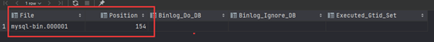

# 主从配置

## 主库

1. Docker

```shell
docker run --privileged=true -d --name mysql-1 -p 3311:3306 -e TZ=Asia/Shanghai -v D:/data/mysql/3311/data:/var/lib/mysql -v D:/data/mysql/3311/mysql.conf.d:/etc/mysql/mysql.conf.d -e MYSQL_ROOT_PASSWORD=123456 mysql:5.7
```

2. mysql.cnf

```cnf
# log-bin
server-id=1
log-bin=mysql-bin
```

3. 验证

> #### log_bin是否开启

```sql
show variables like '%log_bin%'; 
```


> PS: 如果log_bin为OFF，需要docker容器内执行

```shell
chmod 644 mysql.cnf
```

4. 主库状态

```sql
show master status;
```



## 从库

1. Docker

```shell
docker run --privileged=true -d --name mysql-2 -p 3312:3306 -e TZ=Asia/Shanghai -v D:/data/mysql/3312/data:/var/lib/mysql -v D:/data/mysql/3312/mysql.conf.d:/etc/mysql/mysql.conf.d -e MYSQL_ROOT_PASSWORD=123456 mysql:5.7
```

2. mysql.cnf

```cnf
# log-bin
server-id=2
#log-bin=mysql-bin
```

3. 链接到主库

```sql
CHANGE MASTER TO MASTER_HOST='192.168.31.156', MASTER_PORT=3311, MASTER_USER='root', MASTER_PASSWORD='123456', MASTER_LOG_FILE='mysql-bin.000001', MASTER_LOG_POS=154; #后面两个参数的值与主库保持一致

# 开启从库服务
start slave;

# stop slave;
```

4. 验证

```sql
show slave status;
```


## 资料文件

> mysqld.cnf

```cnf
# Copyright (c) 2014, 2021, Oracle and/or its affiliates.
#
# This program is free software; you can redistribute it and/or modify
# it under the terms of the GNU General Public License, version 2.0,
# as published by the Free Software Foundation.
#
# This program is also distributed with certain software (including
# but not limited to OpenSSL) that is licensed under separate terms,
# as designated in a particular file or component or in included license
# documentation.  The authors of MySQL hereby grant you an additional
# permission to link the program and your derivative works with the
# separately licensed software that they have included with MySQL.
#
# This program is distributed in the hope that it will be useful,
# but WITHOUT ANY WARRANTY; without even the implied warranty of
# MERCHANTABILITY or FITNESS FOR A PARTICULAR PURPOSE.  See the
# GNU General Public License, version 2.0, for more details.
#
# You should have received a copy of the GNU General Public License
# along with this program; if not, write to the Free Software
# Foundation, Inc., 51 Franklin St, Fifth Floor, Boston, MA  02110-1301 USA

#
# The MySQL  Server configuration file.

# For explanations see
# http://dev.mysql.com/doc/mysql/en/server-system-variables.html

[mysqld]
pid-file        = /var/run/mysqld/mysqld.pid
socket          = /var/run/mysqld/mysqld.sock
datadir         = /var/lib/mysql
#log-error      = /var/log/mysql/error.log
# By default we only accept connections from localhost
#bind-address   = 127.0.0.1
# Disabling symbolic-links is recommended to prevent assorted security risks
symbolic-links=0
```

# 读写分离（ShardingSphere）

1. 创建项目

readwrite-splitting


2. Gradle dependencies

```groovy
implementation 'org.mybatis.spring.boot:mybatis-spring-boot-starter:2.2.0'
implementation 'org.apache.shardingsphere:shardingsphere-jdbc-core-spring-boot-starter:5.0.0-alpha'
compileOnly 'org.projectlombok:lombok'
developmentOnly 'org.springframework.boot:spring-boot-devtools'
runtimeOnly 'mysql:mysql-connector-java'
annotationProcessor 'org.projectlombok:lombok'
testImplementation 'org.springframework.boot:spring-boot-starter-test'
```

3. application.properties

```properties
#
# Licensed to the Apache Software Foundation (ASF) under one or more
# contributor license agreements.  See the NOTICE file distributed with
# this work for additional information regarding copyright ownership.
# The ASF licenses this file to You under the Apache License, Version 2.0
# (the "License"); you may not use this file except in compliance with
# the License.  You may obtain a copy of the License at
#
#     http://www.apache.org/licenses/LICENSE-2.0
#
# Unless required by applicable law or agreed to in writing, software
# distributed under the License is distributed on an "AS IS" BASIS,
# WITHOUT WARRANTIES OR CONDITIONS OF ANY KIND, either express or implied.
# See the License for the specific language governing permissions and
# limitations under the License.
#

spring.shardingsphere.datasource.common.driver-class-name=com.mysql.jdbc.Driver
spring.shardingsphere.datasource.common.type=com.zaxxer.hikari.HikariDataSource

spring.shardingsphere.datasource.names=master,slave

spring.shardingsphere.datasource.master.jdbc-url=jdbc:mysql://localhost:3311/db_demo?useSSL=false
spring.shardingsphere.datasource.master.username=root
spring.shardingsphere.datasource.master.password=123456

spring.shardingsphere.datasource.slave.jdbc-url=jdbc:mysql://localhost:3312/db_demo?useSSL=false
spring.shardingsphere.datasource.slave.username=root
spring.shardingsphere.datasource.slave.password=123456

# t_test
spring.shardingsphere.rules.sharding.tables.t_test.actual-data-nodes=ds0.t_test
spring.shardingsphere.rules.sharding.tables.t_test.table-strategy.standard.sharding-column=id
spring.shardingsphere.rules.sharding.tables.t_test.table-strategy.standard.sharding-algorithm-name=t-test-inline

# t_test
spring.shardingsphere.rules.sharding.tables.t_test.key-generate-strategy.column=id
spring.shardingsphere.rules.sharding.tables.t_test.key-generate-strategy.key-generator-name=snowflake

spring.shardingsphere.rules.sharding.key-generators.snowflake.type=SNOWFLAKE
spring.shardingsphere.rules.sharding.key-generators.snowflake.props.worker-id=123

# t_test
spring.shardingsphere.rules.sharding.sharding-algorithms.t-test-inline.type=INLINE
spring.shardingsphere.rules.sharding.sharding-algorithms.t-test-inline.props.algorithm-expression=t_test

# 读写分离
spring.shardingsphere.rules.replica-query.data-sources.ds0.primary-data-source-name=master
spring.shardingsphere.rules.replica-query.data-sources.ds0.replica-data-source-names=slave
spring.shardingsphere.rules.replica-query.data-sources.ds0.load-balancer-name=round_robin

# 负载均衡算法配置
spring.shardingsphere.rules.replica-query.load-balancers.round-robin.type=ROUND_ROBIN
spring.shardingsphere.rules.replica-query.load-balancers.round-robin.props.default=0

# sql打印
spring.shardingsphere.props.sql-show=true
```

4. 主要代码

* Test.java

```java
import lombok.Data;

import java.io.Serializable;

/**
 * @author zhoupb
 * @since 2021/6/18
 */
@Data
public class Test implements Serializable {
    private String id;
    private String name;
}
```

* TestMapper.java

```java
import com.zhoupb.readwritesplitting.entity.Test;
import org.apache.ibatis.annotations.Insert;
import org.apache.ibatis.annotations.Mapper;
import org.apache.ibatis.annotations.Select;

/**
 * @author zhoupb
 * @since 2021/6/18
 */
@Mapper
public interface TestMapper {
    @Insert("insert into t_test(name) values(#{name})")
    int save(Test test);

    @Select("select * from t_test where id=#{id}")
    Test selectById(Long id);
}
```

* TestMapperTest.java

```java
import org.junit.jupiter.api.Test;
import org.springframework.boot.test.context.SpringBootTest;

import javax.annotation.Resource;

/**
 * @author zhoupb
 * @since 2021/6/18
 */
@SpringBootTest
class TestMapperTest {
    @Resource
    private TestMapper testMapper;

    @Test
    void save() {
        for (int i = 0; i < 5; i++) {
            com.zhoupb.readwritesplitting.entity.Test test = new com.zhoupb.readwritesplitting.entity.Test();
            test.setName("xiao" + i);
            this.testMapper.save(test);
        }
    }

    @Test
    void selectById() {
        com.zhoupb.readwritesplitting.entity.Test test = this.testMapper.selectById(612612264482549760L);
        System.out.println(test);
    }
}
```

