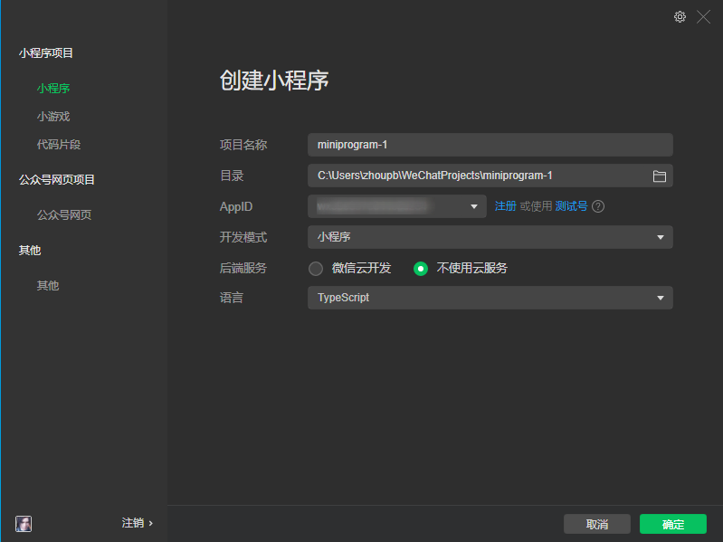
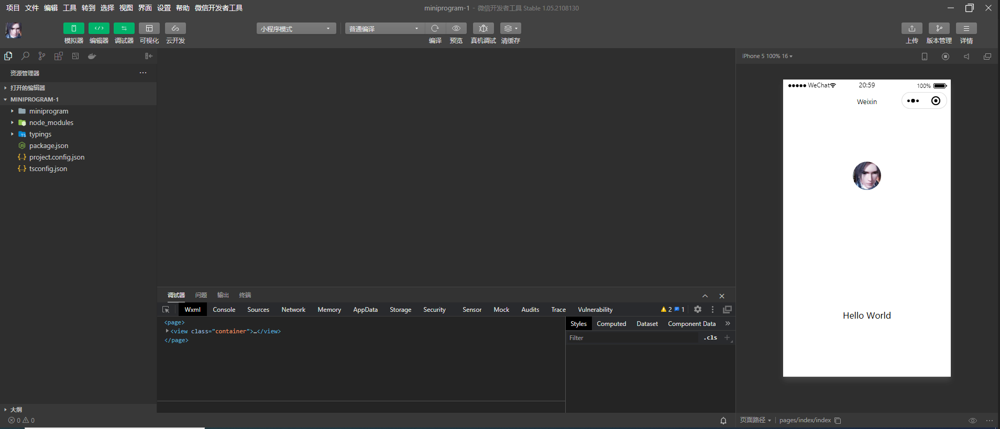
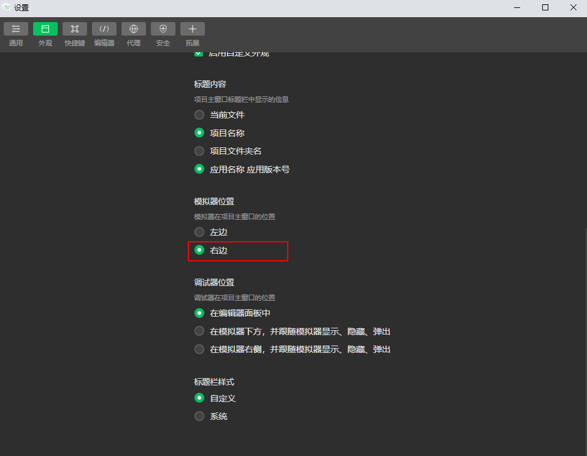
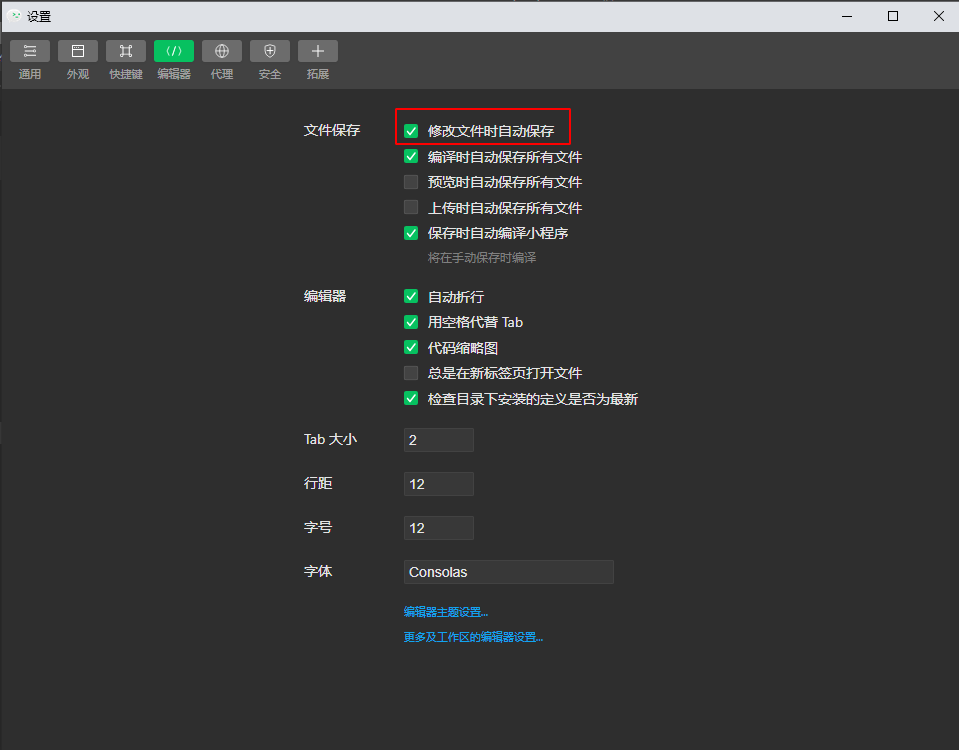
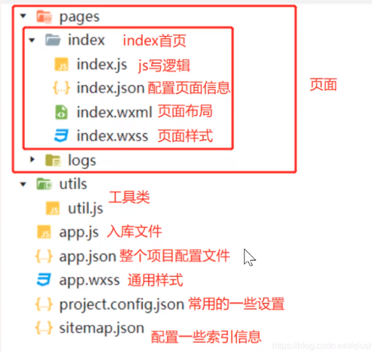
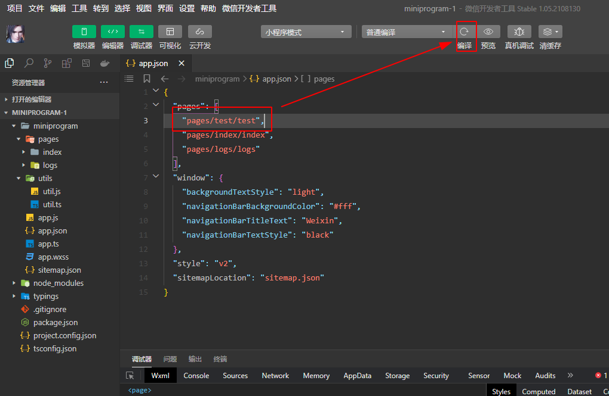

# 一、认识小程序

微信小程序，简称小程序，英文名Mini Program，是一种不需要下载安装即可使用的的应用，它实现了应用“触手可及”的梦想，用户扫一扫或搜一下即可打开应用。

# 二、开发者工具

> https://developers.weixin.qq.com/miniprogram/dev/devtools/download.html

# 三、创建微信小程序

## 3-1、创建小程序



## 3-2、开发者工具面板



常用设置





# 四、目录结构与创建页面

## 4-1、小程序结构目录



## 4-2、启动时加载的页面

> app.json

```json
{
  "pages": [
    // 第一个页面作为启动时加载的页面
    "pages/index/index",
    "pages/logs/logs"
  ],
  // ...
}
```

## 4-3、快速创建页面



## 4-4、小程序三剑客

1. wxml主要用来布局组建
2. wxss主要用来显示样式
3. js主要用来处理逻辑

# 五、组件

## 5-1、基础布局容器

* view

  ```xml
  <!--{{page}}.wxml-->
  <!-- 
    hover-class：指定按下去的样式类。当 hover-class="none" 时，没有点击态效果
    hover-stop-propagation：是否阻止本节点的祖先节点出现点击态	
   -->
  <view class="box" hover-class="box-hover" hover-start-time="50" hover-stay-time="50">
    微信小程序1
    <view class="item" hover-class="item-hover" hover-stop-propagation>111111</view>  
  </view>
  <view>微信小程序2</view>
  ```

  ```css
  /* {{page}}.wxss */
  .box {
    width: 150px;
    height: 150px;
    background-color: green;
  }
  /* 释放后无法恢复 */
  /* .box:hover {
    background-color: blue;
  } */
  
  .box-hover {
    background-color: blueviolet;
  }
  
  .item {
    width: 80px;
    height: 80px;
    background-color: red;
  }
  
  .item-hover {
    background-color: chocolate;
  }
  ```

* text

  ```xml
  <!-- 
    user-select：文本是否可选，该属性会使文本节点显示为 inline-block
    space：显示连续空格
    decode：是否解码
   -->
  <view class="out">
    <text>学&lt;习&gt;</text>
    <text user-select decode space="emsp">微信 小  程&lt;序&gt;</text>
  </view>
  ```

## 5-2、图像媒体

* image

  ```xml
  <!-- 
    mode 图片裁剪、缩放的模式
      aspectFit	缩放模式，保持纵横比缩放图片，使图片的长边能完全显示出来。也就是说，可以完整地将图片显示出来
    show-menu-by-longpress 长按图片显示发送给朋友、收藏、保存图片、搜一搜、打开名片/前往群聊/打开小程序（若图片中包含对应二维码或小程序码）的菜单
   -->
  <image src="/images/20190404225110244.png" mode="aspectFit" show-menu-by-longpress></image>
  <image src="https://img1.baidu.com/it/u=2899834384,3550790818&fm=26&fmt=auto&gp=0.jpg"/>
  ```

## 5-3、navigator超链接导航

* navigator

  ```xml
  <!-- 
    url：当前小程序内的跳转链接
    open-type：跳转方式
      redirect
      reLaunch
   -->
  <view>
    <navigator url="/pages/logs/logs">跳转到日志页面</navigator>
    <navigator url="/pages/logs/logs" open-type="redirect">跳转到日志页面</navigator>
  </view>
  ```

## 5-4、scroll_view滚动视图

* scroll_view

  ```xml
  <scroll-view class="scroll-view-y" scroll-y>
    <view class="scroll-view-item">AAA</view>
    <view class="scroll-view-item">BBB</view>
    <view class="scroll-view-item">CCC</view>
  </scroll-view>
  
  <scroll-view class="scroll-view-x" scroll-x>
    <view class="scroll-view-out">
      <view class="scroll-view-item">AAA</view>
      <view class="scroll-view-item">BBB</view>
      <view class="scroll-view-item">CCC</view>
      <view class="scroll-view-item">DDD</view>
      <view class="scroll-view-item">EEE</view>
    </view>
  </scroll-view>
  ```

  ```css
  .scroll-view-y {
    height: 300px;
    border: 1px solid red;
  }
  
  .scroll-view-y .scroll-view-item {
    height: 150px;
    border: 1px solid blue;
    margin-bottom: 5px;
  }
  
  .scroll-view-x .scroll-view-out {
    display: flex;
  }
  
  .scroll-view-x .scroll-view-item {
    width: 100px;
    height: 100px;
    background-color: cornflowerblue;
    margin-right: 5px;
    flex: 0 0 100px;
  }
  ```


## 5-5、swiper滑块视图

* swiper

  ```xml
  <swiper indicator-dots="true" autoplay circular>
    <swiper-item>
      <image src="/images/swiper_01.jpg" mode="aspectFit"></image>
    </swiper-item>
    <swiper-item>
      <image src="/images/swiper_02.jpg" mode="aspectFit"></image>
    </swiper-item>
    <swiper-item>
      <image src="/images/swiper_03.jpg" mode="aspectFit"></image>  
    </swiper-item>
  </swiper>
  ```

## 5-6、常用的表单组件

```xml
<button>defult</button>
<button type="primary">primary</button>
<button type="primary" plain>primary</button>
<button type="warn" size="mini">warn</button>
<button type="primary" loading>loading</button>

<button type="primary" open-type="contact">contact</button>

<form action="#">
  <input auto-focus placeholder="请输入"></input>
  <input type="idcard" placeholder="请输入身份证"></input>
  <switch></switch>
  <textarea></textarea>
  <button form-type="reset">重置</button>
  <button form-type="submit" type="primary">提交</button>
</form>
```

```css
button {
  margin-bottom: 10px;
}

input, textarea {
  height: 80rpx;
  border: 1px solid gray;
  padding: 0 25rpx;
  box-sizing: border-box;
}
```

## 5-7、其他组件

* icon

  ```xml
  <icon type="success" size="25"></icon>
  <icon type="success_no_circle" size="25"></icon>
  <icon type="info" size="25"></icon>
  <icon type="warn" size="25"></icon>
  <icon type="waiting" size="25"></icon>
  <icon type="cancel" size="25"></icon>
  <icon type="download" size="25"></icon>
  <icon type="search" size="25"></icon>
  <icon type="clear" size="25"></icon>
  ```

* progress

  ```xml
  <progress percent="60" active show-info></progress>
  ```

* map

  ```xml
  <map latitude="{{latitude}}" longitude="{{longitude}}"></map>
  ```

  ```js
  Page({
      data: {
      	latitude: 0,
          longitude: 0
  	},
      
      onLoad: function (options) {
          wx.getLocation({
              type: 'wgs84',
              // 箭头函数 this
              success: (res) => {
                  const latitude = res.latitude
                  const longitude = res.longitude
  
                  this.setData({
                      latitude: latitude,
                      longitude: longitude
                  })
              }
          })
      }
  })
  ```

  ```json
  "permission": {
      "scope.userLocation": {
        "desc": "你的位置信息将用于小程序位置接口的效果展示"
      }
  }
  ```

## 6-8、自定义组件

* 组件引用

  ```xml
  <!-- components/custom/custom.wxml -->
  <view>
    自定义组件
    <slot></slot>
    <slot name="tag"></slot>
  </view>
  ```

  ```js
  Component({
    options: {
      // 在组件定义时的选项中启用多slot支持
      multipleSlots: true
    }
  })
  ```

  ```json
  // pages/request/request.json
  {
    "usingComponents": {
      "my-custom": "/components/custom/custom"
    }
  }
  ```

  ```xml
  <!-- pages/request/request.wxml -->
  <my-custom my-title="这是一个标题">
    <view>11</view>
    <view slot="tag">22</view>
  </my-custom>
  ```

* 组件间通信

  ```xml
  <!-- components/custom/custom.wxml -->
  <view>{{myTitle}}</view>
  ```

  ```js
  // components/custom/custom.js
  Component({
    /**
     * 组件的属性列表
     */
    properties: {
      // myTitle: String
      myTitle: {
        type: String,
        value: "标题默认值"
      }
    }
  })
  ```

  ```xml
  <!-- pages/request/request.wxml -->
  <my-custom my-title="这是一个标题"></my-custom>
  ```

* 组件间事件

  ```xml
  <!-- components/custom/custom.wxml -->
  <view bindtap="onTap">{{myTitle}}</view>
  ```
  
  ```js
  // components/custom/custom.js
  Component({
    /**
     * 组件的方法列表
     */
    methods: {
      onTap() {
        this.triggerEvent('myevent', {
          name: 'xxx',
          age: 18
        })
      }
    }
  })
  ```
  
  ```xml
  <!-- pages/request/request.wxml -->
  <my-custom bind:myevent="receive"></my-custom>
  ```
  
  ```js
  // pages/request/request.js
  Page({
    receive(e) {
      console.log(e.detail)
    }
  })
  ```
  
* 组件间关系

  ```xml
  <!-- components/custom-li/custom-li.wxml -->
  <view>
    <slot></slot>
  </view>
  ```

  ```js
  
  // components/custom-li/custom-li.js
  Component({
    relations: {
      '../custom-ul/custom-ul': {
        type: 'parent', // 关联的目标节点应为父节点
        linked: function (target) {
          // 每次被插入到custom-ul时执行，target是custom-ul节点实例对象，触发在attached生命周期之后
          console.log('child linked to ', target)
        },
        linkChanged: function (target) {
          // 每次被移动后执行，target是custom-ul节点实例对象，触发在moved生命周期之后
        },
        unlinked: function (target) {
          // 每次被移除时执行，target是custom-ul节点实例对象，触发在detached生命周期之后
        }
      }
    }
  })
  ```

  ```xml
  <!-- components/custom-ul/custom-ul.wxml -->
  <view>
    <slot></slot>
  </view>
  ```

  ```js
  // components/custom-ul/custom-ul.js
  Component({
    relations: {
      '../custom-li/custom-li': {
        type: 'child', // 关联的目标节点应为子节点
        linked: function (target) {
          // 每次有custom-li被插入时执行，target是该节点实例对象，触发在该节点attached生命周期之后
          console.log('[custom-ul] a child is linked: ', target)
        },
        linkChanged: function (target) {
          // 每次有custom-li被移动后执行，target是该节点实例对象，触发在该节点moved生命周期之后
        },
        unlinked: function (target) {
          // 每次有custom-li被移除时执行，target是该节点实例对象，触发在该节点detached生命周期之后
        }
      }
    },
    /**
     * 组件的方法列表
     */
    methods: {
      _getAllLi: function () {
        // 使用getRelationNodes可以获得nodes数组，包含所有已关联的custom-li，且是有序的
        var nodes = this.getRelationNodes('../custom-li/custom-li')
        console.log('node: ', nodes)
      }
    },
  
    ready: function () {
      this._getAllLi()
    }
  })
  ```

  ```xml
  <!-- pages/request/request.wxml -->
  <custom-ul>
    <custom-li>A</custom-li>
    <custom-li>B</custom-li>
  </custom-ul>
  ```

# 六、框架

## 6-1、全局配置

```json
{
  "pages": [
    "pages/index/index",
    "pages/form/form",
    "pages/demo/demo",
    "pages/logs/logs"
  ],
  "permission": {
    "scope.userLocation": {
      "desc": "你的位置信息将用于小程序位置接口的效果展示"
    }
  },
  "window": {
    "backgroundTextStyle": "light",
    "enablePullDownRefresh": true,
    "backgroundColor": "#000",
    "navigationBarBackgroundColor": "#fff",
    "navigationBarTitleText": "第一个微信小程序",
    "navigationBarTextStyle": "black"
  },
  "tabBar": {
    "backgroundColor": "#ccc",
    "color": "#515151",
    "selectedColor": "#1296db",
    "list": [
      {
        "pagePath": "pages/index/index",
        "text": "首页",
        "iconPath": "images/index.png",
        "selectedIconPath": "images/index_select.png"
      },
      {
        "pagePath": "pages/logs/logs",
        "text": "日志",
        "iconPath": "images/log.png",
        "selectedIconPath": "images/log_select.png"
      }
    ]
  },
  "style": "v2",
  "sitemapLocation": "sitemap.json"
}
```

## 6-2、页面配置

```json
{
  "usingComponents": {},
  "navigationBarTitleText": "演示实例",
  "enablePullDownRefresh": true,
  "backgroundColor": "#ccc",
  "pageOrientation": "auto"
}
```

## 6-3、数据绑定

```xml
<view>{{title}}</view>
<view>{{content}}</view>
<view>{{data}}</view>
<view>{{data[0]}} - {{data[2]}}</view>
<view>{{person}}</view>
<view>{{person.name}} - {{person.age}}</view>
```

```js
data: {
    title: '微信小程序',
    content: '学习微信小程序开发 学习微信小程序开发 学习微信小程序开发 学习微信小程序开发',
    data: ['微信', '小程序', '开发'],
    person: {
        name: '小明',
        age: 23,
        sex: '男'
    }
}
```

## 6-4、列表渲染

```xml
<view wx:for="{{10}}">
  微信小程序开发
</view>
<view wx:for="{{data}}" wx:key="*this">
  {{index}}: {{item}}
</view>
<view wx:for="{{data}}" wx:key="idx" wx:for-index="idx" wx:for-item="itemName">
  {{idx}}: {{itemName}}
</view>
<block wx:for="{{[1, 2, 3]}}">
  <view> {{index}}: {{item}} </view>
</block>
<!-- 花括号和引号之间如果有空格，将最终被解析成为字符串 -->
<view wx:for="{{[1,2,3]}} ">
  {{item}}
</view>
```

## 6-5、条件渲染

```xml
<view wx:if="true">if2</view>
<view wx:if="{{true}}">if2</view>
<view wx:if="{{1>2}}">if1</view>
<view wx:if="{{day==1}}">周一</view>
<view wx:elif="{{day==2}}">周二</view>
<view wx:else>周天</view>
<!-- <block/> 并不是一个组件，它仅仅是一个包装元素，不会在页面中做任何渲染，只接受控制属性 -->
<block wx:if="{{true}}">
  <view> view1 </view>
  <view> view2 </view>
</block>
```

## 6-6、模板

```xml
<template name="msgItem">
  <view>
    <text> {{index}}: {{msg}} </text>
    <text> Time: {{time}} </text>
  </view>
</template>
<template is="msgItem" data="{{...item}}"/>
<!--
let arr = [1, 23, 4]
console.log(1, ...arr, 5)
VM206:1 1 1 23 4 5

let obj = {name: 'x', age: 23}
console.log({sex: '男', ...obj})
VM385:1 {sex: "男", name: "x", age: 23}
-->
```

```json
data: {
    item: {
        index: 0,
        msg: 'this is a template',
        time: '2016-09-15'
    }
}
```

## 6-7、Page生命周期函数

```js
Page({

  /**
   * 页面的初始数据
   */
  data: {
    
  },

  /**
   * 生命周期函数--监听页面加载
   */
  onLoad() {
    
  },

  /**
   * 生命周期函数--监听页面初次渲染完成
   */
  onReady() {
    
  },

  /**
   * 生命周期函数--监听页面显示
   */
  onShow() {
    
  },

  /**
   * 生命周期函数--监听页面隐藏
   */
  onHide() {
    
  },

  /**
   * 生命周期函数--监听页面卸载
   */
  onUnload() {
    
  },

  /**
   * 页面相关事件处理函数--监听用户下拉动作
   */
  onPullDownRefresh() {
    
  },

  /**
   * 页面上拉触底事件的处理函数
   */
  onReachBottom() {
    
  },

  /**
   * 用户点击右上角分享
   */
  onShareAppMessage(opts): WechatMiniprogram.Page.ICustomShareContent {
    console.log(opts.target)
    return {}
  }
})
```

## 6-8、事件函数

```xml
<view bindtap="tapClick">微信小程序开发</view>
<view bind:tap="tapClick" data-title="微信小程序开发">微信小程序开发</view>
```

```js
Page({
  tapClick(event) {
    console.log('tapClick, ', event)
    console.log(event.currentTarget.dataset)
  }
)}
```

## 6-9、setData

```xml
<text>{{title}}</text>
<view bind:tap="tapClick" data-title="微信小程序开发">微信小程序开发</view>
```

```js
Page({
  data: {
    title: '标题'
  },

  tapClick(event) {
    this.setData({
      title: event.currentTarget.dataset.title
    })
  }
)}
```

# 七、API

## 7-1、基础用法

```js
Page({
  onLoad: function (options) {
    console.log(wx.getSystemInfoSync())

    wx.showLoading({
      title: '数据加载中...'
    })

    wx.showToast({
      title: '提交成功'
    })
  },
})
```

## 7-2、路由用法

```xml
<!-- 
  open-type默认值无法跳转tabbar
 -->
<navigator url="/pages/logs/logs" open-type="switchTab">跳转到日志</navigator>

<button bindtap="jumpTo">跳转到日志</button>
<button bindtap="jumpToDemo">跳转到demo</button>
```

```js
Page({
  jumpTo() {
    // wx.switchTab({
    //   url: '/pages/logs/logs',
    // })
    wx.reLaunch({
      url: '/pages/logs/logs?id=xxx&name=wechat',
      success: res => {
        console.log(res)
      }
    })
  },

  jumpToDemo() {
    wx.navigateTo({
      url: '/pages/demo/demo',
    })
  }
})
```

```xml
<button bindtap="goBack">返回</button>
```

```js
Page({
  goBack() {
    wx.navigateBack()
  }
})
```

## 7-3、网络请求

```js
wx.request({
    url: 'https://edu.newsight.cn/wxList.php',
    data: {
        num: 5, 
        page: 2
    },
    success: res => {
        console.log(res)
        this.setData({
            list: res.data
        })
    }
})
```


