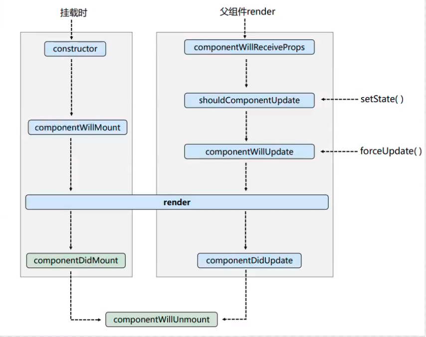
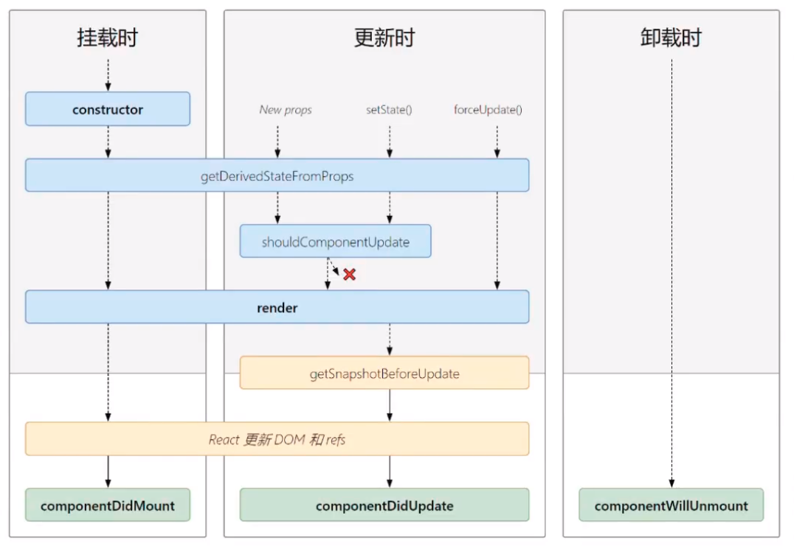
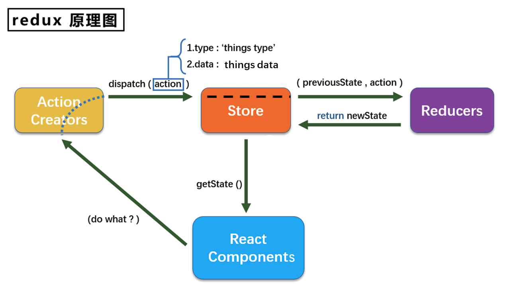
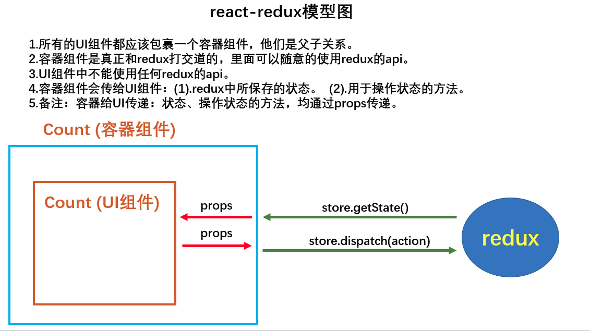

# 一、React简介

## 1.1、React是什么？

用于构建用户界面的JavaScript库。

## 1.2、谁开发的？

由Facebook开发且开源。

## 1.3、为什么要学？

1. 原生JavaScript操作DOM频繁、效率低（DOM-API操作UI）。
2. 使用JavaScript直接操作DOM，浏览器会进行大量的重绘重排。
3. 原生JavaScript没有组件化编码方案，代码效率低。

## 1.4、React的特点

1. 采用组件化模式、声明式编码，提高开发效率及组件复用率。
2. 在React Native中可以使用React语法进行移动端开发。
3. 使用虚拟DOM+优秀的Diffing算法，尽量减少与真实DOM的交互。

# 二、React入门

## 2.1、官网

> https://reactjs.org
>
> https://zh-hans.reactjs.org

## 2.2、React基本使用

### 2.2.1、Hello React

```jsx
<!DOCTYPE html>
<html lang="en">
<head>
    <meta charset="UTF-8">
    <meta http-equiv="X-UA-Compatible" content="IE=edge">
    <meta name="viewport" content="width=device-width, initial-scale=1.0">
    <title>Document</title>
</head>
<body>
    <!-- 1. 准备容器 -->
    <div id="root"></div>

    <!-- 2. 引入js依赖 -->
    <!-- 2-1. 引入react核心库 -->
    <script src="https://unpkg.com/react@17.0.2/umd/react.development.js"></script>
    <!-- 2-2. 引入react-dom，用于支持react操作DOM -->
    <script src="https://unpkg.com/react-dom@17.0.2/umd/react-dom.development.js"></script>
    <!-- 2-3. 引入babel，用于将jsx转为js -->
    <script src="https://unpkg.com/@babel/standalone/babel.min.js"></script>

    <!-- 3. type一定要写babel -->
    <script type="text/babel">
        // 4. 创建虚拟DOM，此处一定不要写引号
        const VDOM = <h1>Hello, React</h1>

        // 5. 渲染虚拟DOM到页面
        ReactDOM.render(VDOM, document.getElementById('root'))
    </script>
</body>
</html>
```

### 2,2,2、虚拟DOM的两种创建方式

```jsx
<!DOCTYPE html>
<html lang="en">
<head>
    <meta charset="UTF-8">
    <meta http-equiv="X-UA-Compatible" content="IE=edge">
    <meta name="viewport" content="width=device-width, initial-scale=1.0">
    <title>Document</title>
</head>
<body>
    <!-- 1. 准备容器 -->
    <div id="root"></div>

    <!-- 2. 引入js依赖 -->
    <!-- 2-1. 引入react核心库 -->
    <script src="https://unpkg.com/react@17.0.2/umd/react.development.js"></script>
    <!-- 2-2. 引入react-dom，用于支持react操作DOM -->
    <script src="https://unpkg.com/react-dom@17.0.2/umd/react-dom.development.js"></script>
    <!-- 2-3. 引入babel，用于将jsx转为js -->
    <script src="https://unpkg.com/@babel/standalone/babel.min.js"></script>

    <!-- 3. type一定要写babel -->
    <script type="text/babel">
        // 4. 创建虚拟DOM，此处一定不要写引号
        const VDOM = (
            <h1 id="title">
                <span>Hello, React</span>
            </h1>
        )

        // 5. 渲染虚拟DOM到页面
        ReactDOM.render(VDOM, document.getElementById('root'))
    </script>
</body>
</html>
```

```html
<!DOCTYPE html>
<html lang="en">
<head>
    <meta charset="UTF-8">
    <meta http-equiv="X-UA-Compatible" content="IE=edge">
    <meta name="viewport" content="width=device-width, initial-scale=1.0">
    <title>Document</title>
</head>
<body>
    <!-- 1. 准备容器 -->
    <div id="root"></div>

    <!-- 2. 引入js依赖 -->
    <!-- 2-1. 引入react核心库 -->
    <script src="https://unpkg.com/react@17.0.2/umd/react.development.js"></script>
    <!-- 2-2. 引入react-dom，用于支持react操作DOM -->
    <script src="https://unpkg.com/react-dom@17.0.2/umd/react-dom.development.js"></script>
    <!-- 2-3. 引入babel，用于将jsx转为js -->
    <script src="https://unpkg.com/@babel/standalone/babel.min.js"></script>

    <!-- 3. type一定要写javascript -->
    <script type="text/javascript">
        // 4. 创建虚拟DOM
        const VDOM = React.createElement(
            'h1', 
            {id: 'title'}, 
            React.createElement('span', {}, 'Hello, React')
        ) 

        // 5. 渲染虚拟DOM到页面
        ReactDOM.render(VDOM, document.getElementById('root'))
    </script>
</body>
</html>
```

### 2,2,3、真实DOM与虚拟DOM区别

```jsx
<!DOCTYPE html>
<html lang="en">
<head>
    <meta charset="UTF-8">
    <meta http-equiv="X-UA-Compatible" content="IE=edge">
    <meta name="viewport" content="width=device-width, initial-scale=1.0">
    <title>Document</title>
</head>
<body>
    <!-- 1. 准备容器 -->
    <div id="root"></div>

    <!-- 2. 引入js依赖 -->
    <!-- 2-1. 引入react核心库 -->
    <script src="https://unpkg.com/react@17.0.2/umd/react.development.js"></script>
    <!-- 2-2. 引入react-dom，用于支持react操作DOM -->
    <script src="https://unpkg.com/react-dom@17.0.2/umd/react-dom.development.js"></script>
    <!-- 2-3. 引入babel，用于将jsx转为js -->
    <script src="https://unpkg.com/@babel/standalone/babel.min.js"></script>

    <!-- 3. type一定要写babel -->
    <script type="text/babel">
        // 4. 创建虚拟DOM，此处一定不要写引号
        const VDOM = (
            <h1 id="title">
                <span>Hello, React</span>
            </h1>
        )

        // 5. 渲染虚拟DOM到页面
        ReactDOM.render(VDOM, document.getElementById('root'))

        console.log('虚拟DOM：', VDOM)
        console.log('真实DOM：')
        console.dir(document.getElementById('root'))
    </script>
</body>
</html>
```

## 2,3、React JSX

JSX（JavaScript XML），react定义的一种类似于XML的js扩展语法

### 2,3,1、JSX语法规则

JSX语法规则：

1. 定义虚拟DOMO不要加引号

2. 标签中混入js表达式时用{}

3. 样式的类名要使用className

4. 内联样式要使用style={{key: value}}

5. 虚拟DOM必须只有一个根标签

  6. 标签必须闭合

7. 标签首字母
   * 若以小写字母开头，将被转为html标签
   * 若以大写字母开头，将被视为组件

  ```jsx
  <!DOCTYPE html>
  <html lang="en">
  <head>
      <meta charset="UTF-8">
      <meta http-equiv="X-UA-Compatible" content="IE=edge">
      <meta name="viewport" content="width=device-width, initial-scale=1.0">
      <title>Document</title>
      <style>
          .title {
              color: red;
          }
      </style>
  </head>
  <body>
      <!-- 1. 准备容器 -->
      <div id="root"></div>
  
      <!-- 2. 引入js依赖 -->
      <!-- 2-1. 引入react核心库 -->
      <script src="https://unpkg.com/react@17.0.2/umd/react.development.js"></script>
      <!-- 2-2. 引入react-dom，用于支持react操作DOM -->
      <script src="https://unpkg.com/react-dom@17.0.2/umd/react-dom.development.js"></script>
      <!-- 2-3. 引入babel，用于将jsx转为js -->
      <script src="https://unpkg.com/@babel/standalone/babel.min.js"></script>
  
      <!-- 3. type一定要写babel -->
      <script type="text/babel">
          const id = 'Title'
          const text = 'Hello, React'
  
          // 4. 创建虚拟DOM，此处一定不要写引号
          const VDOM = (
              <div>
                  <h1 id={id.toLowerCase()} className="title">
                      <span style={{border: '1px solid red'}}>{text}</span>
                  </h1>
                  <input type="text" />
                  <Good>123</Good>
              </div>
          )
  
          // 5. 渲染虚拟DOM到页面
          ReactDOM.render(VDOM, document.getElementById('root'))
  
          /* 
          JSX语法规则：
              1. 定义虚拟DOMO不要加引号
              2. 标签中混入js表达式时用{}
              3. 样式的类名要使用className
              4. 内联样式要使用style={{key: value}}
              5. 虚拟DOM必须只有一个根标签
              6. 标签必须闭合
              7. 标签首字母
                  *. 若以小写字母开头，将被转为html标签
                  *. 若以大写字母开头，将被视为组件
          */
      </script>
  </body>
  </html>
  ```

### 2,3,2、JSX小练习

```jsx
<!DOCTYPE html>
<html lang="en">
<head>
    <meta charset="UTF-8">
    <meta http-equiv="X-UA-Compatible" content="IE=edge">
    <meta name="viewport" content="width=device-width, initial-scale=1.0">
    <title>Document</title>
</head>
<body>
    <!-- 1. 准备容器 -->
    <div id="root"></div>

    <!-- 2. 引入js依赖 -->
    <!-- 2-1. 引入react核心库 -->
    <script src="https://unpkg.com/react@17.0.2/umd/react.development.js"></script>
    <!-- 2-2. 引入react-dom，用于支持react操作DOM -->
    <script src="https://unpkg.com/react-dom@17.0.2/umd/react-dom.development.js"></script>
    <!-- 2-3. 引入babel，用于将jsx转为js -->
    <script src="https://unpkg.com/@babel/standalone/babel.min.js"></script>

    <!-- 3. type一定要写babel -->
    <script type="text/babel">
        const data = ['Angular', 'React', 'Vue']

        /* 
        1. 表达式：一个表达式会产生一个值
            * a
            * a+b
            * demo(1)
            * arr.map()
            * function test() {}
        2. 语句（代码）
            * if () {}
            * for () {}
            * switch () {}
            *  
        */

        // 4. 创建虚拟DOM，此处一定不要写引号
        const VDOM = (
            <div>
                <h3>前端框架列表</h3>
                <ul>
                    {
                        data
                    }
                    {
                        data.map((item, index) => {
                            return <li key={index}>{item}</li>
                        })
                    }
                </ul>
            </div>
        )

        // 5. 渲染虚拟DOM到页面
        ReactDOM.render(VDOM, document.getElementById('root'))
    </script>
</body>
</html>
```

## 2.4、模块与组件

### 2.4.1、模块

* 向外提供特定功能的js程序，一般是一个js文件。
* 随着业务逻辑增加，代码越来越多且复杂。
* 复用js，简化js的编写，提高js运行效率。=

### 2.4.2、组件

* 用来实现局部功能效果的代码和资源的集合（html/css/js/image…）
* 一个界面的功能更复杂
* 复用编程，简化项目编码，提高运行效率

### 2.4.3、模块化

当应用的js都以模块来编写的，这个应用就是一个模块化的应用。

### 2.4.4、组件化

当应用是以多组件的方式实现，这个应用就是一个组件化的应用。

# 三、React组件

## 3.1、基本理解和使用

### 3.1.1、使用React开发者工具调试

> chrome extersions: React Developer Tools

### 3.1.2、函数式组件

```jsx
<!DOCTYPE html>
<html lang="en">
<head>
    <meta charset="UTF-8">
    <meta http-equiv="X-UA-Compatible" content="IE=edge">
    <meta name="viewport" content="width=device-width, initial-scale=1.0">
    <title>Document</title>
</head>
<body>
    <div id="root"></div>

    <script src="https://unpkg.com/react@17.0.2/umd/react.development.js"></script>
    <script src="https://unpkg.com/react-dom@17.0.2/umd/react-dom.development.js"></script>
    <script src="https://unpkg.com/@babel/standalone/babel.min.js"></script>
    <script type="text/babel">
        // 创建组件
        function Good() {
            return (
                <h2>React 组件</h2>
            )
        }

        ReactDOM.render(<Good />, document.getElementById('root'))
    </script>
</body>
</html>
```

### 3.1.3、类式组件

```jsx
<!DOCTYPE html>
<html lang="en">
<head>
    <meta charset="UTF-8">
    <meta http-equiv="X-UA-Compatible" content="IE=edge">
    <meta name="viewport" content="width=device-width, initial-scale=1.0">
    <title>Document</title>
</head>
<body>
    <div id="root"></div>

    <script src="https://unpkg.com/react@17.0.2/umd/react.development.js"></script>
    <script src="https://unpkg.com/react-dom@17.0.2/umd/react-dom.development.js"></script>
    <script src="https://unpkg.com/@babel/standalone/babel.min.js"></script>
    <script type="text/babel">
        // 创建组件
        class Good extends React.Component {
            render() {
                return (
                    <h2>React 组件</h2>
                )
            }
        }

        ReactDOM.render(<Good />, document.getElementById('root'))
    </script>
</body>
</html>
```

## 3.2、组件核心属性state

### 3.2.1、初始化state

```jsx
<!DOCTYPE html>
<html lang="en">
<head>
    <meta charset="UTF-8">
    <meta http-equiv="X-UA-Compatible" content="IE=edge">
    <meta name="viewport" content="width=device-width, initial-scale=1.0">
    <title>Document</title>
</head>
<body>
    <div id="root"></div>

    <script src="https://unpkg.com/react@17.0.2/umd/react.development.js"></script>
    <script src="https://unpkg.com/react-dom@17.0.2/umd/react-dom.development.js"></script>
    <script src="https://unpkg.com/@babel/standalone/babel.min.js"></script>
    <script type="text/babel">
        // 创建组件
        class Weather extends React.Component {
            constructor() {
                super()

                this.state = {
                    isHot: true
                }
            }

            render() {
                console.log(this)
                return (
                    <h2>今天的天气很{this.state.isHot ? '炎热' : '凉爽'}</h2>
                )
            }
        }

        ReactDOM.render(<Weather />, document.getElementById('root'))
    </script>
</body>
</html>
```

### 3.2.2、类中方法中this指向问题

```js
class Person {
    say() {
        console.log(this)
    }
}

let p1 = new Person()
p1.say()

const x = p1.say
x()

console.log('---------------------')

// 局部 use strict
function test1() {
    'use strict'
    console.log(this)
}
function test2() {
    console.log(this)
}

test1()
test2()
```

### 3.2.3、React事件响应

```jsx
<!DOCTYPE html>
<html lang="en">
<head>
    <meta charset="UTF-8">
    <meta http-equiv="X-UA-Compatible" content="IE=edge">
    <meta name="viewport" content="width=device-width, initial-scale=1.0">
    <title>Document</title>
</head>
<body>
    <div id="root"></div>

    <script src="https://unpkg.com/react@17.0.2/umd/react.development.js"></script>
    <script src="https://unpkg.com/react-dom@17.0.2/umd/react-dom.development.js"></script>
    <script src="https://unpkg.com/@babel/standalone/babel.min.js"></script>

    <script type="text/babel">
        // 创建组件
        class Weather extends React.Component {
            constructor() {
                super()

                this.state = {
                    isHot: true
                }

                // 方式一：bind
                //this.changeWeather = this.changeWeather.bind(this)
                this.change = this.changeWeather.bind(this)
            }

            changeWeather() {
                console.log(this.state.isHot)
            }

            /* 方式三：箭头函数（推荐） */
            changeWeather = () => {
                console.log(this.state.isHot)
            }

            render() {
                console.log(this)
                const {isHot} = this.state
                return (
                    /* <h2 onClick={this.change}>今天的天气很{isHot ? '炎热' : '凉爽'}</h2> */

                    /* 方式二：()=>{} 箭头函数 */
                    /* <h2 onClick={() => this.changeWeather()}>今天的天气很{isHot ? '炎热' : '凉爽'}</h2> */

                    <h2 onClick={this.changeWeather}>今天的天气很{isHot ? '炎热' : '凉爽'}</h2>
                )
            }
        }

        ReactDOM.render(<Weather />, document.getElementById('root'))
    </script>
</body>
</html>
```

### 3.2.4、React状态更改setState

```jsx
<!DOCTYPE html>
<html lang="en">
<head>
    <meta charset="UTF-8">
    <meta http-equiv="X-UA-Compatible" content="IE=edge">
    <meta name="viewport" content="width=device-width, initial-scale=1.0">
    <title>Document</title>
</head>
<body>
    <div id="root"></div>

    <script src="https://unpkg.com/react@17.0.2/umd/react.development.js"></script>
    <script src="https://unpkg.com/react-dom@17.0.2/umd/react-dom.development.js"></script>
    <script src="https://unpkg.com/@babel/standalone/babel.min.js"></script>
    <script type="text/babel">
        // 创建组件
        class Weather extends React.Component {
            // 构造调用了几次？ 1次
            constructor() {
                super()

                this.state = {
                    isHot: true
                }
            }

            // render调用了几次？ n+1次
            render() {
                console.log(this)
                return (
                    <h2 onClick={() => this.changeWeather()}>今天的天气很{this.state.isHot ? '炎热' : '凉爽'}</h2>
                )
            }

            changeWeather() {
                this.setState({
                    isHot: !this.state.isHot
                })
            }
        }

        ReactDOM.render(<Weather />, document.getElementById('root'))
    </script>
</body>
</html>
```

### 3.2.5、state与event简写方式

```jsx
<!DOCTYPE html>
<html lang="en">
<head>
    <meta charset="UTF-8">
    <meta http-equiv="X-UA-Compatible" content="IE=edge">
    <meta name="viewport" content="width=device-width, initial-scale=1.0">
    <title>Document</title>
</head>
<body>
    <div id="root"></div>

    <script src="https://unpkg.com/react@17.0.2/umd/react.development.js"></script>
    <script src="https://unpkg.com/react-dom@17.0.2/umd/react-dom.development.js"></script>
    <script src="https://unpkg.com/@babel/standalone/babel.min.js"></script>
    <script type="text/babel">
        class Weather extends React.Component {
            // 初始化状态
            state = {
                isHot: true
            }

            constructor() {
                super()
            }

            // 自定义方法
            changeWeather = () => {
                this.setState({
                    isHot: !this.state.isHot
                })
            }

            render() {
                const {isHot} = this.state
                return (
                    <h2 onClick={this.changeWeather}>今天的天气很{isHot ? '炎热' : '凉爽'}</h2>
                )
            }
        }

        ReactDOM.render(<Weather />, document.getElementById('root'))
    </script>
</body>
</html>
```

## 3.3、组件核心属性props

### 3.3.1、props基本使用

```jsx
<!DOCTYPE html>
<html lang="en">
<head>
    <meta charset="UTF-8">
    <meta http-equiv="X-UA-Compatible" content="IE=edge">
    <meta name="viewport" content="width=device-width, initial-scale=1.0">
    <title>Document</title>
</head>
<body>
    <div id="root1"></div>
    <div id="root2"></div>
    <div id="root3"></div>

    <script src="https://unpkg.zhimg.com/react@17.0.2/umd/react.development.js"></script>
    <script src="https://unpkg.zhimg.com/react-dom@17.0.2/umd/react-dom.development.js"></script>
    <script src="https://unpkg.zhimg.com/@babel/standalone/babel.min.js"></script>
    <script type="text/babel">
        class Person extends React.Component {
            render() {
                const {name, age, sex} = this.props
                return (
                    <ul>
                        <li>姓名：{name}</li>
                        <li>年龄：{age}</li>
                        <li>性别：{sex}</li>
                    </ul>
                )
            }
        }

        ReactDOM.render(<Person name="JS" age="18" sex="男" />, document.getElementById('root1'))
        ReactDOM.render(<Person name="Vue" age="18" sex="男" />, document.getElementById('root2'))

        // props批量传递
        const p = {
            name: 'React',
            age: 19,
            sex: '女'
        }
        ReactDOM.render(<Person {...p} />, document.getElementById('root3'))
    </script>
</body>
</html>
```

### 3.3.2、props限制规则

```jsx
<!DOCTYPE html>
<html lang="en">
<head>
    <meta charset="UTF-8">
    <meta http-equiv="X-UA-Compatible" content="IE=edge">
    <meta name="viewport" content="width=device-width, initial-scale=1.0">
    <title>Document</title>
</head>
<body>
    <div id="root1"></div>
    <div id="root2"></div>
    <div id="root3"></div>

    <script src="https://unpkg.zhimg.com/react@17.0.2/umd/react.development.js"></script>
    <script src="https://unpkg.zhimg.com/react-dom@17.0.2/umd/react-dom.development.js"></script>
    <script src="https://unpkg.zhimg.com/@babel/standalone/babel.min.js"></script>
    <script src="https://unpkg.zhimg.com/prop-types@15.7.2/prop-types.js"></script>
    <script type="text/babel">
        class Person extends React.Component {
            render() {
                const {name, age, sex} = this.props

                // props是只读属性
                // this.props.name = 'Tom'

                return (
                    <ul>
                        <li>姓名：{name}</li>
                        <li>年龄：{age}</li>
                        <li>性别：{sex}</li>
                    </ul>
                )
            }
        }

        // 类型规则
        Person.propTypes = {
            name: PropTypes.string.isRequired, // 字符串类型，且必传
            age: PropTypes.number, // 数字类型
            sex: PropTypes.string, // 字符串类型
            say: PropTypes.func // 函数类型
        }
        // 默认值
        Person.defaultProps = {
            sex: '保密'
        }

        ReactDOM.render(<Person name="JS" age="18" sex="男" />, document.getElementById('root1'))
        ReactDOM.render(<Person name="Vue" age="18" sex="男" />, document.getElementById('root2'))

        // props批量传递
        const p = {
            name: 'React',
            age: 19,
            sex: '女',
            say() {
                console.log('say...')
            }
        }
        ReactDOM.render(<Person {...p} />, document.getElementById('root3'))
    </script>
</body>
</html>
```

### 3.3.3、props简写方式

```jsx
<!DOCTYPE html>
<html lang="en">
<head>
    <meta charset="UTF-8">
    <meta http-equiv="X-UA-Compatible" content="IE=edge">
    <meta name="viewport" content="width=device-width, initial-scale=1.0">
    <title>Document</title>
</head>
<body>
    <div id="root1"></div>
    <div id="root2"></div>
    <div id="root3"></div>

    <script src="https://unpkg.zhimg.com/react@17.0.2/umd/react.development.js"></script>
    <script src="https://unpkg.zhimg.com/react-dom@17.0.2/umd/react-dom.development.js"></script>
    <script src="https://unpkg.zhimg.com/@babel/standalone/babel.min.js"></script>
    <script src="https://unpkg.zhimg.com/prop-types@15.7.2/prop-types.js"></script>
    <script type="text/babel">
        class Person extends React.Component {
            
            // 类型规则
            static propTypes = {
                name: PropTypes.string.isRequired,
                age: PropTypes.number,
                sex: PropTypes.string,
                say: PropTypes.func
            }

            // 默认值
            static defaultProps = {
                sex: '保密'
            }

            // 构造器是否接收props且是否传递给super，主要影响constructor内使用this方式props
            constructor(props) {
                super(props)

                console.log(this.props) // 如果不传递给super，此处undefined
            }

            render() {
                const {name, age, sex} = this.props

                return (
                    <ul>
                        <li>姓名：{name}</li>
                        <li>年龄：{age}</li>
                        <li>性别：{sex}</li>
                    </ul>
                )
            }
        }
       
        ReactDOM.render(<Person name="JS" age="18" sex="男" />, document.getElementById('root1'))
        ReactDOM.render(<Person name="Vue" age="18" sex="男" />, document.getElementById('root2'))

        // props批量传递
        const p = {
            name: 'React',
            age: 19,
            sex: '女',
            say() {
                console.log('say...')
            }
        }
        ReactDOM.render(<Person {...p} />, document.getElementById('root3'))
    </script>
</body>
</html>
```

### 3.3.4、函数组件使用props

```jsx
<!DOCTYPE html>
<html lang="en">
<head>
    <meta charset="UTF-8">
    <meta http-equiv="X-UA-Compatible" content="IE=edge">
    <meta name="viewport" content="width=device-width, initial-scale=1.0">
    <title>Document</title>
</head>
<body>
    <div id="root"></div>

    <script src="https://unpkg.zhimg.com/react@17.0.2/umd/react.development.js"></script>
    <script src="https://unpkg.zhimg.com/react-dom@17.0.2/umd/react-dom.development.js"></script>
    <script src="https://unpkg.zhimg.com/@babel/standalone/babel.min.js"></script>
    <script src="https://unpkg.zhimg.com/prop-types@15.7.2/prop-types.js"></script>
    <script type="text/babel">
        function Person(props) {
            const {name, age, sex} = props

            return (
                <ul>
                    <li>姓名：{name}</li>
                    <li>年龄：{age}</li>
                    <li>性别：{sex}</li>
                </ul>
            )
        }

        // 类型规则
        Person.propTypes = {
            name: PropTypes.string.isRequired, // 字符串类型，且必传
            age: PropTypes.number, // 数字类型
            sex: PropTypes.string, // 字符串类型
            say: PropTypes.func // 函数类型
        }

        // 默认值
        Person.defaultProps = {
            sex: '保密'
        }

        // props批量传递
        const p = {
            name: 'React',
            age: 19,
            //sex: '女'
        }
        ReactDOM.render(<Person {...p} />, document.getElementById('root'))
    </script>
</body>
</html>
```

## 3.4、组件核心属性refs

### 3.4.1、字符串形式ref

```jsx
<!DOCTYPE html>
<html lang="en">
<head>
    <meta charset="UTF-8">
    <meta http-equiv="X-UA-Compatible" content="IE=edge">
    <meta name="viewport" content="width=device-width, initial-scale=1.0">
    <title>Document</title>
</head>
<body>
    <div id="root"></div>

    <script src="https://unpkg.zhimg.com/react@17.0.2/umd/react.development.js"></script>
    <script src="https://unpkg.zhimg.com/react-dom@17.0.2/umd/react-dom.development.js"></script>
    <script src="https://unpkg.zhimg.com/@babel/standalone/babel.min.js"></script>
    <script type="text/babel">
        class Demo extends React.Component {

            showData = () => {
                const {input1} = this.refs
                alert(input1.value)
            }

            showData2 = () => {
                const {input2} = this.refs
                alert(input2.value)
            }

            render() {
                return (
                    <div>
                        <input ref="input1" type="text" placeholder="点击按钮提示数据" />
                        <button onClick={this.showData}>点我提示</button>
                        <br/>
                        <input ref="input2" type="text" placeholder="失去焦点提示数据" onBlur={this.showData2} />
                    </div>
                )
            }
        }

        ReactDOM.render(<Demo />, document.getElementById('root'))
    </script>
</body>
</html>
```

### 3.4.2、回调形式ref

```jsx
<!DOCTYPE html>
<html lang="en">
<head>
    <meta charset="UTF-8">
    <meta http-equiv="X-UA-Compatible" content="IE=edge">
    <meta name="viewport" content="width=device-width, initial-scale=1.0">
    <title>Document</title>
</head>
<body>
    <div id="root"></div>

    <script src="https://unpkg.zhimg.com/react@17.0.2/umd/react.development.js"></script>
    <script src="https://unpkg.zhimg.com/react-dom@17.0.2/umd/react-dom.development.js"></script>
    <script src="https://unpkg.zhimg.com/@babel/standalone/babel.min.js"></script>
    <script type="text/babel">
        class Demo extends React.Component {

            showData = () => {
                const {input1} = this
                alert(input1.value)
            }

            showData2 = () => {
                const {input2} = this
                alert(input2.value)
            }

            render() {
                return (
                    <div>
                        <input ref={c => this.input1 = c} type="text" placeholder="点击按钮提示数据" />
                        <button onClick={this.showData}>点我提示</button>
                        <br/>
                        <input ref={c => this.input2 = c} type="text" placeholder="失去焦点提示数据" onBlur={this.showData2} />
                    </div>
                )
            }
        }

        ReactDOM.render(<Demo />, document.getElementById('root'))
    </script>
</body>
</html>
```

### 3.4.3、回调ref调用次数

```jsx
<!DOCTYPE html>
<html lang="en">
<head>
    <meta charset="UTF-8">
    <meta http-equiv="X-UA-Compatible" content="IE=edge">
    <meta name="viewport" content="width=device-width, initial-scale=1.0">
    <title>Document</title>
</head>
<body>
    <div id="root"></div>

    <script src="https://unpkg.zhimg.com/react@17.0.2/umd/react.development.js"></script>
    <script src="https://unpkg.zhimg.com/react-dom@17.0.2/umd/react-dom.development.js"></script>
    <script src="https://unpkg.zhimg.com/@babel/standalone/babel.min.js"></script>
    <script type="text/babel">
        class Demo extends React.Component {

            state = {
                value: ''
            }

            showData = () => {
                const {input1} = this
                this.setState({
                    value: input1.value
                })
            }

            bindRef = (c) => {
                console.log('@ ', c);
                this.input1 = c
            }

            render() {
                return (
                    <div>
                        {/* ref回调如果是以内敛函数形式，再更新时会触发两次，第一次是null */}
                        {/* <input ref={c => {console.log('@ ', c);this.input1 = c}} type="text" placeholder="点击按钮提示数据" /> */}

                        {/* 类绑定方式，避免两次调用 */}
                        <input ref={this.bindRef} type="text" placeholder="点击按钮提示数据" />

                        <button onClick={this.showData}>点我提示</button>
                        <div>结果：{this.state.value}</div>
                    </div>
                )
            }
        }

        ReactDOM.render(<Demo />, document.getElementById('root'))
    </script>
</body>
</html>
```

### 3.4.4、createRef

```jsx
<!DOCTYPE html>
<html lang="en">
<head>
    <meta charset="UTF-8">
    <meta http-equiv="X-UA-Compatible" content="IE=edge">
    <meta name="viewport" content="width=device-width, initial-scale=1.0">
    <title>Document</title>
</head>
<body>
    <div id="root"></div>

    <script src="https://unpkg.zhimg.com/react@17.0.2/umd/react.development.js"></script>
    <script src="https://unpkg.zhimg.com/react-dom@17.0.2/umd/react-dom.development.js"></script>
    <script src="https://unpkg.zhimg.com/@babel/standalone/babel.min.js"></script>
    <script type="text/babel">
        class Demo extends React.Component {

            // 创建容器
            myRef = React.createRef()

            showData = () => {
                alert(this.myRef.current.value)
            }

            render() {
                return (
                    <div>
                        <input ref={this.myRef} type="text" placeholder="点击按钮提示数据" />
                        <button onClick={this.showData}>点我提示</button>
                    </div>
                )
            }
        }

        ReactDOM.render(<Demo />, document.getElementById('root'))
    </script>
</body>
</html>
```

### 3.4.5、事件处理

```jsx
<!DOCTYPE html>
<html lang="en">
<head>
    <meta charset="UTF-8">
    <meta http-equiv="X-UA-Compatible" content="IE=edge">
    <meta name="viewport" content="width=device-width, initial-scale=1.0">
    <title>Document</title>
</head>
<body>
    <div id="root"></div>

    <script src="https://unpkg.zhimg.com/react@17.0.2/umd/react.development.js"></script>
    <script src="https://unpkg.zhimg.com/react-dom@17.0.2/umd/react-dom.development.js"></script>
    <script src="https://unpkg.zhimg.com/@babel/standalone/babel.min.js"></script>
    <script type="text/babel">
        class Demo extends React.Component {
            /* 
                1. 通过onXxx属性指定事件处理函数，注意大小写
                    * React使用的是自定义（合成）事件，而非使用原生DOM事件
                    * React中的事件是通过事件委托方式处理的（委托给组件最外层的元素）
                2. 通过event.target得到发生事件的DOM元素对象
            */

            showData = (event) => {
                alert(event.target.value)
            }

            render() {
                return (
                    <div>
                        <input type="text" placeholder="失去按钮提示数据" onBlur={this.showData} />
                    </div>
                )
            }
        }

        ReactDOM.render(<Demo />, document.getElementById('root'))
    </script>
</body>
</html>
```

## 3.5、React表单数据

### 3.5.1、非受控组件

```jsx
<!DOCTYPE html>
<html lang="en">
<head>
    <meta charset="UTF-8">
    <meta http-equiv="X-UA-Compatible" content="IE=edge">
    <meta name="viewport" content="width=device-width, initial-scale=1.0">
    <title>Document</title>
</head>
<body>
    <div id="root"></div>

    <script src="https://unpkg.zhimg.com/react@17.0.2/umd/react.development.js"></script>
    <script src="https://unpkg.zhimg.com/react-dom@17.0.2/umd/react-dom.development.js"></script>
    <script src="https://unpkg.zhimg.com/@babel/standalone/babel.min.js"></script>
    <script type="text/babel">
        class Login extends React.Component {
           
            handleSubmit = (event) => {
                // 阻止默认行为 
                event.preventDefault()

                const {username, password} = this
                console.log('username: ', username.value, ', password: ', password.value)
            }

            render() {
                return (
                    /* 非受控组件：现用现取 */
                    <form onSubmit={this.handleSubmit}>
                        <div>
                            <label>用户名：</label>
                            <input ref={c => this.username = c} type="text" name="username" />
                        </div>
                        <div>
                            <label>密　码：</label>
                            <input ref={c => this.password = c} type="password" name="password" />
                        </div>
                        <div>
                            <button>登录</button>
                        </div>
                    </form>
                )
            }
        }

        ReactDOM.render(<Login />, document.getElementById('root'))
    </script>
</body>
</html>
```

### 3.5.2、受控组件

```jsx
<!DOCTYPE html>
<html lang="en">
<head>
    <meta charset="UTF-8">
    <meta http-equiv="X-UA-Compatible" content="IE=edge">
    <meta name="viewport" content="width=device-width, initial-scale=1.0">
    <title>Document</title>
</head>
<body>
    <div id="root"></div>

    <script src="https://unpkg.zhimg.com/react@17.0.2/umd/react.development.js"></script>
    <script src="https://unpkg.zhimg.com/react-dom@17.0.2/umd/react-dom.development.js"></script>
    <script src="https://unpkg.zhimg.com/@babel/standalone/babel.min.js"></script>
    <script type="text/babel">
        class Login extends React.Component {

            state = {
                username: '',
                password: ''
            }
           
            handleSubmit = (event) => {
                // 阻止默认行为 
                event.preventDefault()

                const {username, password} = this.state
                console.log('username: ', username, ', password: ', password)
            }

            userNameChange = event => {
                this.setState({
                    username: event.target.value
                })
            }

            passwordChange = eventt => {
                this.setState({
                    password: event.target.value
                })
            }

            render() {
                return (
                    <form onSubmit={this.handleSubmit}>
                        <div>
                            <label>用户名：</label>
                            <input type="text" name="username" onChange={this.userNameChange} />
                        </div>
                        <div>
                            <label>密　码：</label>
                            <input type="password" name="password" onChange={this.passwordChange} />
                        </div>
                        <div>
                            <button>登录</button>
                        </div>
                    </form>
                )
            }
        }

        ReactDOM.render(<Login />, document.getElementById('root'))
    </script>
</body>
</html>
```

### 3.5.3、高阶函数柯里化

```jsx
<!DOCTYPE html>
<html lang="en">
<head>
    <meta charset="UTF-8">
    <meta http-equiv="X-UA-Compatible" content="IE=edge">
    <meta name="viewport" content="width=device-width, initial-scale=1.0">
    <title>Document</title>
</head>
<body>
    <div id="root"></div>

    <script src="https://unpkg.zhimg.com/react@17.0.2/umd/react.development.js"></script>
    <script src="https://unpkg.zhimg.com/react-dom@17.0.2/umd/react-dom.development.js"></script>
    <script src="https://unpkg.zhimg.com/@babel/standalone/babel.min.js"></script>
    <script type="text/babel">
        class Login extends React.Component {

            state = {
                username: '',
                password: ''
            }
           
            handleSubmit = (event) => {
                event.preventDefault()
            }

            //#region
            /*
              高阶函数，
                1. 若A函数，接收的参数十一个函数
                或
                2. 若A函数，调用的返回值依然是一个函数

              函数柯里化：通过函数调用继续返回函数的方式，实现多次接收参数最后统一处理的函数编程形式
            */
            //#enregion
            formDataChange = typeName => {
                return (event) => {
                    console.log(typeName, ': ', event.target.value)
                    this.setState({
                        [typeName]: event.target.value
                    })
                }
            }

            render() {
                return (
                    <form onSubmit={this.handleSubmit}>
                        <div>
                            <label>用户名：</label>
                            <input type="text" name="username" onChange={this.formDataChange('username')} />
                        </div>
                        <div>
                            <label>密　码：</label>
                            <input type="password" name="password" onChange={this.formDataChange('password')} />
                        </div>
                        <div>
                            <button>登录</button>
                        </div>
                    </form>
                )
            }
        }

        ReactDOM.render(<Login />, document.getElementById('root'))
    </script>
</body>
</html>
```

### 3.5.4、不使用柯里化实现

```jsx
<!DOCTYPE html>
<html lang="en">
<head>
    <meta charset="UTF-8">
    <meta http-equiv="X-UA-Compatible" content="IE=edge">
    <meta name="viewport" content="width=device-width, initial-scale=1.0">
    <title>Document</title>
</head>
<body>
    <div id="root"></div>

    <script src="https://unpkg.zhimg.com/react@17.0.2/umd/react.development.js"></script>
    <script src="https://unpkg.zhimg.com/react-dom@17.0.2/umd/react-dom.development.js"></script>
    <script src="https://unpkg.zhimg.com/@babel/standalone/babel.min.js"></script>
    <script type="text/babel">
        class Login extends React.Component {

            state = {
                username: '',
                password: ''
            }
           
            handleSubmit = (event) => {
                event.preventDefault()
            }


            formDataChange = (event, typeName) => {
                console.log(typeName, ': ', event.target.value)
                this.setState({
                    [typeName]: event.target.value
                })
            }

            render() {
                return (
                    <form onSubmit={this.handleSubmit}>
                        <div>
                            <label>用户名：</label>
                            <input type="text" name="username" onChange={event => this.formDataChange(event, 'username')} />
                        </div>
                        <div>
                            <label>密　码：</label>
                            <input type="password" name="password" onChange={event => this.formDataChange(event, 'password')} />
                        </div>
                        <div>
                            <button>登录</button>
                        </div>
                    </form>
                )
            }
        }

        ReactDOM.render(<Login />, document.getElementById('root'))
    </script>
</body>
</html>
```

## 3.6、React组件生命周期

### 3.6.1、引出生命周期

```jsx
<!DOCTYPE html>
<html lang="en">
<head>
    <meta charset="UTF-8">
    <meta http-equiv="X-UA-Compatible" content="IE=edge">
    <meta name="viewport" content="width=device-width, initial-scale=1.0">
    <title>Document</title>
</head>
<body>
    <div id="root"></div>

    <script src="https://unpkg.zhimg.com/react@17.0.2/umd/react.development.js"></script>
    <script src="https://unpkg.zhimg.com/react-dom@17.0.2/umd/react-dom.development.js"></script>
    <script src="https://unpkg.zhimg.com/@babel/standalone/babel.min.js"></script>
    <script type="text/babel">
        class Life extends React.Component {

            state = {
                opacity: 1
            }

            // 组件挂载完成
            componentDidMount() {
                this.timer = setInterval(() => {
                    let {opacity} = this.state

                    if (opacity <= 0) {
                        opacity = 1
                    }

                    opacity -= .1

                    this.setState({
                        opacity: opacity
                    })
                }, 200);
            }

            // 组件将要卸载
            componentWillUnmount() {
                clearInterval(this.timer)
            }

            handleStudy = () => {
                ReactDOM.unmountComponentAtNode(document.getElementById('root'))
            }

            render() {
                const {opacity} = this.state

                return (
                    <div>
                        <h2 style={{opacity}}>React学不会怎么办？</h2>
                        <button onClick={this.handleStudy}>拼命学</button>
                    </div>
                )
            }
        }

        ReactDOM.render(<Life />, document.getElementById('root'))
    </script>
</body>
</html>
```

### 3.6.2、生命周期函数（旧）



1. 初始化阶段：由ReactDOM.render()触发—初次渲染
   * constructor()
   * componentWillMount()
   * render()
   * componentDidMount()
2. 更新阶段：由组件内部this.setState()或父组件重新render触发
   * componentWillReceiveProps()
   * shouldComponentUpdate()
   * componentWillUpdate()
   * render()
   * componentDidUpdate()
3. 卸载组件：由ReactDOM.unmountComponentAtNode()触发
   * componentWillUnmount()

```jsx
<!DOCTYPE html>
<html lang="en">
<head>
    <meta charset="UTF-8">
    <meta http-equiv="X-UA-Compatible" content="IE=edge">
    <meta name="viewport" content="width=device-width, initial-scale=1.0">
    <title>Document</title>
</head>
<body>
    <div id="root"></div>

    <script src="https://unpkg.zhimg.com/react@17.0.2/umd/react.development.js"></script>
    <script src="https://unpkg.zhimg.com/react-dom@17.0.2/umd/react-dom.development.js"></script>
    <script src="https://unpkg.zhimg.com/@babel/standalone/babel.min.js"></script>
    <script type="text/babel">
        class Count extends React.Component {

            state = {
                count: 0
            }

            // 构造器
            constructor(props) {
                super(props)
                console.log('Count---constructor...')   
            }

            // 组件将要挂载的钩子
            componentWillMount() {
                console.log('Count---componentWillMount...')
            }

            // 组件挂载完成的钩子
            componentDidMount() {
                console.log('Count---componentDidMount...')
            }
            
            // 组件将要卸载的钩子
            componentWillUnmount() {
                console.log('Count---componentWillUnmount...')
            }

            // 返回值决定组件是否更新
            shouldComponentUpdate() {
                console.log('Count---shouldComponentUpdate...')
                return true;
            }

            // 组件将要更新的钩子
            componentWillUpdate() {
                console.log('Count---componentWillUpdate...')
            }

            // 组件更新完成的钩子
            componentDidUpdate() {
                console.log('Count---componentDidUpdate...')
            }

            handleCum = () => {
                const {count} = this.state
                this.setState({
                    count: count+1
                })
            }

            handleUnmount = () => {
                ReactDOM.unmountComponentAtNode(document.getElementById('root'))
            }

            handleForceUpdate = () => {
                this.forceUpdate()
            }

            // 渲染
            render() {
                console.log('Count---render...')
                return (
                    <div>
                        <h2>count: {this.state.count}</h2>
                        <button onClick={this.handleCum}>Click Me +1</button><br/>
                        <button onClick={this.handleUnmount}>Unmount Component</button><br/>
                        <button onClick={this.handleForceUpdate}>Force Update</button><br/>
                        <div>
                            
                        </div>
                    </div>
                )
            }
        }

        // 父组件
        class A extends React.Component {

            state = {
                value: 0
            }

            change = () => {
                const {value} = this.state

                this.setState({
                    value: value + 1
                })
            }

            render() {
                return (
                    <div>
                        <p>我是A组件</p>
                        <button onClick={this.change}>切换</button>
                        <B value={this.state.value} />
                        <div>
                            
                        </div>
                    </div>
                )
            }
        }

        // 子组件
        class B extends React.Component {

            // 组件将要接收新的props的钩子
            componentWillReceiveProps(props) {
                console.log('B---componentWillReceiveProps ', props)
            }

            // 返回值决定组件是否更新
            shouldComponentUpdate() {
                console.log('B---shouldComponentUpdate...')
                return true;
            }

            // 组件将要更新的钩子
            componentWillUpdate() {
                console.log('B---componentWillUpdate...')
            }

            // 组件更新完成的钩子
            componentDidUpdate() {
                console.log('B---componentDidUpdate...')
            }

            render() {
                console.log('B---render...')
                return (
                    <div>
                        <p>我是B组件，从A组件接受到的值：{this.props.value}</p>
                    </div>
                )
            }
        }

        /* ReactDOM.render(<Count />, document.getElementById('root')) */
        ReactDOM.render(<A />, document.getElementById('root'))
    </script>
</body>
</html>
```

### 3.6.3、生命周期函数（新）



1. 初始化阶段：由ReactDOM.render()触发—初次渲染
   * constructor()
   * getDerivedStateFromProps()
   * render()
   * componentDidMount()
2. 更新阶段：由组件内部this.setState()或父组件重新render触发
   * getDerivedStateFromProps
   * shouldComponentUpdate()
   * render()
   * getSnapshotBeforeUpdate()
   * componentDidUpdate()
3. 卸载组件：由ReactDOM.unmountComponentAtNode()触发
   * componentWillUnmount()

```jsx
<!DOCTYPE html>
<html lang="en">
<head>
    <meta charset="UTF-8">
    <meta http-equiv="X-UA-Compatible" content="IE=edge">
    <meta name="viewport" content="width=device-width, initial-scale=1.0">
    <title>Document</title>
</head>
<body>
    <div id="root"></div>

    <script src="https://unpkg.zhimg.com/react@17.0.2/umd/react.development.js"></script>
    <script src="https://unpkg.zhimg.com/react-dom@17.0.2/umd/react-dom.development.js"></script>
    <script src="https://unpkg.zhimg.com/@babel/standalone/babel.min.js"></script>
    <script type="text/babel">
        class Count extends React.Component {

            state = {
                count: 0
            }

            // 构造器
            constructor(props) {
                super(props)
                console.log('Count---constructor...')   
            }

            // 若state的值取决于props，可以设计用getDerivedStateFromProps
            static getDerivedStateFromProps(props, state) {
                console.log('Count---getDerivedStateFromProps...', props, state)
                // return props
                return null
            }

            // 在更新之前获取快照
            getSnapshotBeforeUpdate() {
                console.log('Count---getSnapshotBeforeUpdate...')
                // return null
                return {name: 'react', age: 10}
            }

            // 组件挂载完成的钩子
            componentDidMount() {
                console.log('Count---componentDidMount...')
            }
            
            // 组件将要卸载的钩子
            componentWillUnmount() {
                console.log('Count---componentWillUnmount...')
            }

            // 返回值决定组件是否更新
            shouldComponentUpdate() {
                console.log('Count---shouldComponentUpdate...')
                return true
            }

            // 组件更新完成的钩子
            componentDidUpdate(prevProps, prevState, snapshotValue) {
                console.log('Count---componentDidUpdate...', prevProps, prevState, snapshotValue)
            }

            handleCum = () => {
                const {count} = this.state
                this.setState({
                    count: count+1
                })
            }

            handleUnmount = () => {
                ReactDOM.unmountComponentAtNode(document.getElementById('root'))
            }

            handleForceUpdate = () => {
                this.forceUpdate()
            }

            // 渲染
            render() {
                console.log('Count---render...')
                return (
                    <div>
                        <h2>count: {this.state.count}</h2>
                        <button onClick={this.handleCum}>Click Me +1</button><br/>
                        <button onClick={this.handleUnmount}>Unmount Component</button><br/>
                        <button onClick={this.handleForceUpdate}>Force Update</button><br/>
                        <div>
                            
                        </div>
                    </div>
                )
            }
        }
       
        ReactDOM.render(<Count count={100} />, document.getElementById('root'))
    </script>
</body>
</html>
```

### 3.6.4、getSnapshotBeforeUpdate案例

```jsx
<!DOCTYPE html>
<html lang="en">
<head>
    <meta charset="UTF-8">
    <meta http-equiv="X-UA-Compatible" content="IE=edge">
    <meta name="viewport" content="width=device-width, initial-scale=1.0">
    <title>Document</title>
    <style>
        .list {
            width: 200px;
            height: 120px;
            overflow: auto;
            background-color: aqua;
        }

        .list > .item {
            height: 30px;
            border-bottom: 1px solid red;
        }
    </style>
</head>
<body>
    <div id="root"></div>

    <script src="https://unpkg.zhimg.com/react@17.0.2/umd/react.development.js"></script>
    <script src="https://unpkg.zhimg.com/react-dom@17.0.2/umd/react-dom.development.js"></script>
    <script src="https://unpkg.zhimg.com/@babel/standalone/babel.min.js"></script>

    <script type="text/babel">
        class ItemsList extends React.Component {

            state = {
                data: []
            }

            componentDidMount() {
                setInterval(() => {
                    const {data} = this.state

                    // 模拟生成一条数据
                    const item = `新闻${data.length + 1}`

                    this.setState({
                        data: [item, ...data]
                    })
                }, 800)
            }

            getSnapshotBeforeUpdate() {
                return this.refs.list.scrollHeight
            }

            componentDidUpdate(presProps, presState, snapshotValue) {
                this.refs.list.scrollTop += this.refs.list.scrollHeight - snapshotValue
            }

            render() {
                return (
                    <div className="list" ref="list">
                        {
                            this.state.data.map((item, index) => {
                                return <div className="item" key={index}>{item}</div>
                            })
                        }
                    </div>
                )
            }
        }
       
        ReactDOM.render(<ItemsList />, document.getElementById('root'))
    </script>
</body>
</html>
```

## 3.7、DOM的Diffing算法

### 3.7.1、验证Diffing算法

```jsx
<!DOCTYPE html>
<html lang="en">
<head>
    <meta charset="UTF-8">
    <meta http-equiv="X-UA-Compatible" content="IE=edge">
    <meta name="viewport" content="width=device-width, initial-scale=1.0">
    <title>Document</title>
</head>
<body>
    <div id="root"></div>

    <script src="https://unpkg.zhimg.com/react@17.0.2/umd/react.development.js"></script>
    <script src="https://unpkg.zhimg.com/react-dom@17.0.2/umd/react-dom.development.js"></script>
    <script src="https://unpkg.zhimg.com/@babel/standalone/babel.min.js"></script>

    <script type="text/babel">
        class Time extends React.Component {

            state = {
                date: new Date()
            }

            componentDidMount() {
                setInterval(() => {
                    this.setState({
                        date: new Date()
                    })
                }, 1000);
            }

            render() {
                return (
                    <div>
                        <h1>hello</h1>
                        <input type="text" /><br/><br/>
                        <span>
                            现在时间：{this.state.date.toTimeString()}
                            <input type="text" />
                        </span><br/><br/>
                    </div>
                )
            }

        }
       
        ReactDOM.render(<Time />, document.getElementById('root'))
    </script>
</body>
</html>
```

### 3.7.2、key的作用

```jsx
<!DOCTYPE html>
<html lang="en">
<head>
    <meta charset="UTF-8">
    <meta http-equiv="X-UA-Compatible" content="IE=edge">
    <meta name="viewport" content="width=device-width, initial-scale=1.0">
    <title>Document</title>
</head>
<body>
    <div id="root"></div>

    <script src="https://unpkg.zhimg.com/react@17.0.2/umd/react.development.js"></script>
    <script src="https://unpkg.zhimg.com/react-dom@17.0.2/umd/react-dom.development.js"></script>
    <script src="https://unpkg.zhimg.com/@babel/standalone/babel.min.js"></script>

    <script type="text/babel">
        /* 
        使用index作为key
            初始数据
                {id: 1, name: 'react', age: 18}
                {id: 2, name: 'vue', age: 20}
            初始虚拟DOM
                <li key=0>react - 18 <input type="text" /></li>
                <li key=1>vue - 20 <input type="text" /></li>
            
            更新后数据
                {id: 3, name: 'js3', age: 20}
                {id: 1, name: 'react', age: 18}
                {id: 2, name: 'vue', age: 20}
            更新后虚拟DOM
                <li key=0>js3 - 20 <input type="text" /></li>
                <li key=1>react - 18 <input type="text" /></li>
                <li key=2>vue - 20 <input type="text" /></li>
        */

        class Person extends React.Component {

            state = {
                persons: [
                    {
                        id: 1,
                        name: 'react',
                        age: 18
                    },
                    {
                        id: 2,
                        name: 'vue',
                        age: 20
                    }
                ]
            }

            componentDidMount() {
                setInterval(() => {
                    this.setState({
                        date: new Date()
                    })
                }, 1000);
            }

            handleAdd = () => {
                const {persons} = this.state

                const person = {
                    id: persons.length + 1,
                    name: `js${persons.length + 1}`,
                    age: 20
                }

                this.setState({
                    persons: [person, ...persons]
                })
            }

            render() {
                return (
                    <div>
                        <button onClick={this.handleAdd}>新增</button>
                        <h3>使用index作为key</h3>
                        <ul>
                            {
                                this.state.persons.map((person, index) => {
                                    return <li key={index}>{person.name} - {person.age} <input type="text" /></li>
                                })
                            }
                        </ul>
                        <hr/>
                        <h3>使用index作为key</h3>
                        <ul>
                            {
                                this.state.persons.map(person => {
                                    return <li key={person.id}>{person.name} - {person.age} <input type="text" /></li>
                                })
                            }
                        </ul>
                    </div>
                )
            }

        }
       
        ReactDOM.render(<Person />, document.getElementById('root'))
    </script>
</body>
</html>
```

# 四、React应用

## 4.1、React脚手架

### 4.1.1、脚手架创建项目

```shell
# 1. nodejs

# 2. create-react-app
npx create-react-app my-app

# 3. cd my-app
cd my-app

# 3. start
yarn start
```

### 4.1.2、脚手架项目结构

1. public — 静态资源文件夹
   * favicon.icon — 网站页签图标
   * index.html — 主页面
   * logo192.png — logo图
   * logo512.png — logo图
   * manifest.json — 应用加壳的配置文件
   * robots.txt — 爬虫协议文件
2. src — 源码文件夹
   * App.css — App组件样式
   * App.js — App组件
   * App.test.js — 用于给予App做测试
   * index.css — 样式
   * index.js — 入口文件
   * logo.svg — logo图
   * reportWebVitals.js — 页面性能分析文件（需要web-vitals库的支持）
   * setupTests.js — 组件单元测试文件（需要jest-dom库的支持）

### 4.1.3、Hello React

```jsx
// src/components/Hello/index.jsx
import React, {Component} from 'react'
import './style.css'

export default class Hello extends Component {
    render() {
        return (
            <h2 className="title">Hello, React</h2>
        )
    }
}
```

```css
/* src/components/Hello/style.css */
.title {
    background-color: blue;
}
```

```js
// src/App.js
/* eslint-disable no-unused-vars */
import logo from './logo.svg';
import './App.css';

import Hello from './components/Hello'

function App() {
  return (
    <div className="App">
      <Hello />
    </div>
  );
}

export default App;
```

### 4.1.4、样式模块化

```css
/* src/components/Hello/style.module.css */
.title {
    background-color: blue;
}
```

```jsx
import React, {Component} from 'react'
// xxx.module.css
import hello from './style.module.css'

export default class Hello extends Component {
    render() {
        return (
            <h2 className={hello.title}>Hello, React</h2>
        )
    }
}
```

### 4.1.5、ToDoList案例

```jsx
// src/App.js
import ToDo from './pages/ToDo'

function App() {
  return (
    <div className="App">  
      <ToDo />
    </div>
  );
}

export default App;
```

```jsx
// src/pages/ToDo/index.jsx
import React, { Component } from 'react'
// import { nanoid } from 'nanoid'
import './style.css'

import Entry from './Entry'
import List from './List'
import Summary from './Summary'

export default class ToDo extends Component {

    state = {
        todos: [
            {id: 1, name: '吃饭', done: true},
            {id: 2, name: '睡觉', done: false},
            {id: 3, name: '敲代码', done: true}
        ]
    }

    createTodo = (name) => {
        const {todos} = this.state

        const todo = {
            id: todos.length + 1,
            name,
            done: false
        }

        this.setState({
            todos: [todo, ...todos]
        })
    }

    updateTodo = (id, done) => {
        const {todos} = this.state

        // 更新后的todo集合
        const newTodos = todos.map(todo => {
            if (todo.id === id) {
                return {...todo, done}
            }
            return todo
        })
    
        this.setState({
            todos: newTodos
        })
    }

    removeTodo = id => {
        const {todos} = this.state

        const index = todos.findIndex(todo => todo.id === id)
        if (index === -1) {
            return alert('此数据已被删除！')
        }

        todos.splice(index, 1)

        // const newTodos = todos.filter(todo => todo.id !== id)

        this.setState({
            todos: todos
        })
    }

    toggleAllChecked = checked => {
        const {todos} = this.state

        const newTodos = todos.map(todo => {
            return {...todo, done: checked}
        })

        this.setState({
            todos: newTodos
        })
    }

    clearAllDone = () => {
        const {todos} = this.state

        const newTodos = todos.filter(todo => !todo.done)

        this.setState({
            todos: newTodos
        })

    }

    render() {
        const {todos} = this.state

        return (
            <div className="todo-container">
                <div className="todo-wrap">
                    <Entry createTodo={this.createTodo} />
                    <List todos={todos} updateTodo={this.updateTodo} removeTodo={this.removeTodo} />
                    <Summary todos={todos} toggleAllChecked={this.toggleAllChecked} clearAllDone={this.clearAllDone} />
                </div>
            </div>
        )
    }
}
```

```css
/* src/pages/ToDo/style.css */
/*base*/
body {
  background: #fff;
}

.btn {
  display: inline-block;
  padding: 4px 12px;
  margin-bottom: 0;
  font-size: 14px;
  line-height: 20px;
  text-align: center;
  vertical-align: middle;
  cursor: pointer;
  box-shadow: inset 0 1px 0 rgba(255, 255, 255, 0.2),
    0 1px 2px rgba(0, 0, 0, 0.05);
  border-radius: 4px;
}

.btn-danger {
  color: #fff;
  background-color: #da4f49;
  border: 1px solid #bd362f;
}

.btn-danger:hover {
  color: #fff;
  background-color: #bd362f;
}

.btn:focus {
  outline: none;
}

.todo-container {
  width: 600px;
  margin: 0 auto;
}
.todo-container .todo-wrap {
  padding: 10px;
  border: 1px solid #ddd;
  border-radius: 5px;
}
```

```jsx
// src/pages/ToDo/Entry/index.jsx
import React, { Component } from 'react'
import './style.css'

export default class Entry extends Component {

    handleCreate = (event) => {
        const {createTodo} = this.props
        const {key, keyCode, target, target: {value = null}} = event

        if (key === 'Enter' || keyCode === 13) {
            if (!value) {
                return
            }

            // 创建todo，触发回调
            createTodo(value)

            // 清空值
            target.value = ''
        }
    }

    render() {
        return (
            <div className="todo-header">
                <input type="text" placeholder="请输入你的任务名称，按回车键确认" onKeyUp={this.handleCreate} />
            </div>
        )
    }
}
```

```css
/* src/pages/ToDo/Entry/style.css */
/*header*/
.todo-header input {
  width: 560px;
  height: 28px;
  font-size: 14px;
  border: 1px solid #ccc;
  border-radius: 4px;
  padding: 4px 7px;
}

.todo-header input:focus {
  outline: none;
  border-color: rgba(82, 168, 236, 0.8);
  box-shadow: inset 0 1px 1px rgba(0, 0, 0, 0.075),
    0 0 8px rgba(82, 168, 236, 0.6);
}
```

```jsx
// src/pages/ToDo/Item/index.jsx
import React, { Component } from 'react'
import PropTypes from 'prop-types'
import './style.css'

export default class Item extends Component {

    static propTypes = {
        updateTodo: PropTypes.func.isRequired,
        removeTodo: PropTypes.func.isRequired
    }

    handleChange = (id) => {
        return (event) => {
            const {updateTodo} = this.props
            const {target: {checked: done}} = event

            updateTodo(id, done)
        }
    }

    handleRemove = (id) => {
        if (window.confirm('确定删除任务？')) {
            const {removeTodo} = this.props

            removeTodo(id)
        }
    }

    render() {
        const {id, name, done} = this.props

        return (
            <li>
                <label>
                    <input type="checkbox" checked={done} onChange={this.handleChange(id)} />
                    <span>{name}</span>
                </label>
                <button className="btn btn-danger" style={{display: 'none'}} onClick={() => this.handleRemove(id)}>删除</button>
            </li>
        )
    }
}
```

```css
/* src/pages/ToDo/Item/style.css */
/*item*/
li {
  list-style: none;
  height: 36px;
  line-height: 36px;
  padding: 0 5px;
  border-bottom: 1px solid #ddd;
}

li:hover {
  background-color: rgba(204, 204, 204, .5);
}

li:hover button {
  display: block !important;
}

li label {
  float: left;
  cursor: pointer;
}

li label li input {
  vertical-align: middle;
  margin-right: 6px;
  position: relative;
  top: -1px;
}

li button {
  float: right;
  display: none;
  margin-top: 3px;
}

li:before {
  content: initial;
}

li:last-child {
  border-bottom: none;
}
```

```jsx
// src/pages/ToDo/List/index.jsx
import React, { Component } from 'react'
import PropTypes from 'prop-types'
import './style.css'

import Item from '../Item'

export default class List extends Component {

    static propTypes = {
        todos: PropTypes.array.isRequired,
        updateTodo: PropTypes.func.isRequired,
        removeTodo: PropTypes.func.isRequired
    }

    render() {
        const {todos, updateTodo, removeTodo} = this.props

        return (
            <ul className="todo-main">
                {
                    todos.map(todo => {
                        /* return <Item todo={todo} key={todo.id} /> */
                        return <Item key={todo.id} {...todo} updateTodo={updateTodo} removeTodo={removeTodo} />
                    })
                }
            </ul>
        )
    }
}
```

```css
/* src/pages/ToDo/List/style.css */
/*main*/
.todo-main {
  margin-left: 0px;
  border: 1px solid #ddd;
  border-radius: 2px;
  padding: 0px;
}

.todo-empty {
  height: 40px;
  line-height: 40px;
  border: 1px solid #ddd;
  border-radius: 2px;
  padding-left: 5px;
  margin-top: 10px;
}
```

```jsx
// src/pages/ToDo/Summary/index.jsx
import React, { Component } from 'react'

import './style.css'

export default class Summary extends Component {

    handleToggleAllChecked = (event) => {
        const {checked} = event.target
        const {toggleAllChecked} = this.props
        toggleAllChecked(checked)
    }

    handleClearAllDone = () => {
        const {clearAllDone} = this.props
        clearAllDone()
    }

    render() {
        const {todos, totalNum = todos.length} = this.props

        // 已完成数量
        const doneNum = todos.reduce((pre, {done}) => pre + (done ? 1 : 0), 0)

        return (
            <div className="todo-footer">
                <label>
                    <input 
                        type="checkbox" 
                        checked={doneNum === totalNum && totalNum !== 0} 
                        onChange={this.handleToggleAllChecked} 
                        />全选/取消
                </label>
                <span>
                    <span>已完成{doneNum}</span> / 全部{totalNum}
                </span>
                <button className="btn btn-danger" onClick={this.handleClearAllDone}>清除已完成任务</button>
            </div>
        )
    }
}
```

```css
/* src/pages/ToDo/Summary/style.css */
/*footer*/
.todo-footer {
  height: 40px;
  line-height: 40px;
  padding-left: 6px;
  margin-top: 5px;
}

.todo-footer label {
  display: inline-block;
  margin-right: 20px;
  cursor: pointer;
}

.todo-footer label input {
  position: relative;
  top: -1px;
  vertical-align: middle;
  margin-right: 5px;
}

.todo-footer button {
  float: right;
  margin-top: 5px;
}
```

# 五、React请求

## 5.1、axios

### 5.1.1、axios配置代理

```shell
yarn add axios -S
```

> 方式一
>
> 当请求不到资源时，就会走代理转发

```json
// package.json
"proxy": "http://localhost:5000"
```

```jsx
// src/pages/Axios/index.jsx
import React, { Component } from 'react'
import axios from 'axios'

export default class Axios extends Component {

    getStudent = () => {
        axios.get('http://localhost:3000/students').then(value => {
            console.log('value: ', value)
        }, reason => {
            console.log('reason: ', reason)
        })
    }

    render() {
        return (
            <div>
                <button onClick={this.getStudent}>获取学生</button>
            </div>
        )
    }
}
```

> 方式二
>
> 可以配置多个代理，但是请求时需要前缀

```js
// src/setupProxy.js
const proxy = require('http-proxy-middleware')

module.exports = function(app) {
    app.use(
        proxy('/api1', {
            target: 'http://localhost:5000',
            changeOrigin: true,
            pathRewrite: {
                '^/api1': ''
            }
        }),
        proxy('/api2', {
            target: 'http://localhost:5001',
            changeOrigin: true,
            pathRewrite: {
                '^/api2': ''
            }
        })
    )
}
```

```jsx
import React, { Component } from 'react'
import axios from 'axios'

export default class Axios extends Component {

    getStudent = () => {
        axios.get('http://localhost:3000/api1/students').then(value => {
            console.log('students-value: ', value)
        }, reason => {
            console.log('students-reason: ', reason)
        })
    }

    getCar = () => {
        axios.get('http://localhost:3000/api2/cars').then(value => {
            console.log('cars-value: ', value)
        }, reason => {
            console.log('cars-reason: ', reason)
        })
    }

    render() {
        return (
            <div>
                <button onClick={this.getStudent}>获取学生</button><br />
                <button onClick={this.getCar}>获取汽车</button>
            </div>
        )
    }
}
```

### 5.1.2、Github Search

```jsx
// src/pages/Search/index.jsx
import React, { Component } from 'react'

import Query from './Query'
import List from './List'

export default class Search extends Component {

    state = {
        users: [],
        status: '0',
        error: ''
    }

    receiveUsers = (options) => {
        this.setState(options)
    }

    render() {
        return (
            <div className="container">
                <Query receiveUsers={this.receiveUsers} />
                <List {...this.state}/>
            </div>
        )
    }
}
```

```jsx
// src/pages/Search/Query/index.jsx
import React, { Component } from 'react'
import axios from 'axios'

export default class Query extends Component {

    handleSearch = () => {
        const {keyWord: {value}} = this
        const {receiveUsers} = this.props

        // 加载状态
        receiveUsers({
            status: '1'
        })

        axios.get(`https://api.github.com/search/users?q=${value}`).then(res => {
            // items => avatar_url login html_url
            // 请求完成
            receiveUsers({
                status: '2',
                users: res.data.items
            })
        }, err => {
            // 请求出错
            receiveUsers({
                status: '-1',
                users: [],
                error: err.message
            })
        })
    }

    render() {
        return (
            <section className="jumbotron">
                <h3 className="jumbotron-heading">Search Github Users</h3>
                <div>
                    <input 
                        ref={c => this.keyWord = c} 
                        type="text" 
                        onKeyDown={event => event.keyCode === 13 && this.handleSearch()}
                        placeholder="enter the name you search" />&nbsp;
                    <button onClick={this.handleSearch}>Search</button>
                </div>
            </section>
        )
    }
}
```

```jsx
// src/pages/Search/List/index.jsx
import React, { Component } from 'react'
import './style.css'
export default class List extends Component {
    render() {
        const {users, status, error} = this.props

        return (
            <div className="row">
                {
                    status === '0' ? <h2>欢迎使用Github搜索</h2> :
                    status === '1' ? <h2>Loading....</h2> :
                    status === '-1' ? <h2 style={{color: 'red'}}>{error}</h2> :
                    users.map(user => {
                        return (
                            <div className="card" key={user.id}>
                                <a href={user.html_url} target="_blank" rel="noreferrer">
                                    
                                </a>
                                <p className="card-text">{user.login}</p>
                            </div>
                        )
                    })
                }
            </div>
        )
    }
}
```

```css
/* src/pages/Search/List/style.css */
.album {
  min-height: 50rem; /* Can be removed; just added for demo purposes */
  padding-top: 3rem;
  padding-bottom: 3rem;
  background-color: #f7f7f7;
}

.card {
  float: left;
  width: 33.333%;
  padding: 0.75rem;
  margin-bottom: 2rem;
  border: 1px solid #efefef;
  text-align: center;
}

.card > img {
  margin-bottom: 0.75rem;
  border-radius: 100px;
}

.card-text {
  font-size: 85%;
}
```

## 5.2、pubsub

### 5.2.1、消息订阅-发布机制

```shell
yarn add pubsub-js -S
```

### 5.2.2、Github Search

```jsx
// src/pages/PubSub/index.jsx
import React, { Component } from 'react'

import Query from './Query'
import List from './List'

export default class Search extends Component {
    render() {
        return (
            <div className="container">
                <Query />
                <List />
            </div>
        )
    }
}
```

```jsx
// src/pages/PubSub/Query/index.jsx
import React, { Component } from 'react'
import axios from 'axios'
import PusbSub from 'pubsub-js'

export default class Query extends Component {

    handleSearch = () => {
        const {keyWord: {value}} = this

        // 加载状态
        PusbSub.publish('searchResult', {
            status: '1'
        })

        axios.get(`https://api.github.com/search/users?q=${value}`).then(res => {
            // items => avatar_url login html_url
            // 请求完成
            PusbSub.publish('searchResult', {
                status: '2',
                users: res.data.items
            })
        }, err => {
            // 请求出错
            PusbSub.publish('searchResult', {
                status: '-1',
                users: [],
                error: err.message
            })
        })
    }

    render() {
        return (
            <section className="jumbotron">
                <h3 className="jumbotron-heading">Search Github Users</h3>
                <div>
                    <input 
                        ref={c => this.keyWord = c} 
                        type="text" 
                        onKeyDown={event => event.keyCode === 13 && this.handleSearch()}
                        placeholder="enter the name you search" />&nbsp;
                    <button onClick={this.handleSearch}>Search</button>
                </div>
            </section>
        )
    }
}
```

```jsx
// src/pages/PubSub/List/index.jsx
import React, { Component } from 'react'
import PubSub from 'pubsub-js'
import './style.css'

export default class List extends Component {
    state = {
        users: [],
        status: '0',
        error: ''
    }

    componentDidMount() {
        this.pubsub = PubSub.subscribe('searchResult', (msg, data) => {
            this.setState(data)
        })
    }

    componentWillUnmount() {
        PubSub.unsubscribe(this.pubsub)
    }

    render() {
        const {users, status, error} = this.state

        return (
            <div className="row">
                {
                    status === '0' ? <h2>欢迎使用Github搜索</h2> :
                    status === '1' ? <h2>Loading....</h2> :
                    status === '-1' ? <h2 style={{color: 'red'}}>{error}</h2> :
                    users.map(user => {
                        return (
                            <div className="card" key={user.id}>
                                <a href={user.html_url} target="_blank" rel="noreferrer">
                                    
                                </a>
                                <p className="card-text">{user.login}</p>
                            </div>
                        )
                    })
                }
            </div>
        )
    }
}
```

## 5.3、fetch

### 5.3.1、Github Search

```js
// 方式一
fetch(
    `https://api.github.com/search/users1?q=${value}`
)
.then(
    res => {
        console.log('1-res ', res)
        return res.json()
    },
    err => {
        console.log('1-err ', err)
        return new Promise(() => {})
    }
)
.then(
    res => {
        console.log('2-res ', res)
    },
    err => {
        console.log('2-err ', err)
    }
) 

// 方式二
try {
    const response = await fetch(`https://api.github.com/search/users?q=${value}`)
    const res = await response.json()
    // 请求完成
    PusbSub.publish('searchResult', {
        status: '2',
        users: res.items
    })
} catch (error) {
    // 请求出错
    PusbSub.publish('searchResult', {
        status: '-1',
        users: [],
        error: error.message
    })
}
```

# 六、React路由

## 6.1、相关理论

### 6.1.1、SPA的理解

1. 单页Web应用（single page application, SPA）。
2. 整个应用总是有一个完整的页面。
3. 单击页面中的链接不会刷新新页面，只能做页面的局部更新。
4. 数据都需要通过ajax请求获取，并在前端异步展现。

### 6.1.2、路由的理解

1. 什么是路由？
   * 一个路由就是一个映射关系（key => value）
   * key作为路径，value可能是function或component
2. 路由分类
   * 后端路由
   * 前端路由

## 6.2、Router  Api

### 6.2.1、内置组件

1. &lt;BrowserRouter&gt;
2. &lt;HashRouter&gt;
3. &lt;Router&gt;
4. &lt;Redirect&gt;
5. &lt;Link&gt;
6. &lt;NavLink&gt;
7. &lt;Switch&gt;

### 6.2.2、react-router-dom

```shell
yarn add react-router-dom -S
```

## 6.3、基本路由

### 6.3.1、&lt;Link&gt;

```js
// src/index.js
import React from 'react';
import ReactDOM from 'react-dom';
import { BrowserRouter } from 'react-router-dom'
import './index.css';
import App from './App';
import reportWebVitals from './reportWebVitals';

ReactDOM.render(
  <React.StrictMode>
    <BrowserRouter>
      <App />
    </BrowserRouter>
  </React.StrictMode>,
  document.getElementById('root')
);

// If you want to start measuring performance in your app, pass a function
// to log results (for example: reportWebVitals(console.log))
// or send to an analytics endpoint. Learn more: https://bit.ly/CRA-vitals
reportWebVitals();
```

```jsx
// src/pages/Router/index.jsx
import React, { Component } from 'react'
import { Link, Route } from 'react-router-dom'
import './style.css'

import About from './About'
import Home from './Home'

export default class Router extends Component {
    render() {
        return (
            <div>
                <div className="row">
                    <div className="col-xs-offset-2 col-xs-8">
                        <div className="page-header"><h2>React Router Demo</h2></div>
                    </div>
                </div>
                <div className="row">
                    <div className="col-xs-2 col-xs-offset-2">
                        <div className="list-group">
                            {/* <a className="list-group-item" href="./about.html">About</a>
                            <a className="list-group-item active" href="./home.html">Home</a> */}

                            {/* 路由链接 */}
                            <Link className="list-group-item" to="/about">About</Link>
                            <Link className="list-group-item" to="/home">Home</Link>
                        </div>
                    </div>
                    <div className="col-xs-6">
                        <div className="panel">
                            <div className="panel-body">
                                {/* 注册路由 */}
                                <Route path="/about" component={About} />
                                <Route path="/home" component={Home} />
                            </div>
                        </div>
                    </div>
                </div>
            </div>
        )
    }
}
```

```css
/* src/pages/Router/style.css */
@import 'https://cdn.bootcdn.net/ajax/libs/twitter-bootstrap/3.3.5/css/bootstrap.css'
```

```jsx
// src/pages/Router/About/index.jsx
import React, { Component } from 'react'

export default class About extends Component {
    render() {
        return (
            <h3>我是About的内容</h3>
        )
    }
}
```

```jsx
// src/pages/Router/Home/index.jsx
import React, { Component } from 'react'

export default class Home extends Component {
    render() {
        return (
            <h3>我是Home的内容</h3>
        )
    }
}
```

### 6.3.2、&lt;NavLink&gt;

> 自带active样式

```jsx
// src/pages/Router/index.jsx
import React, { Component } from 'react'
import { Link, NavLink, Route } from 'react-router-dom'
import './style.css'

import About from './About'
import Home from './Home'

export default class Router extends Component {
    render() {
        return (
            <div>
                <div className="row">
                    <div className="col-xs-offset-2 col-xs-8">
                        <div className="page-header"><h2>React Router Demo</h2></div>
                    </div>
                </div>
                <div className="row">
                    <div className="col-xs-2 col-xs-offset-2">
                        <div className="list-group">
                            {/* <a className="list-group-item" href="./about.html">About</a>
                            <a className="list-group-item active" href="./home.html">Home</a> */}

                            {/* 路由链接 */}
                            <NavLink activeClassName="active" className="list-group-item" to="/about">About</NavLink>
                            <NavLink activeClassName="active" className="list-group-item" to="/home">Home</NavLink>
                        </div>
                    </div>
                    <div className="col-xs-6">
                        <div className="panel">
                            <div className="panel-body">
                                {/* 注册路由 */}
                                <Route path="/about" component={About} />
                                <Route path="/home" component={Home} />
                            </div>
                        </div>
                    </div>
                </div>
            </div>
        )
    }
}
```

### 6.3.3、封装NavLink

```jsx
// src/pages/Router/MyNavLink/index.jsx
import React, { Component } from 'react'
import { NavLink } from 'react-router-dom'

export default class MyNavLink extends Component {
    render() {
        return (
            <NavLink activeClassName="active" className="list-group-item" {...this.props}>{/* {this.props.children} */}</NavLink>
        )
    }
}

```

```jsx
// src/pages/Router/index.jsx
import React, { Component } from 'react'
import { Link, NavLink, Route } from 'react-router-dom'
import './style.css'

import About from './About'
import Home from './Home'
import MyNavLink from './MyNavLink'

export default class Router extends Component {
    render() {
        return (
            <div>
                <div className="row">
                    <div className="col-xs-offset-2 col-xs-8">
                        <div className="page-header"><h2>React Router Demo</h2></div>
                    </div>
                </div>
                <div className="row">
                    <div className="col-xs-2 col-xs-offset-2">
                        <div className="list-group">
                            {/* <a className="list-group-item" href="./about.html">About</a>
                            <a className="list-group-item active" href="./home.html">Home</a> */}

                            {/* 路由链接 */}
                            <MyNavLink to="/about" children="About" />
                            <MyNavLink to="/home" children="Home" /><br/>
                        </div>
                    </div>
                    <div className="col-xs-6">
                        <div className="panel">
                            <div className="panel-body">
                                {/* 注册路由 */}
                                <Route path="/about" component={About} />
                                <Route path="/home" component={Home} />
                            </div>
                        </div>
                    </div>
                </div>
            </div>
        )
    }
}
```

### 6.3.4、&lt;Switch&gt;

> 匹配到路由即不再往下匹配了

```jsx
// src/pages/Router/index.jsx
import React, { Component } from 'react'
import { Link, NavLink, Route, Switch } from 'react-router-dom'
import './style.css'

import About from './About'
import Home from './Home'
import Demo from './Demo'
import MyNavLink from './MyNavLink'

export default class Router extends Component {
    render() {
        return (
            <div>
                <div className="row">
                    <div className="col-xs-offset-2 col-xs-8">
                        <div className="page-header"><h2>React Router Demo</h2></div>
                    </div>
                </div>
                <div className="row">
                    <div className="col-xs-2 col-xs-offset-2">
                        <div className="list-group">
                            {/* 路由链接 */}
                            <NavLink activeClassName="active" className="list-group-item" to="/about">NavLink-About</NavLink>
                            <NavLink activeClassName="active" className="list-group-item" to="/home">NavLink-Home</NavLink><br/>
                        </div>
                    </div>
                    <div className="col-xs-6">
                        <div className="panel">
                            <div className="panel-body">
                                {/* 注册路由 */}
                                <Switch>
                                    <Route path="/about" component={About} />
                                    <Route path="/home" component={Home} />
                                    <Route path="/home" component={Demo} />
                                </Switch>
                            </div>
                        </div>
                    </div>
                </div>
            </div>
        )
    }
}

```

### 6.3.5、模糊匹配与严格匹配

```jsx
// src/pages/Router/index.jsx
import React, { Component } from 'react'
import { Link, NavLink, Route, Switch } from 'react-router-dom'
import './style.css'

import About from './About'
import Home from './Home'
import Demo from './Demo'
import MyNavLink from './MyNavLink'

export default class Router extends Component {
    render() {
        return (
            <div>
                <div className="row">
                    <div className="col-xs-offset-2 col-xs-8">
                        <div className="page-header"><h2>React Router Demo</h2></div>
                    </div>
                </div>
                <div className="row">
                    <div className="col-xs-2 col-xs-offset-2">
                        <div className="list-group">
                            {/* 模糊路由与严格路由 */}
                            <NavLink className="list-group-item" to="/about/a/b">exact-About</NavLink>
                            <NavLink className="list-group-item" to="/home/a/b">exact-Home</NavLink><br/>
                        </div>
                    </div>
                    <div className="col-xs-6">
                        <div className="panel">
                            <div className="panel-body">
                                {/* 注册路由 */}
                                <Switch>
                                    <Route path="/about" component={About} />
                                    <Route exact path="/home" component={Home} />
                                    <Route exact path="/home" component={Demo} />
                                </Switch>
                            </div>
                        </div>
                    </div>
                </div>
            </div>
        )
    }
}
```

### 6.3.6、&lt;Redirect&gt;

```jsx
import React, { Component } from 'react'
import { Link, NavLink, Redirect, Route, Switch } from 'react-router-dom'
import './style.css'

import About from './About'
import Home from './Home'
import Demo from './Demo'
import MyNavLink from './MyNavLink'

export default class Router extends Component {
    render() {
        return (
            <div>
                <div className="row">
                    <div className="col-xs-offset-2 col-xs-8">
                        <div className="page-header"><h2>React Router Demo</h2></div>
                    </div>
                </div>
                <div className="row">
                    <div className="col-xs-2 col-xs-offset-2">
                        <div className="list-group">
                            {/* 重定向 */}
                            <NavLink className="list-group-item" to="/home111">Home111</NavLink><br/>
                        </div>
                    </div>
                    <div className="col-xs-6">
                        <div className="panel">
                            <div className="panel-body">
                                {/* 注册路由 */}
                                <Switch>
                                    <Route path="/about" component={About} />
                                    <Route exact path="/home" component={Home} />
                                    <Route exact path="/home" component={Demo} />
                                    {/* 匹配不道路径时，重定向某个路径 */}
                                    <Redirect to="/home" />
                                </Switch>
                            </div>
                        </div>
                    </div>
                </div>
            </div>
        )
    }
}
```

## 6.4、嵌套路由

### 6.4.1、嵌套路由示例

```jsx
// src/pages/Multi/index.jsx
import React, { Component } from 'react'
import { NavLink, Switch, Route } from 'react-router-dom'
import './style.css'

import About from './About'
import Home from './Home'

export default class Multi extends Component {
    render() {
        return (
            <div>
                <div className="row">
                    <div className="col-xs-offset-2 col-xs-8">
                        <div className="page-header"><h2>React Router Demo</h2></div>
                    </div>
                </div>
                <div className="row">
                    <div className="col-xs-2 col-xs-offset-2">
                        <div className="list-group">
                            <NavLink to="/about" className="list-group-item">About</NavLink>
                            <NavLink to="/home" className="list-group-item">Home</NavLink>
                        </div>
                    </div>
                    <div className="col-xs-6">
                        <div className="panel">
                            <div className="panel-body">
                                <Switch>
                                    <Route path="/about" component={About} />
                                    <Route path="/home" component={Home} />
                                </Switch>
                            </div>
                        </div>
                    </div>
                </div>
            </div>
        )
    }
}
```

```css
/* src/pages/Multi/style.css */
@import 'https://cdn.bootcdn.net/ajax/libs/twitter-bootstrap/3.3.5/css/bootstrap.css'
```

```jsx
// src/pages/Multi/About/index.jsx
import React, { Component } from 'react'

export default class About extends Component {
    render() {
        return (
            <div>
                <h2>我是About的内容</h2>
            </div>
        )
    }
}
```

```jsx
// src/pages/Multi/Home/index.jsx
import React, { Component } from 'react'
import { NavLink, Route, Switch } from 'react-router-dom'

import Message from './Message'
import News from './News'

export default class index extends Component {
    render() {
        return (
            <div>
                <h2>Home组件内容</h2>
                <div>
                    <ul className="nav nav-tabs">
                        <li>
                            <NavLink to="/home/news" className="list-group-item">News</NavLink>
                        </li>
                        <li>
                            <NavLink to="/home/message" className="list-group-item">Message</NavLink>
                        </li>
                    </ul>
                    <div>
                        <Switch>
                            <Route path="/home/news" component={News} />
                            <Route path="/home/message" component={Message} />
                        </Switch>
                    </div>
                </div>
            </div>
        )
    }
}
```

```jsx
// src/pages/Multi/Home/Message/index.jsx
import React, { Component } from 'react'

export default class Message extends Component {
    render() {
        return (
            <div>
                <ul>
                    <li>
                        <a href="/message1">message001</a>&nbsp;&nbsp;
                    </li>
                    <li>
                        <a href="/message2">message002</a>&nbsp;&nbsp;
                    </li>
                    <li>
                        <a href="/message/3">message003</a>&nbsp;&nbsp;
                    </li>
                </ul>
            </div>
        )
    }
}
```

```jsx
// src/pages/Multi/Home/News/index.jsx
import React, { Component } from 'react'

export default class News extends Component {
    render() {
        return (
            <div>
                <ul>
                    <li>news001</li>
                    <li>news002</li>
                    <li>news003</li>
                </ul>
            </div>
        )
    }
}
```

## 6.5、路由传参

### 6.5.1、match.params

```jsx
// src/pages/Multi/Home/Message/index.jsx
import React, { Component } from 'react'
import { Link, Route } from 'react-router-dom'

import Detail from './Detail'

export default class Message extends Component {
    state = {
        data: [
            {id: '1', title: 'message1'},
            {id: '2', title: 'message2'},
            {id: '3', title: 'message3'}
        ]
    }

    render() {
        const {data} = this.state

        return (
            <div>
                <ul>
                    {
                        data.map(({id, title}) => {
                            return (
                                <li key={id}>
                                    {/* 传递参数 */}
                                    <Link to={`/home/message/detail/${id}/${title}`}>{title}</Link>
                                </li>
                            )
                        })
                    }
                </ul>
                <div>
                    <Route path="/home/message/detail/:id/:title" component={Detail} />
                </div>
            </div>
        )
    }
}
```

```jsx
// src/pages/Multi/Home/Message/Detail/index.jsx
import React, { Component } from 'react'

const data = [
    {id: '1', content: 'Hello, React'},
    {id: '2', content: 'Hello, Vue'},
    {id: '3', content: 'Hello, JS'}
]

export default class Detail extends Component {
    render() {
        const {id, title} = this.props.match.params

        return (
            <ul>
                <li>ID: {id}</li>
                <li>Title: {title}</li>
                <li>Content: {data.find(item => item.id === id)?.content}</li>
            </ul>
        )
    }
}
```

### 6.5.2、location.search

```jsx
// src/pages/Multi/Home/Message/index.jsx
import React, { Component } from 'react'
import { Link, Route } from 'react-router-dom'

import Detail from './Detail'

export default class Message extends Component {
    state = {
        data: [
            {id: '1', title: 'message1'},
            {id: '2', title: 'message2'},
            {id: '3', title: 'message3'}
        ]
    }

    render() {
        const {data} = this.state

        return (
            <div>
                <ul>
                    {
                        data.map(({id, title}) => {
                            return (
                                <li key={id}>
                                    {/* search 传递参数 */}
                                    <Link to={`/home/message/detail?id=${id}&title=${title}`}>{title}</Link>
                                </li>
                            )
                        })
                    }
                </ul>
                <div>
                    <Route path="/home/message/detail" component={Detail} />
                </div>
            </div>
        )
    }
}
```

```jsx
// src/pages/Multi/Home/Message/Detail/index.jsx
import React, { Component } from 'react'
import qs from 'querystring'

const data = [
    {id: '1', content: 'Hello, React'},
    {id: '2', content: 'Hello, Vue'},
    {id: '3', content: 'Hello, JS'}
]

export default class Detail extends Component {
    render() {
        const {id, title} = qs.parse(this.props.location.search.slice(1))

        return (
            <ul>
                <li>ID: {id}</li>
                <li>Title: {title}</li>
                <li>Content: {data.find(item => item.id === id)?.content}</li>
            </ul>
        )
    }
}
```

### 6.5.3、location.state

```jsx
// src/pages/Multi/Home/Message/index.jsx
import React, { Component } from 'react'
import { Link, Route } from 'react-router-dom'

import Detail from './Detail'

export default class Message extends Component {
    state = {
        data: [
            {id: '1', title: 'message1'},
            {id: '2', title: 'message2'},
            {id: '3', title: 'message3'}
        ]
    }

    render() {
        const {data} = this.state

        return (
            <div>
                <ul>
                    {
                        data.map(({id, title}) => {
                            return (
                                <li key={id}>
                                    {/* state 传递参数 */}
                                    <Link to={{pathname: '/home/message/detail', state: {'id': id, 'title': title}}}>{title}</Link>
                                </li>
                            )
                        })
                    }
                </ul>
                <div>
                    <Route path="/home/message/detail" component={Detail} />
                </div>
            </div>
        )
    }
}
```

```jsx
// src/pages/Multi/Home/Message/Detail/index.jsx
import React, { Component } from 'react'

const data = [
    {id: '1', content: 'Hello, React'},
    {id: '2', content: 'Hello, Vue'},
    {id: '3', content: 'Hello, JS'}
]

export default class Detail extends Component {
    render() {
        const {id, title} = this.props.location.state || {}

        return (
            <ul>
                <li>ID: {id}</li>
                <li>Title: {title}</li>
                <li>Content: {data.find(item => item.id === id)?.content}</li>
            </ul>
        )
    }
}
```

## 6.6、路由跳转方式

### 6.6.1、replace

```jsx
// src/pages/Multi/Home/Message/index.jsx
import React, { Component } from 'react'
import { Link, Route } from 'react-router-dom'

import Detail from './Detail'

export default class Message extends Component {
    state = {
        data: [
            {id: '1', title: 'message1'},
            {id: '2', title: 'message2'},
            {id: '3', title: 'message3'}
        ]
    }

    render() {
        const {data} = this.state

        return (
            <div>
                <ul>
                    {
                        data.map(({id, title}) => {
                            return (
                                <li key={id}>
                                    <Link replace to={{pathname: '/home/message/detail', state: {'id': id, 'title': title}}}>{title}</Link>
                                </li>
                            )
                        })
                    }
                </ul>
                <div>
                    <Route path="/home/message/detail" component={Detail} />
                </div>
            </div>
        )
    }
}
```

### 6.6.2、编程式路由导航

```jsx
// src/pages/Multi/Home/Message/index.jsx
import React, { Component } from 'react'
import { Link, Route } from 'react-router-dom'

import Detail from './Detail'

export default class Message extends Component {
    state = {
        data: [
            {id: '1', title: 'message1'},
            {id: '2', title: 'message2'},
            {id: '3', title: 'message3'}
        ]
    }

    pushShow = (id, title) => {
        // params
        // this.props.history.push(`/home/message/detail/${id}/${title}`)

        // search
        // this.props.history.push(`/home/message/detail?id=${id}&title=${title}`)
        
        // state
        this.props.history.push(`/home/message/detail`, {'id': id, 'title': title})
    }

    replaceShow = (id, title) => {
        // params
        // this.props.history.replace(`/home/message/detail/${id}/${title}`)

        // search
        // this.props.history.replace(`/home/message/detail?id=${id}&title=${title}`)
        
        // state
        this.props.history.replace(`/home/message/detail`, {'id': id, 'title': title})
    }

    goBack = () => {
        this.props.history.goBack()
    }

    forward = () => {
        this.props.history.goForward()
    }

    go = () => {
        // this.props.history.go(-1)
        this.props.history.go(2)
    }

    render() {
        const {data} = this.state

        return (
            <div>
                <ul>
                    {
                        data.map(({id, title}) => {
                            return (
                                <li key={id}>
                                    {/* params 传递参数 */}
                                    <Link to={`/home/message/detail/${id}/${title}`}>{title}</Link>&nbsp;&nbsp;
                                    <button onClick={() => this.pushShow(id, title)}>push-{title}</button>&nbsp;&nbsp;
                                    <button onClick={() => this.replaceShow(id, title)}>replace-{title}</button>&nbsp;&nbsp;

                                    {/* search 传递参数 */}
                                    {/* <Link to={`/home/message/detail?id=${id}&title=${title}`}>{title}</Link> */}

                                    {/* state 传递参数 */}
                                    {/* <Link replace to={{pathname: '/home/message/detail', state: {'id': id, 'title': title}}}>{title}</Link> */}
                                </li>
                            )
                        })
                    }
                </ul>
                <hr />
                <div>
                    {/* params路由注册 */}
                    {/* <Route path="/home/message/detail/:id/:title" component={Detail} /> */}

                    {/* search路由注册 */}
                    {/* <Route path="/home/message/detail" component={Detail} /> */}

                    {/* state路由注册 */}
                    <Route path="/home/message/detail" component={Detail} />
                </div>
                <div>
                    <button onClick={this.goBack}>&lt;--回退</button>&nbsp;
                    <button onClick={this.forward}>前进--&gt;</button>
                    <button onClick={this.go}>go</button>
                </div>
            </div>
        )
    }
}
```

```jsx
// src/pages/Multi/Home/Message/Detail/index.jsx
/* eslint-disable no-unused-vars */
import React, { Component } from 'react'
import qs from 'querystring'

const data = [
    {id: '1', content: 'Hello, React'},
    {id: '2', content: 'Hello, Vue'},
    {id: '3', content: 'Hello, JS'}
]

export default class Detail extends Component {
    render() {
        /* 接收params参数 */
        /* const {id, title} = this.props.match.params */

        /* 接收search参数 */
        /* const {id, title} = qs.parse(this.props.location.search.slice(1)) */

        /* 接收state参数 */
        const {id, title} = this.props.location.state || {}

        return (
            <ul>
                <li>ID: {id}</li>
                <li>Title: {title}</li>
                <li>Content: {data.find(item => item.id === id)?.content}</li>
            </ul>
        )
    }
}
```

### 6.6.3、go goBack goForward

```jsx
// src/pages/Multi/Home/Message/index.jsx
import React, { Component } from 'react'
import { Link, Route } from 'react-router-dom'

import Detail from './Detail'

export default class Message extends Component {
    state = {
        data: [
            {id: '1', title: 'message1'},
            {id: '2', title: 'message2'},
            {id: '3', title: 'message3'}
        ]
    }

    pushShow = (id, title) => {
        // params
        // this.props.history.push(`/home/message/detail/${id}/${title}`)

        // search
        // this.props.history.push(`/home/message/detail?id=${id}&title=${title}`)
        
        // state
        this.props.history.push(`/home/message/detail`, {'id': id, 'title': title})
    }

    replaceShow = (id, title) => {
        // params
        // this.props.history.replace(`/home/message/detail/${id}/${title}`)

        // search
        // this.props.history.replace(`/home/message/detail?id=${id}&title=${title}`)
        
        // state
        this.props.history.replace(`/home/message/detail`, {'id': id, 'title': title})
    }

    goBack = () => {
        this.props.history.goBack()
    }

    forward = () => {
        this.props.history.goForward()
    }

    go = () => {
        // this.props.history.go(-1)
        this.props.history.go(2)
    }

    render() {
        const {data} = this.state

        return (
            <div>
                <ul>
                    {
                        data.map(({id, title}) => {
                            return (
                                <li key={id}>
                                    {/* params 传递参数 */}
                                    <Link to={`/home/message/detail/${id}/${title}`}>{title}</Link>&nbsp;&nbsp;
                                    <button onClick={() => this.pushShow(id, title)}>push-{title}</button>&nbsp;&nbsp;
                                    <button onClick={() => this.replaceShow(id, title)}>replace-{title}</button>&nbsp;&nbsp;

                                    {/* search 传递参数 */}
                                    {/* <Link to={`/home/message/detail?id=${id}&title=${title}`}>{title}</Link> */}

                                    {/* state 传递参数 */}
                                    {/* <Link replace to={{pathname: '/home/message/detail', state: {'id': id, 'title': title}}}>{title}</Link> */}
                                </li>
                            )
                        })
                    }
                </ul>
                <hr />
                <div>
                    {/* params路由注册 */}
                    {/* <Route path="/home/message/detail/:id/:title" component={Detail} /> */}

                    {/* search路由注册 */}
                    {/* <Route path="/home/message/detail" component={Detail} /> */}

                    {/* state路由注册 */}
                    <Route path="/home/message/detail" component={Detail} />
                </div>
                <div>
                    <button onClick={this.goBack}>&lt;--回退</button>&nbsp;
                    <button onClick={this.forward}>前进--&gt;</button>
                    <button onClick={this.go}>go</button>
                </div>
            </div>
        )
    }
}
```

### 6.6.4、withRouter

```jsx
// src/pages/Multi/PageHeader/index.jsx
import React, { Component } from 'react'
import { withRouter } from 'react-router-dom'

class PageHeader extends Component {
    goBack = () => {
        this.props.history.goBack()
    }

    forward = () => {
        this.props.history.goForward()
    }

    go = () => {
        // this.props.history.go(-1)
        this.props.history.go(2)
    }

    render() {
        return (
            <div>
                <button onClick={this.goBack}>回退</button>&nbsp;
                <button onClick={this.forward}>前进</button>&nbsp;
                <button onClick={this.go}>go</button>
            </div>
        )
    }
}

// withRouter让一般组件具备路由组件的API
export default withRouter(PageHeader)
```

```jsx
// src/pages/Multi/index.jsx
import React, { Component } from 'react'
import { NavLink, Switch, Route } from 'react-router-dom'
import './style.css'

import About from './About'
import Home from './Home'
import PageHeader from './PageHeader'

export default class Multi extends Component {
    render() {
        return (
            <div>
                <div className="row">
                    <div className="col-xs-offset-2 col-xs-8">
                        <div className="page-header"><h2>React Router Demo</h2></div>
                        <PageHeader />
                    </div>
                </div>
                <div className="row">
                    <div className="col-xs-2 col-xs-offset-2">
                        <div className="list-group">
                            <NavLink to="/about" className="list-group-item">About</NavLink>
                            <NavLink to="/home" className="list-group-item">Home</NavLink>
                        </div>
                    </div>
                    <div className="col-xs-6">
                        <div className="panel">
                            <div className="panel-body">
                                <Switch>
                                    <Route path="/about" component={About} />
                                    <Route path="/home" component={Home} />
                                </Switch>
                            </div>
                        </div>
                    </div>
                </div>
            </div>
        )
    }
}
```

## 6.7、BrowserRouter | HashRouter

> HashRouter不支持state

# 七、React UI

## 7.1、Ant Design

> [Ant Design](https://ant.design/index-cn)

### 7.1.1、引入

```shell
yarn add antd
yarn add @ant-design/icons
```

```css
/* src/App.css */
@import '~antd/dist/antd.css';
```

```jsx
import { Button } from 'antd';
```

### 7.1.2、按需引入

> https://blog.csdn.net/qq_45073203/article/details/119719421

```shell
yarn add @craco/craco react-scripts craco-antd
```

```json
/* package.json */
"scripts": {
-   "start": "react-scripts start",
-   "build": "react-scripts build",
-   "test": "react-scripts test",
+   "start": "craco start",
+   "build": "craco build",
+   "test": "craco test",
}
```

```js
/* craco.config.js */
//craco-antd插件包含 craco-less，babel-plugin-import
const CracoAntDesignPlugin = require("craco-antd");
module.exports = {
    plugins: [
        {
            plugin: CracoAntDesignPlugin
        }
    ]
};
```

# 八、Redux

> https://redux.js.org

## 8.1、Redux理解

### 8.1.1、redux是什么

1. redux是一个专门用于做状态管理的JS库（不是react插件库）。
2. 可以用在react、angular、vue等项目中，但基本与react配合使用。
3. 作用：集中管理react应用中多个组件共享的状态。

### 8.1.2、什么情况使用

1. 某个组件的状态，需要让其他组件可以随时拿到（共享）。
2. 一个组件需要改变与零个组件的状态（通信）。

### 8.1.3、工作流程



## 8.2、Redux核心

### 8.2.1、action

1. 动作的对象

2. 包含2个属性

   * type：标识属性, 值为字符串, 唯一, 必要属性

   * data：数据属性, 值类型任意, 可选属性

### 8.2.2、reducer

1. 用于初始化状态、加工状态。

2. 加工时，根据旧的state和action， 产生新的state的纯函数。

### 8.2.3、store

1. 将state、action、reducer联系在一起的对象

2. 如何得到此对象?

   * import {createStore} from 'redux'

   * import reducer from './reducers'

   * const store = createStore(reducer)

3. 此对象的功能?

   * getState(): 得到state

   * dispatch(action): 分发action, 触发reducer调用, 产生新的state

   * subscribe(listener): 注册监听, 当产生了新的state时, 自动调用

## 8.3、Redux示例

### 8.3.1、简单版

```shell
yarn add redux
```

```js
// src/redux/store.js
import reducer from './reducer'
import { createStore } from "redux"

export default createStore(reducer)
```

```js
// src/redux/reducer.js
export default function reducer(preState = 0, action) {
    const {type, data} = action

    switch(type) {
        case 'increment':
            return preState + data
        case 'decrement':
            return preState - data

        default:
            return preState
    }
}
```

```js
// src/pages/Count/index.jsx
import React, { Component } from 'react'
import store from '../../redux/store'

export default class Count extends Component {

    componentDidMount() {
        store.subscribe(() => {
            this.setState({})
        })
    }

    increment = () => {
        const {value} = this.selectRef

        // 简单版
        store.dispatch({
            type: 'increment',
            data: value * 1
        })
    }

    decrement = () => {
        const {value} = this.selectRef
        store.dispatch({
            type: 'decrement',
            data: value * 1
        })
    }

    incrementIfOdd = () => {
        const result = store.getState()
        const {value} = this.selectRef
        if (result % 2 !== 0) {
            store.dispatch({
                type: 'increment',
                data: value * 1
            })
        }
    }

    incrementAsync = () => {
        // const {result} = this.state
        const {value} = this.selectRef
        setTimeout(() => {
            store.dispatch({
                type: 'increment',
                data: value * 1
            })
        }, 500);
    }

    render() {
        return (
            <div>
                <h2>结果：{store.getState()}</h2>&nbsp;
                <select ref={c => this.selectRef = c}>
                    <option value={1}>1</option>
                    <option value={2}>2</option>
                    <option value={3}>3</option>
                </select>&nbsp;
                <button onClick={this.increment}>相加</button>&nbsp;
                <button onClick={this.decrement}>相减</button>&nbsp;
                <button onClick={this.incrementIfOdd}>奇数相加</button>&nbsp;
                <button onClick={this.incrementAsync}>异步相加</button>&nbsp;
            </div>
        )
    }
}
```

### 8.3.2、完整版

```js
// src/redux/constant.js
export const INCREMENT = 'increment'
export const DECREMENT = 'decrement'
```

```js
// src/redux/constant.js
import store from './store'
import { INCREMENT, DECREMENT } from './constant'

// 同步action，返回一般对象
export const incrementAction = data => ({ type: INCREMENT, data })
export const decrementAction = data => ({ type: DECREMENT, data })
```

```jsx
// src/pages/Count/index.jsx
import React, { Component } from 'react'
import store from '../../redux/store'
import { incrementAction, decrementAction } from '../../redux/action'

export default class Count extends Component {

    componentDidMount() {
        store.subscribe(() => {
            this.setState({})
        })
    }

    increment = () => {
        const {value} = this.selectRef
        store.dispatch(incrementAction(value * 1))
    }

    decrement = () => {
        const {value} = this.selectRef
        store.dispatch(decrementAction(value * 1))
    }

    incrementIfOdd = () => {
        const result = store.getState()
        const {value} = this.selectRef
        if (result % 2 !== 0) {
            store.dispatch(incrementAction(value * 1))
        }
    }

    incrementAsync = () => {
        const {value} = this.selectRef
        setTimeout(() => {
            store.dispatch(incrementAction(value * 1))
        }, 500);
    }

    render() {
        return (
            <div>
                <h2>结果：{store.getState()}</h2>&nbsp;
                <select ref={c => this.selectRef = c}>
                    <option value={1}>1</option>
                    <option value={2}>2</option>
                    <option value={3}>3</option>
                </select>&nbsp;
                <button onClick={this.increment}>相加</button>&nbsp;
                <button onClick={this.decrement}>相减</button>&nbsp;
                <button onClick={this.incrementIfOdd}>奇数相加</button>&nbsp;
                <button onClick={this.incrementAsync}>异步相加</button>&nbsp;
            </div>
        )
    }
}
```

### 8.3.3、异步Action

```shell
yarn add redux-thunk
```

```js
// src/redux/store.js
import reducer from './reducer'
import thunk from 'redux-thunk'
import { createStore, applyMiddleware } from "redux"

export default createStore(reducer, applyMiddleware(thunk))
```

```js
// src/redux/constant.js
import { INCREMENT, DECREMENT } from './constant'

// 同步action，返回一般对象
export const incrementAction = data => ({ type: INCREMENT, data })
export const decrementAction = data => ({ type: DECREMENT, data })

// 异步action，返回函数
export const incrementAsyncAction = (data, time) => {
    return (dispatch) => {
        setTimeout(() => {
            dispatch(incrementAction(data))
        }, time);
    }
}
```

```jsx
// src/pages/Count/index.jsx
import React, { Component } from 'react'
import store from '../../redux/store'
import { incrementAction, decrementAction, incrementAsyncAction } from '../../redux/action'

export default class Count extends Component {

    componentDidMount() {
        store.subscribe(() => {
            this.setState({})
        })
    }

    increment = () => {
        const {value} = this.selectRef
        store.dispatch(incrementAction(value * 1))
    }

    decrement = () => {
        const {value} = this.selectRef
        store.dispatch(decrementAction(value * 1))
    }

    incrementIfOdd = () => {
        const result = store.getState()
        const {value} = this.selectRef
        if (result % 2 !== 0) {
            store.dispatch(incrementAction(value * 1))
        }
    }

    incrementAsync = () => {
        const {value} = this.selectRef
        // 异步
        store.dispatch(incrementAsyncAction(value * 1, 500))
    }

    render() {
        return (
            <div>
                <h2>结果：{store.getState()}</h2>&nbsp;
                <select ref={c => this.selectRef = c}>
                    <option value={1}>1</option>
                    <option value={2}>2</option>
                    <option value={3}>3</option>
                </select>&nbsp;
                <button onClick={this.increment}>相加</button>&nbsp;
                <button onClick={this.decrement}>相减</button>&nbsp;
                <button onClick={this.incrementIfOdd}>奇数相加</button>&nbsp;
                <button onClick={this.incrementAsync}>异步相加</button>&nbsp;
            </div>
        )
    }
}
```

## 8.4、React-Redux




### 8.4.1、示例

```shell
yarn add react-redux
```

```jsx
// src/pages/Count/react.jsx
import React, { Component } from 'react'

export default class Count extends Component {

    increment = () => {
        const { value } = this.selectRef
        const { increment } = this.props
        increment(value * 1)
    }

    decrement = () => {
        const { value } = this.selectRef
        const { decrement } = this.props
        decrement(value * 1)

    }

    incrementIfOdd = () => {
        const { value } = this.selectRef
        const { count, increment } = this.props
        if (count % 2 !== 0) {
            increment(value * 1)
        }
    }

    incrementAsync = () => {
        const { value } = this.selectRef
        const { incrementAsync } = this.props
        // 异步
        incrementAsync(value * 1, 500)
    }

    render() {
        const { count } = this.props

        return (
            <div>
                <h2>结果：{count}</h2>&nbsp;
                <select ref={c => this.selectRef = c}>
                    <option value={1}>1</option>
                    <option value={2}>2</option>
                    <option value={3}>3</option>
                </select>&nbsp;
                <button onClick={this.increment}>相加</button>&nbsp;
                <button onClick={this.decrement}>相减</button>&nbsp;
                <button onClick={this.incrementIfOdd}>奇数相加</button>&nbsp;
                <button onClick={this.incrementAsync}>异步相加</button>&nbsp;
            </div>
        )
    }
}
```

```js
// src/containers/Count/index.js
import { connect } from 'react-redux'
import CountUI from '../../pages/Count/react'
import {incrementAction, decrementAction, incrementAsyncAction} from '../../redux/action'

const mapStateToProps = state => ({count: state})

const mapDispatchToProps = (dispatch) => {
    return {
        increment: data => dispatch(incrementAction(data)),
        decrement: data => dispatch(decrementAction(data)),
        incrementAsync: (data, time) => dispatch(incrementAsyncAction(data, time))
    }
}

// connect两个参数，
export default connect(mapStateToProps, mapDispatchToProps)(CountUI)
```

```js
// src/App.js
import './App.css';
import CountContainer from './containers/Count'
import store from './redux/store'

function App() {
  return (
    <div className="App">
      <CountContainer store={store} />
    </div>
  );
}

export default App;
```

### 8.4.2、简写

```js
// src/containers/Count/index.js
import { connect } from 'react-redux'
import CountUI from '../../pages/Count/react'
import {incrementAction, decrementAction, incrementAsyncAction} from '../../redux/action'

export default connect(
    state => ({count: state}),
    {
        increment: incrementAction,
        decrement: decrementAction,
        incrementAsync: incrementAsyncAction
    }
)(CountUI)
```

```jsx
// src/App.js
import './App.css';
import CountContainer from './containers/Count'

function App() {
  return (
    <div className="App">
      <CountContainer />
    </div>
  );
}

export default App;
```

```js
// src/index.js
import React from 'react';
import ReactDOM from 'react-dom';
import { BrowserRouter } from 'react-router-dom'
import './index.css';
import App from './App';
import reportWebVitals from './reportWebVitals';
import store from './redux/store'
import { Provider } from 'react-redux'

ReactDOM.render(
  <React.StrictMode>
    <Provider store={store}>
      <BrowserRouter>
        <App />
      </BrowserRouter>
    </Provider>
  </React.StrictMode>,
  document.getElementById('root')
);

// If you want to start measuring performance in your app, pass a function
// to log results (for example: reportWebVitals(console.log))
// or send to an analytics endpoint. Learn more: https://bit.ly/CRA-vitals
reportWebVitals();
```

### 8.4.3、UI与容器整合

```jsx
// delete src/pages/Count/react.jsx
// src/containers/Count/index.jsx
import React, { Component } from 'react'
import { connect } from 'react-redux'
import { incrementAction, decrementAction, incrementAsyncAction } from '../../redux/action'

class Count extends Component {

    increment = () => {
        const { value } = this.selectRef
        const { increment } = this.props
        increment(value * 1)
    }

    decrement = () => {
        const { value } = this.selectRef
        const { decrement } = this.props
        decrement(value * 1)

    }

    incrementIfOdd = () => {
        const { value } = this.selectRef
        const { count, increment } = this.props
        if (count % 2 !== 0) {
            increment(value * 1)
        }
    }

    incrementAsync = () => {
        const { value } = this.selectRef
        const { incrementAsync } = this.props
        // 异步
        incrementAsync(value * 1, 500)
    }

    render() {
        const { count } = this.props

        return (
            <div>
                <h2>结果：{count}</h2>&nbsp;
                <select ref={c => this.selectRef = c}>
                    <option value={1}>1</option>
                    <option value={2}>2</option>
                    <option value={3}>3</option>
                </select>&nbsp;
                <button onClick={this.increment}>相加</button>&nbsp;
                <button onClick={this.decrement}>相减</button>&nbsp;
                <button onClick={this.incrementIfOdd}>奇数相加</button>&nbsp;
                <button onClick={this.incrementAsync}>异步相加</button>&nbsp;
            </div>
        )
    }
}

export default connect(
    state => ({ count: state }),
    {
        increment: incrementAction,
        decrement: decrementAction,
        incrementAsync: incrementAsyncAction
    }
)(Count)
```

### 8.4.4、数据共享

```jsx
// src/containers/Account/index.jsx
import React, { Component } from 'react'

import Person from './Person'
import User from './User'


export default class Account extends Component {
    render() {
        return (
            <div>
                <Person />
                <User />
            </div>
        )
    }
}
```

```jsx
// src/containers/Account/Person/index.jsx
import React, { Component } from 'react'
import { connect } from 'react-redux'
import { addPersonAction } from '../../../redux/actions/person'

class Person extends Component {

    handleAddPerson = () => {
        const { persons, addPerson } = this.props
        const { value: name } = this.nameRef
        const { value: age } = this.ageRef

        addPerson({ id: persons.length + 1, name, age })
    }

    render() {
        const { users: {length: userCount}, persons, personCount = persons.length } = this.props

        return (
            <div style={{border: '1px solid red', margin: '20px'}}>
                <h2>人员组件 人员数量：{personCount}, 用户数量：{userCount}</h2>
                name: <input ref={c => this.nameRef = c} type="text" /><br />
                age:  <input ref={c => this.ageRef = c} type="text" /><br />
                <button onClick={this.handleAddPerson}>添加人员</button>
                <ul>
                    {
                        persons.map(({id, name, age}) => {
                            return (
                                <li key={id}>id: {id}, name: {name}, age: {age}</li>
                            )
                        })
                    }
                </ul>
            </div>
        )
    }
}


export default connect(
    (state) => ({ 
        persons: state.persons,
        users: state.users
    }),
    {
        addPerson: addPersonAction
    }
)(Person)
```

```jsx
// src/containers/Account/User/index.jsx
import React, { Component } from 'react'
import { connect } from 'react-redux'
import { addUserAction } from '../../../redux/actions/user'

class User extends Component {

    handleAddUser = () => {
        // 人员
        const { users, addUser } = this.props
        const { value: personId } = this.personRef
        const { value: loginName } = this.loginNameRef

        addUser({
            id: users.length + 1,
            personId,
            loginName
        })
    }

    render() {
        // 人员 => 下拉
        const { users, persons, personCount = persons.length, userCount = users.length } = this.props

        return (
            <div style={{border: '1px solid red', margin: '20px'}}>
                <h2>用户组件 人员数量：{personCount}, 用户数量：{userCount}</h2>
                选择人员：
                <select ref={c => this.personRef = c}>
                    {
                        persons.map(({id, name, age}) => {
                            return (
                                <option key={id} value={id}>{name} - {age}</option>
                            )
                        })
                    }
                </select><br />
                登录名：<input ref={c => this.loginNameRef = c} type="text" /><br />
                <button onClick={this.handleAddUser}>添加用户</button><br />
                <ul>
                    {
                        users.map(({id, personId, loginName}) => {
                            return (
                                <li key={id}>id: {id}, personId: {personId}, loginName: {loginName}</li>
                            )
                        })
                    }
                </ul>
            </div>
        )
    }
}

export default connect(
    state => ({
        users: state.users,
        persons: state.persons
    }),
    {
        addUser: addUserAction
    }
)(User)
```

```js
// src/redux/store.js
import personReducer from './reducers/person'
import userReducer from './reducers/user'
import thunk from 'redux-thunk'
import { createStore, applyMiddleware, combineReducers } from "redux"

// combineReducers合并多个reducer
export default createStore(
    combineReducers({
        persons: personReducer,
        users: userReducer
    }), 
    applyMiddleware(thunk)
)
```

```js
// src/redux/actions/person.js
import { ADD_PERSON } from "../constant";

export const addPersonAction = data => ({type: ADD_PERSON, data})
```

```js
// src/redux/actions/user.js
import { ADD_USER } from '../../redux/constant'

export const addUserAction = data => ({type: ADD_USER, data})
```

```js
// src/redux/reducers/person.js
import { ADD_PERSON } from "../constant"

export default function reducer(preState = [], action) {
    const {type, data} = action

    switch (type) {
        case ADD_PERSON:
            return [...preState, data]
        default:
            return preState
    }
}
```

```js
// src/redux/reducers/user.js
import { ADD_USER } from "../constant"

export default function reducer(preState = [], action) {
    const { type, data } = action

    switch (type) {
        case ADD_USER:
            
            return [...preState, data]
    
        default:
            return preState;
    }
}
```

### 8.4.5、Redux Dev

> https://chrome.google.com/webstore/detail/redux-devtools/lmhkpmbekcpmknklioeibfkpmmfibljd?hl=zh-CN

```shell
yarn add redux-devtools-extension
```

```js
// src/redux/store.js
// import reducer from './reducer'
import personReducer from './reducers/person'
import userReducer from './reducers/user'
import thunk from 'redux-thunk'
import { createStore, applyMiddleware, combineReducers } from "redux"
import { composeWithDevTools } from 'redux-devtools-extension'

// export default createStore(reducer, applyMiddleware(thunk))

// combineReducers合并多个reducer
export default createStore(
    combineReducers({
        persons: personReducer,
        users: userReducer
    }), 
    composeWithDevTools(applyMiddleware(thunk))
)
```

# 九、React扩展

## 9.1、setState

```js
// 对象式
setState(stateChange, [callback])

// 函数式
setState(updater, [callback])
```

```jsx
// src/extensions/SetState/index.jsx
import React, { Component } from 'react'

export default class SetState extends Component {

    state = {
        result: 0
    }

    handleClick = () => {
        // 方式一：对象式
        /* const { result } = this.state
        this.setState({
            result: result + 1
        }, () => {
            console.log('对象式setState回调...')
        }) */

        // 方式二：函数式
        this.setState((state, props) => {
            console.log(state, props)
            return {
                result: state.result + 1
            }
        }, () => {
            console.log('函数式setState回调...')
        })
    }

    render() {
        console.log('render...')

        const { result } = this.state

        return (
            <div>
                <p>结果：{result}</p>
                <button onClick={this.handleClick}>+1</button>
            </div>
        )
    }
}
```

## 9.2、LazyLoad

```jsx
// src/extensions/LazyLoad/index.jsx
import React, { Component, lazy, Suspense } from 'react'
import { NavLink, Route } from 'react-router-dom'

// 同步方式
// import About from './About'
// import Home from './Home'

// 异步方式
const About = lazy(() => import(/* webpackchunkname: "about" */'./About'))
const Home = lazy(() => import(/* webpackchunkname: "home" */'./Home'))

export default class LazyLoad extends Component {
    render() {
        return (
            <div>
                <NavLink to="/about">About</NavLink>&nbsp;|&nbsp;
                <NavLink to="/home">Home</NavLink>
                <div>
                    <Suspense fallback={<h2>加载中...</h2>}>
                        <Route path="/about" component={About} />
                        <Route path="/home" component={Home} />
                    </Suspense>
                </div>
            </div>
        )
    }
}
```

## 9.3、Hooks

### 9.3.1、useState

```jsx
// src/extensions/Hooks/index.jsx
import React from 'react'

export default function Hooks() {

    const [result, setResult] = React.useState(0)

    const handleClick = () => {
        // 方式一
        // setResult(result + 1)

        // 方式二
        setResult(result => result + 1)
    }

    return (
        <div>
            <p>结果：{result}</p>
            <button onClick={handleClick}>+1</button>
        </div>
    )
}
```

### 9.3.2、useEffect

```jsx
// src/extensions/Hooks/index.jsx
import React from 'react'
import ReactDom from 'react-dom';

export default function Hooks() {

    const [result, setResult] = React.useState(0)

    // componentDidMount()
    // componentDidUpdate()
    // componentWillUnmount()
    React.useEffect(() => {
        const timer = setInterval(() => {
            setResult(result + 1)
        }, 800)

        // 卸载前触发
        return () => {
            window.clearInterval(timer)
        }
    }, [result]) // 监听哪些状态

    const handleClick = () => {
        // 方式一
        // setResult(result + 1)

        // 方式二
        setResult(result => result + 1)
    }

    const handleUnmound = () => {
        ReactDom.unmountComponentAtNode(document.getElementById('root'))
    }

    return (
        <div>
            <p>结果：{result}</p>
            <button onClick={handleClick}>+1</button>&nbsp;
            <button onClick={handleUnmound}>卸载组件</button>
        </div>
    )
}
```

### 9.3.3、useRef

```jsx
// src/extensions/Hooks/index.jsx
import React from 'react'
import ReactDom from 'react-dom';

export default function Hooks() {

    const myRef = React.useRef()

    const [result, setResult] = React.useState(0)

    // componentDidMount()
    // componentDidUpdate()
    // componentWillUnmount()
    React.useEffect(() => {
        const timer = setInterval(() => {
            setResult(result + 1)
        }, 800)

        // 卸载前触发
        return () => {
            window.clearInterval(timer)
        }
    }, [result]) // 监听哪些状态

    const handleClick = () => {
        // 方式一
        // setResult(result + 1)

        // 方式二
        setResult(result => result + 1)
    }

    const handleUnmound = () => {
        ReactDom.unmountComponentAtNode(document.getElementById('root'))
    }

    const handleShow = () => {
        console.log(myRef.current.value)
    }

    return (
        <div>
            <p>结果：{result}</p>
            <button onClick={handleClick}>+1</button>&nbsp;
            <button onClick={handleUnmound}>卸载组件</button>

            <div>
                <input ref={myRef} type="text" /><br />
                <button onClick={handleShow}>获取内容</button>
            </div>
        </div>
    )
}
```

## 9.4、Fragment

```jsx
<Fragment></Fragment>

<></>
```

```jsx
// src/extensions/Fragment/index.jsx
import React, { Component, Fragment } from 'react'

export default class FragmentDemo extends Component {
    render() {
        /* return (
            <Fragment key={1}>
                <h1>Fragment...</h1>
            </Fragment>
        ) */
        return (
            <>
                <h1>Fragment...</h1>
            </>
        )
    }
}
```

## 9.5、Context

```jsx
// src/extensions/Context/index.jsx
import React, { Component } from 'react'

const Context = React.createContext()

export default class A extends Component {
    state = {
        name: '小明',
        age: 23
    }

    render() {
        const { name, age } = this.state
        return (
            <div style={{ border: '2px solid blue', margin: '20px' }}>
                <h2>A组件, name: {name}</h2>
                <Context.Provider value={{ name, age }}>
                    <B />
                </Context.Provider>
            </div>
        )
    }
}

class B extends Component {
    render() {
        return (
            <div style={{ border: '2px solid green', margin: '20px' }}>
                <h2>B组件</h2>
                <C />
            </div>
        )
    }
}

class C extends Component {
    // 方式一：仅适用于类式组件
    static contextType = Context

    render() {
        const { name, age } = this.context

        return (
            <div style={{ border: '2px solid red', margin: '20px' }}>
                <h2>C组件, 从A接受到name: {name}, age: {age}</h2>
                <D />
            </div>
        )
    }
}

function D(props) {
    return (
        <div style={{ border: '2px solid orange', margin: '20px' }}>
            <h2>
                D组件, 从A接受到
                {/* 方式二：适用于类式、函数式 */}
                <Context.Consumer>
                    {
                        value => {
                            return `name: ${value.name}, age: ${value.age}`
                        }
                    }
                </Context.Consumer>
            </h2>
        </div>
    )
}
```

## 9.6、PureComponent

> PureComponent重写了shouldComponentUpdate()，只有state或props数据有变化才返回true
>
> 只是进行state和props数据的浅比较，如果是数据对象内部数据变了，则返回false
>
> 不要直接修改state数据，而是要产生新数据。

```jsx
// src/extensions/PureComponent/index.jsx
import React, { PureComponent } from 'react'

export default class Parent extends PureComponent {

    state = {
        name: 'Component'
    }

    handleClick = () => {
        // this.setState({})
        this.setState({name: 'PureComponent'})
    }

    render() {
        console.log('parent-render...')
        const { name } = this.state
        return (
            <div>
                <p>{name}</p>
                <button onClick={this.handleClick}>更改</button>
                <Child name={name} />
            </div>
        )
    }
}

class Child extends PureComponent {
    render() {
        console.log('child-render...')
        return (
            <div>
                <p>Child组件</p>
            </div>
        )
    }
}
```

## 9.7、RenderProps

> 向组件内部动态传入带有内容的结构/标签
>
> render props
>
> children props

```jsx
// src/extensions/RenderProps/index.jsx
import React, { Component } from 'react';

export default class RenderProps extends Component {
    render() {
        return (
            <div style={{ border: '2px solid red', margin: '20px' }}>
                <h2>RenderProps组件</h2>
                <A render={(name) => <B name={name} />} />
            </div>
        )
    }
}

class A extends Component {
    state = {
        name: 'Tom'
    }

    render() {
        const { name } = this.state
        const { render } = this.props

        return (
            <div style={{ border: '2px solid blue', margin: '20px' }}>
                <h2>A组件, name: {name}</h2>
                {render(name)}
            </div>
        )
    }
}

class B extends Component {
    render() {
        const { name } = this.props

        return (
            <div style={{ border: '2px solid orange', margin: '20px' }}>
                <h2>B组件, 从A接收的name：{name}</h2>
            </div>
        )
    }
}
```

## 9.8、ErrorBoundary

> 错误边界（Error Boundary）。只能捕获后代组件生命周期产生的错误，不能捕获自身组件产生的错误和其他组件在合成事件、定时器中产生的错误

```jsx
// src/extensions/ErrorBoundary/index.jsx
import React, { Component } from 'react'

export default class ErrorBoundary extends Component {

    state = {
        hasError: ''
    }

    static getDerivedStateFromError(error) {
        console.error('@@', error)
        return { 
            hasError: true 
        }
    }

    componentDidCatch(error, info) {
        console.error('渲染组件出错！', error, info)
    }

    render() {
        const { hasError } = this.state

        return (
            <div>
                {hasError ? <h1 style={{ color: 'red' }}>当前网络不稳定，请稍后重试！</h1> : <Child />}
            </div>
        )
    }
}

class Child extends Component {
    state = {
        /* users: [
            { id: '1', name: 'react' },
            { id: '2', name: 'vue' }
        ] */
        users: ''
    }

    render() {
        const { users } = this.state

        return (
            <div>
                {
                    users.map(({ id, name }) => {
                        return <h4 key={id}>id: {id} --- name: {name}</h4>
                    })
                }
            </div>
        )
    }
}
```

## 9.9、组件通信方式

### 组件间的关系：

- 父子组件
- 兄弟组件（非嵌套组件）
- 祖孙组件（跨级组件）

### 几种通信方式

1. props
   * children props
   * render props
2. 消息订阅-发布
   * pubs-sub
   * event
3. 集中式管理
   * redux
   * dva
   * MobX
   * UmiJS配合
4. Context
   * 生产者-消费者模式

### 比较好的搭配方式

1. 父子组件：props
2. 兄弟组件：消息订阅-发布、集中式管理
3. 祖孙组件（跨级组件）：消息订阅-发布、集中式管理、Context（开发用的少，封装插件用的多）

# 资料

[react全家桶资料](./README.assets/react全家桶资料.zip)


